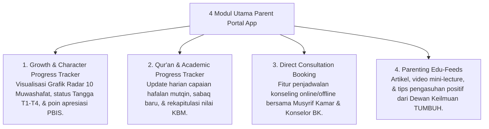

# P7-07-03: Spesifikasi dan Fitur Parent Portal Digital App

## Status Dokumen
* **Status**: 🌟 **A+ (Tervalidasi & Siap Diimplementasikan)**
* **Sub-Domain**: `07 Implementation Framework / 07 Family Practices`
* **Penanggung Jawab Keilmuan**: Dewan Keilmuan TUMBUH (*Pakar Arsitektur Digital Pesantren & Pakar Bimbingan Konseling*)

---

## 1. Spesifikasi Fitur Parent Portal Mobile App

Aplikasi Parent Portal dirancang untuk memberikan transparansi informasi perkembangan santri kepada orang tua secara terenkripsi dan ramah pengguna:

---

## 2. Jaminan Kerahasiaan Data (Data Privacy)

Parent Portal hanya menampilkan data spesifik anak kandung orang tua bersangkutan (*Strict Access Control*) untuk melindungi kehormatan dan martabat santri.
