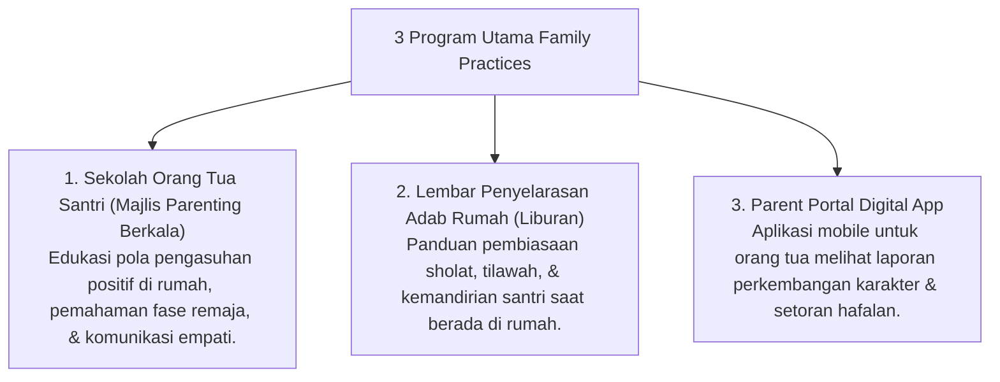

# P7-07: Kemitraan Pengasuhan Keluarga dan Orang Tua

## Status Dokumen
* **Status**: 🌟 **A+ (Tervalidasi & Siap Diimplementasikan)**
* **Sub-Domain**: `07 Implementation Framework / 07 Family Practices`
* **Penanggung Jawab Keilmuan**: Dewan Keilmuan TUMBUH (*Pakar Bimbingan Konseling & Pakar Pengasuhan Asrama*)

---

## 1. Operasionalisasi Family Practices & Parent Engagement

Pendidikan karakter santri hanya akan berhasil jika terdapat **Kemitraan Segitiga Kokoh** antara Pesantren, Santri, dan Orang Tua/Keluarga:

---

## 2. Prinsip Komunikasi Bersama Orang Tua

- **Bukan Sekadar Mengadu Problem**: Musyrif dan Wali Kelas menyampaikan kabar kebaikan dan kemajuan santri terlebih dahulu sebelum mendiskusikan area yang membutuhkan penguatan (*Magic Ratio Communication*).
- **Kolaborasi Tanpa Menyalahkan**: Membantu orang tua memahami kondisi emosional santri dan merumuskan langkah pendampingan bersama di rumah.
