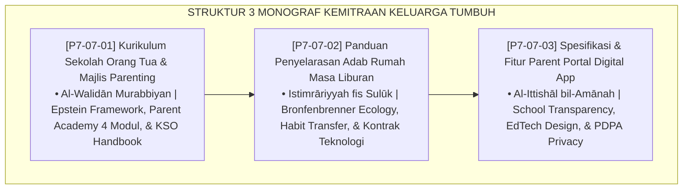

# P7-07: DOKUMEN INDUK KEMITRAAN PENGASUHAN KELUARGA DAN ORANG TUA
## *Arsitektur dan Standarisasi Kurikulum Sekolah Orang Tua, Panduan Penyelarasan Adab Masa Liburan, dan Spesifikasi Parent Portal Digital sebagai Tiga Pilar Kemitraan Keluarga-Pesantren (Parent Academy Form KSO, Holiday Adab Continuity Form PAR, Serta Parent Portal App Form PPD) di Ekosistem TUMBUH Pesantren*

**Nomor Identifikasi**: `P7-07/DOKUMEN-INDUK-KEMITRAAN-KELUARGA-ORANG-TUA/2026`  
**Domain**: `07 Implementation Framework` > `07 Family Practices` (Gugus Sub-Domain 07: *Parent Academy, Holiday Continuity, & Digital Parent Portal*)  
**Klasifikasi Naskah**: *Master Architecture & Navigation Monograph*  
**Rumpun Disiplin Pengkaji**: Parent Engagement Science, Family-Pesantren Partnership, EdTech Design, Fiqh Al-Walidain wal Kemitraan  

---

> ### 💡 INTISARI EKSEKUTIF
>
> * **Kedudukan Strategis Gugus Kemitraan Keluarga:** Gugus ini menghapuskan dinding imaginer antara pesantren dan rumah — menjadikan orang tua sebagai mitra aktif yang informed, teredukasi, dan terhubung secara bermakna dengan perjalanan tumbuh kembang anak mereka.
> * **Triad Kemitraan Keluarga TUMBUH:** (1) **Sekolah Orang Tua** untuk mengedukasinya, (2) **Panduan Liburan** untuk menyelaraskan adab di rumah, dan (3) **Parent Portal Digital** untuk menghubungkannya secara real-time.
> * **3 Monograf Komprehensif:** Form KSO-Parenting, Form PAR-Liburan, dan Form PPD-Portal.

---

## 📑 PETA NAVIGASI TIGA MONOGRAF

---

## 📚 DESKRIPSI RINGKAS 3 BERKAS MONOGRAF

1. **[P7-07-01: Kurikulum Sekolah Orang Tua dan Majlis Parenting](file:///c:/xampp/htdocs/tumbuh/07%20Implementation%20Framework/07%20Family%20Practices/P7-07-01-Kurikulum-Sekolah-Orang-Tua-Majlis-Parenting.md)**  
   *4 Modul workshop interaktif bulanan (neurosains remaja, komunikasi empatis, penyelarasan liburan, kesehatan digital), doktrin Al-Walidān Murabbiyan, Epstein Framework, dan Form KSO-Parenting.*
2. **[P7-07-02: Panduan Penyelarasan Adab Rumah Masa Liburan](file:///c:/xampp/htdocs/tumbuh/07%20Implementation%20Framework/07%20Family%20Practices/P7-07-02-Panduan-Penyelarasan-Adab-Rumah-Masa-Liburan.md)**  
   *Panduan 3 fase (kepulangan 5 hari, ritme rumah, keberangkatan) + Kontrak Teknologi Keluarga, doktrin Istimrāriyyah fis Sulūk, Bronfenbrenner Ecology, dan Form PAR-Liburan.*
3. **[P7-07-03: Spesifikasi dan Fitur Parent Portal Digital App](file:///c:/xampp/htdocs/tumbuh/07%20Implementation%20Framework/07%20Family%20Practices/P7-07-03-Spesifikasi-dan-Fitur-Parent-Portal-Digital-App.md)**  
   *6 fitur unggulan (dashboard real-time, notifikasi pintar, chat terenkripsi, booking kunjungan, galeri, survei), doktrin Al-Ittishāl bil-Amānah, PDPA, dan Form PPD-Portal.*

---

## 🎯 STANDAR PENJAMINAN MUTU KEMITRAAN KELUARGA

Penerapan gugus **Kemitraan Pengasuhan Keluarga dan Orang Tua** menjamin bahwa:
1. **Tidak Ada Orang Tua yang Asing dengan Perjalanan Tumbuh Anaknya (*Informed Parent Guarantee*)**: Sekolah Orang Tua dan Portal memastikan orang tua memiliki pengetahuan dan akses informasi yang mereka butuhkan.
2. **Adab Pesantren Tidak Terhenti di Gerbang Pesantren (*Continuity Beyond Walls Guarantee*)**: Panduan Liburan memastikan pembiasaan adab berlanjut secara realistis dan bermakna di rumah.
3. **Komunikasi Pesantren-Keluarga Selalu Transparan, Cepat, dan Amanah (*Transparent Communication Guarantee*)**: Parent Portal memastikan tidak ada informasi penting tentang anak yang terlambat sampai ke orang tua.
