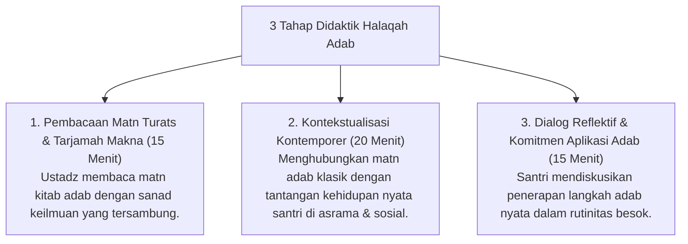

# P7-08-01: Metodologi Halaqah Adab dan Kajian Turats

## Status Dokumen
* **Status**: 🌟 **A+ (Tervalidasi & Siap Diimplementasikan)**
* **Sub-Domain**: `07 Implementation Framework / 08 Pesantren Practices`
* **Penanggung Jawab Keilmuan**: Dewan Keilmuan TUMBUH (*Pakar Epistemologi Turats & Pakar Desain Kurikulum Adab*)

---

## 1. Metodologi Halaqah Adab & Kajian Kitab Turats

Kajian adab diselenggarakan dalam format **Halaqah Lesehan Beradab** untuk mengaji kitab-kitab adab Turats Klasik (misal: *Ta'lim al-Muta'allim*, *Adab al-Alim wa al-Muta'allim*, *Tadzkirat as-Sami'*):

---

## 2. Penghidupan Ruh Keilmuan (*Barakah 'Ilmi*)

Halaqah Adab menanamkan kesadaran bahwa ilmu syariat hanya akan memancarkan keberkahan jika disertai dengan penghormatan tinggi pada adab dan sang guru.
