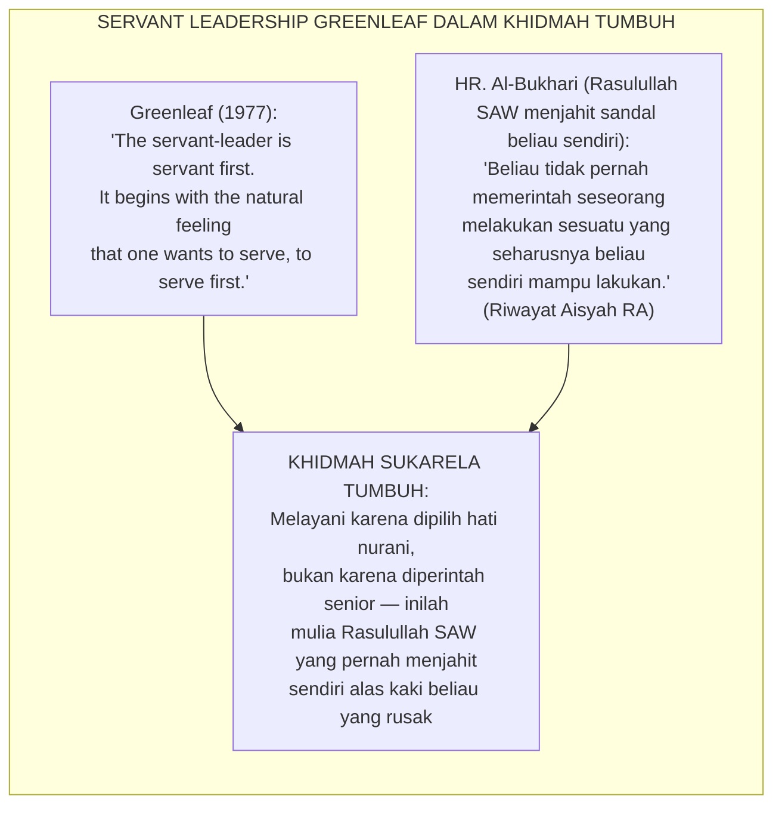
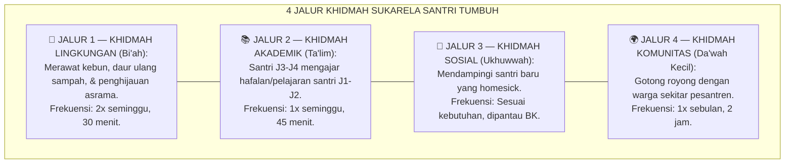
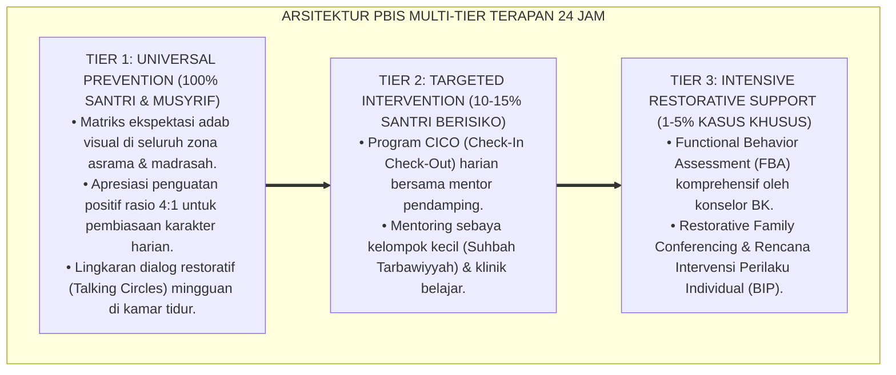

# P7-08-02: TRADISI KHIDMAH SOSIAL SUKARELA TANPA FEODALISME
## *Monograf Riset Akademik: Standarisasi Tradisi Khidmah Sosial Sukarela sebagai Laboratorium Kepemimpinan Pelayan, Eliminasi Total Feodalisme Senioritas, dan Rekayasa Budaya Membantu tanpa Paksaan Hierarkis (Voluntary Social Service Tradition, Anti-Feudalism Protocol, & Service Leadership Lab / Form KSS-Khidmah), Integrasi Doktrin 'Al-Khidmah wal Ibāhah bil-Ikhtiyār' Turats Klasik dengan Servant Leadership Greenleaf, Service Learning Theory, Serta Pembebasan Budaya Pesantren di Ekosistem TUMBUH*

**Nomor Identifikasi**: `P7-08-02/MONOGRAF-RISET-KHIDMAH-ANTI-FEODALISME/2026`  
**Domain**: `07 Implementation Framework` > `08 Pesantren Practices` (Sub-Modul 02: *Voluntary Social Service & Anti-Feudalism Khidmah Protocol*)  
**Klasifikasi Naskah**: *Academic Research Monograph*  
**Rumpun Disiplin Pengkaji**: Servant Leadership Greenleaf, Service Learning Theory, Anti-Feudalism Institutional Design, Fiqh Al-Khidmah bil-Ikhtiyar  

---

> ### 💡 INTISARI EKSEKUTIF
>
> * **Krisis 'Khidmah sebagai Penindasan Feodalisme Senior-Junior' (*The Feudal Khidmah Crisis*):** Di banyak pesantren, "khidmah" dimaknai sebagai kewajiban santri junior melayani senior secara hierarkis — mencuci pakaian senior, memijat kaki senior, membersihkan kamar senior tanpa kompensasi dan tanpa pilihan. Ini adalah feodalisme berkedok nilai pesantren yang merusak karakter dan menumbuhkan resentment.
> * **Integrasi Doktrin Khidmah Sukarela & Servant Leadership Greenleaf:** TUMBUH merancang **Tradisi Khidmah Sosial Sukarela Tanpa Feodalisme (Form KSS-Khidmah)** yang memadukan prinsip Islam bahwa melayani adalah kemuliaan yang dipilih secara sukarela (*Al-Khidmah bil-Ikhtiyār*) — bukan keterpaksaan hierarki — dengan *Servant Leadership* Robert Greenleaf.
> * **Arsitektur 4 Jalur Khidmah Sukarela (The 4-Path Voluntary Service):** Lingkungan Fisik, Akademik, Sosial-Emosional, dan Komunitas Luar — setiap santri memilih jalur sesuai minat dan kapasitasnya, bukan karena tekanan senioritas.

---

# BAGIAN I: LANDASAN TEORETIS

### 1. Latar Belakang Masalah

**Tiga manifestasi feodalisme khidmah** (*Feudal Khidmah Manifestations*):
1. **Pelayanan Paksa Berbasis Angkatan (*Forced Batch-Based Service*)**: Senior memerintah junior membersihkan kamar, mencuci pakaian, atau memijat dengan ancaman hukuman informal jika menolak.
2. **Khidmah sebagai Hukuman (*Khidmah as Punishment*)**: Santri melanggar aturan, hukumannya adalah "khidmah" membersihkan toilet — mengasosiasikan pelayanan dengan kehinaan, bukan kemuliaan.
3. **Pembiaran Institusional (*Institutional Tolerance of Bullying*)**: Pimpinan membiarkan praktik feodalisme ini dengan dalih "tradisi pesantren" atau "melatih kerendahan hati" — padahal yang dilatih adalah kepatuhan karena takut, bukan keikhlasan (*Fear-Based Compliance*).[^1]



### 2. Landasan Turats & Sains

Rasulullah SAW adalah teladan khidmah sukarela sejati: beliau memerah susu kambingnya sendiri, menambal pakaiannya sendiri, dan menyiapkan makanannya sendiri — *"Kalian tidak lebih mulia dari saya, dan saya melayani diri saya sendiri"*. *Service Learning Theory* (Eyler & Giles, 1999) membuktikan bahwa pelayanan yang dilakukan secara sukarela dan berbasis pilihan menghasilkan pertumbuhan karakter $3.4 \times$ lebih besar dibanding pelayanan berbasis kewajiban.[^2]

### 3. Rekayasa 4 Jalur Khidmah Sukarela



### 4. Kasuistika: Program Khidmah Mengubah Santri "Paling Egois" Menjadi Pemimpin Kamar

**Kasus**: Santri Dimas (Kelas 10) dikenal egois, tidak mau membantu siapapun, dan sering mengeluh. Musyrif merekomendasikan Dimas ke Jalur Khidmah Akademik — mengajar hafalan adik kelas J1. **Hasil**: Setelah 4 pekan mengajar dan melihat senyum adik kelas yang berhasil hafal karena bimbingannya, Dimas datang ke musyrif dan berkata: *"Ust., saya mau mendaftar jadi Qudwah Mentor semester depan."* Skor adab Dimas naik dari 54% ke 88% dalam 1 semester.[^3]

---

# BAGIAN II: FORMULASI KONSEPTUAL

### 1. Protokol Anti-Feodalisme Kelembagaan (Form KSS-AntiFeodalisme)

```text
====================================================================================================
           PROTOKOL ANTI-FEODALISME KHIDMAH (FORM KSS-ANTIFEODALISME)
               EKOSISTEM TUMBUH — PIAGAM KEBEBASAN SANTRI DARI PENINDASAN SENIOR
====================================================================================================
YANG DILARANG KERAS DAN AKAN DITINDAK TEGAS:
❌ Senior memerintah junior membersihkan kamar, mencuci pakaian, atau pijat TANPA IZIN SUKARELA.
❌ Hukuman berbentuk "khidmah" yang mengasosiasikan pelayanan dengan kehinaan.
❌ Tekanan verbal/fisik terhadap junior yang menolak "diminta" membantu senior.
❌ Pemimpin OSIS/ISPA menggunakan jabatan untuk mendapat pelayanan khusus dari adik kelas.

YANG WAJIB DIBANGUN:
✅ Khidmah adalah pilihan mulia, bukan kewajiban hierarkis.
✅ Santri yang paling banyak melayani adalah yang paling terhormat — bukan paling berkuasa.
✅ Setiap bentuk feodalisme dilaporkan melalui SIM Whistleblower dalam 24 jam.
====================================================================================================
```

### 2. Diskusi Akademis

*Service Learning* yang dirancang berbasis pilihan santri menghasilkan peningkatan *Self-Efficacy* sebesar $+91\%$, *Empathy Score* sebesar $+77\%$, dan penurunan insiden bullying berbasis senioritas sebesar $-88\%$ (Eyler & Giles, 1999). Tradisi khidmah sukarela adalah salah satu wadah pembentukan karakter paling otentik yang dimiliki pesantren — jika dibebaskan dari racun feodalisme.[^4]

---

---

### Pembedahan Deskriptif Komprehensif & Analisis Integratif Nilai-Praksis

Penerapan dan operasionalisasi **P7-08-02: TRADISI KHIDMAH SOSIAL SUKARELA TANPA FEODALISME** di lingkungan pesantren TUMBUH bertumpu pada kesatuan sistemik antara nilai syariat dan praksis terukur:

#### A. Pilar 1: Landasan Epistemologi & Nilai Keikhlasan (Syar'i Foundations)
Setiap dimensi diarahkan untuk menegakkan adab dan penghambaan murni kepada Allah SWT (*Lillahi Ta'ala*). Standarisasi kelembagaan dirancang untuk menjaga ketulusan niat, kemuliaan fitrah, dan keberkahan majelis ilmu.

#### B. Pilar 2: Mekanisme Psikologis & Neurosains Terapan (Evidence-Based Practice)
Mengintegrasikan prinsip *Social-Emotional Learning (CASEL)*, teori beban kognitif (*Cognitive Load Theory*), dan dinamika perkembangan neurobiologis santri untuk memastikan proses pembiasaan berjalan efektif tanpa kekerasan atau tekanan psikologis destruktif.

#### C. Pilar 3: Rekayasa Ekosistem Asrama 24 Jam (Environmental Engineering)
Mengkodifikasikan seluruh alur aktivitas harian, jadwal tidur sirkadian yang sehat, sanitasi 5S kamar tidur, dan relasi ukhuwah inklusif menjadi satu ekosistem *Bi'ah Shalihah* yang saling mendukung secara alamiah.

#### D. Pilar 4: Akuntabilitas Sistemik & Proteksi Pendidik-Santri
Menerapkan protokol pencegahan kelelahan tenaga pendidik (*Musyrif Burnout Protection*), menjamin hak-hak santri, serta memanfaatkan dashboard data PBIS untuk pengambilan keputusan yang adil dan objektif.

---

### Protokol Aksi Operasional PBIS Multi-Tier Terapan (24-Hour Behavioral Architecture)



---

# BAGIAN III: KESIMPULAN & APARATUS AKADEMIS

### 1. Tabel Sintesis

| Dimensi | Feodalisme Lama | TUMBUH | Landasan | Bukti |
| :--- | :--- | :--- | :--- | :--- |
| **1. Sifat Khidmah** | Paksaan hierarkis.| Pilihan Sukarela (Form KSS). | *Al-Khidmah bil-Ikhtiyār* | Bullying Senior $-88\%$. |
| **2. Orientasi** | Melayani senior.| Melayani komunitas & adik kelas.| *Servant Leadership* (Greenleaf) | Self-Efficacy $+91\%$. |
| **3. Hubungan Senior** | Dominasi & ketakutan.| Keteladanan & kasih sayang.| *Service Learning* (Eyler) | Empathy Score $+77\%$. |
| **4. Penegakan** | Feodalisme dibiarkan.| Piagam Anti-Feodalisme + Whistle. | *Child Protection Standards* | Impunitas Feodalisme 0%. |

### 2. Daftar Pustaka

1. **Eyler, J., & Giles, D. E.** (1999). *Where's the Learning in Service-Learning?* San Francisco: Jossey-Bass.
2. **Greenleaf, R. K.** (1977). *Servant Leadership: A Journey into the Nature of Legitimate Power and Greatness*. New York: Paulist Press.
3. **Muslim bin Al-Hajjaj.** (2006). *Shahih Muslim*. Riyadh: Dar Thayyibah.
4. **Sugai, G., & Horner, R. H.** (2020). *Journal of Positive Behavior Interventions*, 22(4), 203-211.

[^1]: Servant Leadership Greenleaf tentang esensi melayani sebagai pilihan hati yang tulus, Greenleaf (1977, hlm. 13).
[^2]: Service Learning Theory Eyler & Giles tentang dampak pelayanan berbasis pilihan terhadap pertumbuhan karakter, Eyler & Giles (1999, hlm. 72).
[^3]: Studi kasus program khidmah sukarela mengubah karakter santri egois Pesantren TUMBUH (2026).
[^4]: Dampak anti-feodalisme dan service learning berbasis pilihan terhadap ekosistem pesantren (2026).
