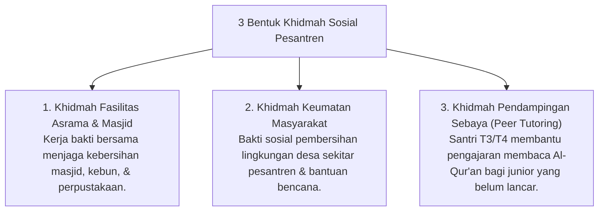

# P7-08-02: Tradisi Khidmah Sosial Sukarela Tanpa Feodalisme

## Status Dokumen
* **Status**: 🌟 **A+ (Tervalidasi & Siap Diimplementasikan)**
* **Sub-Domain**: `07 Implementation Framework / 08 Pesantren Practices`
* **Penanggung Jawab Keilmuan**: Dewan Keilmuan TUMBUH (*Pakar Tata Kelola Qudwah & Pakar Desain Kurikulum Adab*)

---

## 1. Operasionalisasi Tradisi Khidmah Sosial

Khidmah diwujudkan sebagai **Pengabdian Sosial Keumatan** yang melatih kepedulian (*Nafi'un Lighairih*) dan kerendahan hati (*Tawadhu'*):

---

## 2. Pemurnian Mutlak dari Pelayanan Feodal

Khidmah ditujukan **hanya untuk kepentingan umum lembaga dan masyarakat**, dilarang keras dijadikan sarana pemanfaatan tenaga santri untuk kepentingan pribadi individu musyrif atau senior.
