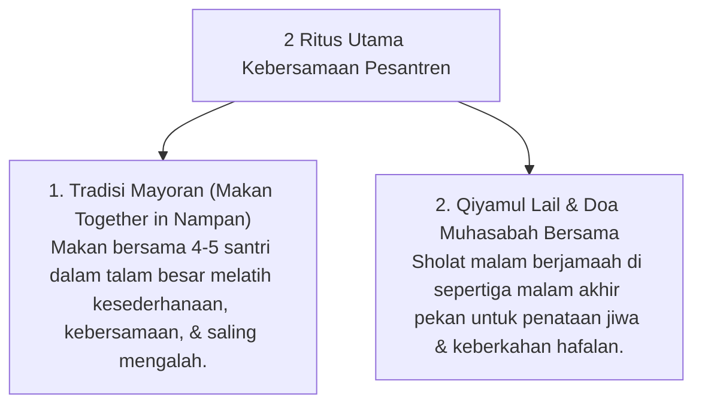

# P7-08-03: Ritus Ukhuwah Mayoran dan Qiyamul Lail Bersama

## Status Dokumen
* **Status**: 🌟 **A+ (Tervalidasi & Siap Diimplementasikan)**
* **Sub-Domain**: `07 Implementation Framework / 08 Pesantren Practices`
* **Penanggung Jawab Keilmuan**: Dewan Keilmuan TUMBUH (*Pakar Pengasuhan Asrama & Pakar Psikologi Sosial Santri*)

---

## 1. Operasionalisasi Ritus Ukhuwah Pesantren

Ritus khas pesantren dimanfaatkan untuk mengokohkan persaudaraan sosial (*Ukhuwah Islamiyah*) dan keheningan spiritual:

---

## 2. Penguatan Iklim Kekeluargaan Pesantren

Tradisi mayoran dan Qiyamul Lail bersama meruntuhkan sekat sosial dan egoistis antar santri, menciptakan rasa kepemilikan komunitas (*Sense of Belonging*) yang kuat.
