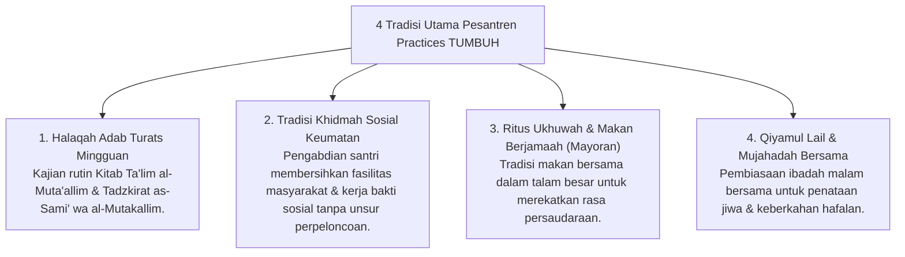

# P7-08: Tradisi Pesantren dan Integrasi Turats Klasik

## Status Dokumen
* **Status**: 🌟 **A+ (Tervalidasi & Siap Diimplementasikan)**
* **Sub-Domain**: `07 Implementation Framework / 08 Pesantren Practices`
* **Penanggung Jawab Keilmuan**: Dewan Keilmuan TUMBUH (*Pakar Epistemologi Turats & Pakar Desain Kurikulum Adab*)

---

## 1. Operasionalisasi Pesantren Practices (Integrasi Turats & Budaya Khas)

Kerangka kerja **TUMBUH** menghidupkan dan menyempurnakan tradisi luhur pesantren klasik (*At-Turats al-Islami*) dengan prinsip kepemimpinan bebas feodalisme:

---

## 2. Pemurnian Tradisi Khidmah dari Feodalisme

Khidmah diwujudkan sebagai **Pengabdian Sukarela Kesiapsiagaan Diri (*Servant Leadership*)** kepada masyarakat dan pesantren, bukan pelayanan penderitaan junior kepada senior.
