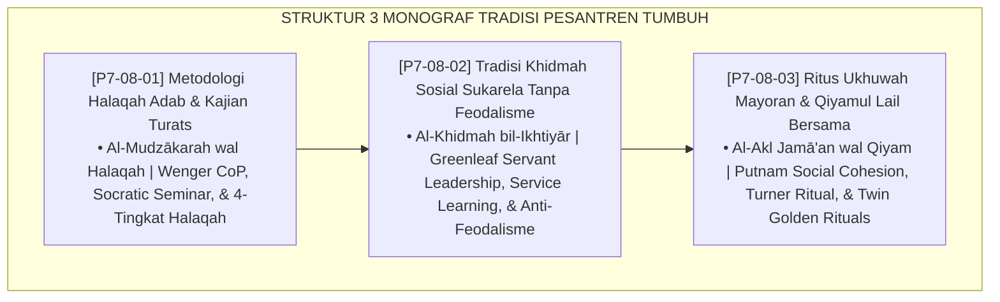

# P7-08: DOKUMEN INDUK TRADISI PESANTREN DAN INTEGRASI TURATS KLASIK
## *Arsitektur dan Standarisasi Metodologi Halaqah Adab Kontekstual, Tradisi Khidmah Sosial Sukarela Bebas Feodalisme, dan Ritus Ukhuwah Mayoran serta Qiyamul Lail Bersama sebagai Tiga Pilar Tradisi Pesantren Otentik TUMBUH (Halaqah Adab Form HAT, Khidmah Sukarela Form KSS, Serta Ritus Ukhuwah Form RUQ) di Ekosistem TUMBUH Pesantren*

**Nomor Identifikasi**: `P7-08/DOKUMEN-INDUK-TRADISI-PESANTREN-INTEGRASI-TURATS/2026`  
**Domain**: `07 Implementation Framework` > `08 Pesantren Practices` (Gugus Sub-Domain 08: *Halaqah Adab, Anti-Feudalism Khidmah, & Communal Ukhuwah Rituals*)  
**Klasifikasi Naskah**: *Master Architecture & Navigation Monograph*  
**Rumpun Disiplin Pengkaji**: Turats Pesantren Klasik, Community of Practice, Service Learning, Social Cohesion Science  

---

> ### 💡 INTISARI EKSEKUTIF
>
> * **Kedudukan Strategis Gugus Tradisi Pesantren:** Gugus ini adalah jiwa otentik pesantren — merawat dan memperbarui tradisi-tradisi agung yang tidak dimiliki oleh sekolah manapun di luar pesantren. Di sinilah identitas santri dalam sistem TUMBUH ditempa menjadi sesuatu yang lebih dalam dari sekadar nilai akademik.
> * **Triad Tradisi Ekosistem Pesantren Berbasis TUMBUH:** (1) **Halaqah Adab** sebagai ruang pembentukan karakter komunal melalui ilmu, (2) **Khidmah Sukarela** sebagai laboratorium kepemimpinan pelayan bebas feodalisme, dan (3) **Ritus Ukhuwah** sebagai momen pembaruan ikatan jiwa melalui makan bersama dan sujud bersama.
> * **3 Monograf Komprehensif:** Form HAT-Halaqah, Form KSS-Khidmah, dan Form RUQ-Ritus.

---

## 📑 PETA NAVIGASI TIGA MONOGRAF

---

## 📚 DESKRIPSI RINGKAS 3 BERKAS MONOGRAF

1. **[P7-08-01: Metodologi Halaqah Adab dan Kajian Turats](file:///c:/xampp/htdocs/tumbuh/07%20Implementation%20Framework/08%20Pesantren%20Practices/P7-08-01-Metodologi-Halaqah-Adab-dan-Kajian-Turats.md)**  
   *4 tingkat halaqah (kamar/angkatan/lintas-jenjang/keilmuan terbuka), kurikulum rotasi tahunan, doktrin Al-Mudzākarah wal Halaqah, Community of Practice Wenger, dan Form HAT-Halaqah.*
2. **[P7-08-02: Tradisi Khidmah Sosial Sukarela Tanpa Feodalisme](file:///c:/xampp/htdocs/tumbuh/07%20Implementation%20Framework/08%20Pesantren%20Practices/P7-08-02-Tradisi-Khidmah-Sosial-Sukarela-Tanpa-Feodalisme.md)**  
   *4 jalur khidmah sukarela (lingkungan/akademik/sosial/komunitas), piagam anti-feodalisme, doktrin Al-Khidmah bil-Ikhtiyār, Greenleaf Servant Leadership, dan Form KSS-Khidmah.*
3. **[P7-08-03: Ritus Ukhuwah Mayoran dan Qiyamul Lail Bersama](file:///c:/xampp/htdocs/tumbuh/07%20Implementation%20Framework/08%20Pesantren%20Practices/P7-08-03-Ritus-Ukhuwah-Mayoran-dan-Qiyamul-Lail-Bersama.md)**  
   *Mayoran bulanan + Qiyamul Lail berjamaah triwulanan, doktrin Al-Akl Jamā'an, Putnam Social Cohesion, Turner Ritual Theory, dan Form RUQ-Ritus.*

---

## 🎯 STANDAR PENJAMINAN MUTU TRADISI PESANTREN

Penerapan gugus **Tradisi Pesantren dan Integrasi Turats Klasik** menjamin bahwa:
1. **Turats Klasik Hidup dan Kontekstual, Bukan Tekstual Mati (*Living Turats Guarantee*)**: Halaqah Socratic memastikan setiap teks turats dimaknai, didiskusikan, dan diterapkan dalam konteks kehidupan asrama nyata santri.
2. **Khidmah adalah Kemuliaan yang Dipilih, Bukan Penindasan yang Dipaksakan (*Voluntary Service Guarantee*)**: Piagam Anti-Feodalisme memastikan tidak ada satupun santri yang dipaksa melayani senior melalui tekanan hierarki.
3. **Setiap Santri Memiliki Momen Jiwa Bergabung dengan Komunitas (*Communitas Guarantee*)**: Mayoran dan Qiyamul Lail bersama memastikan ada momen-momen sakral yang memperbaharui ikatan ukhuwah melampaui sekadar kohabitasi.
