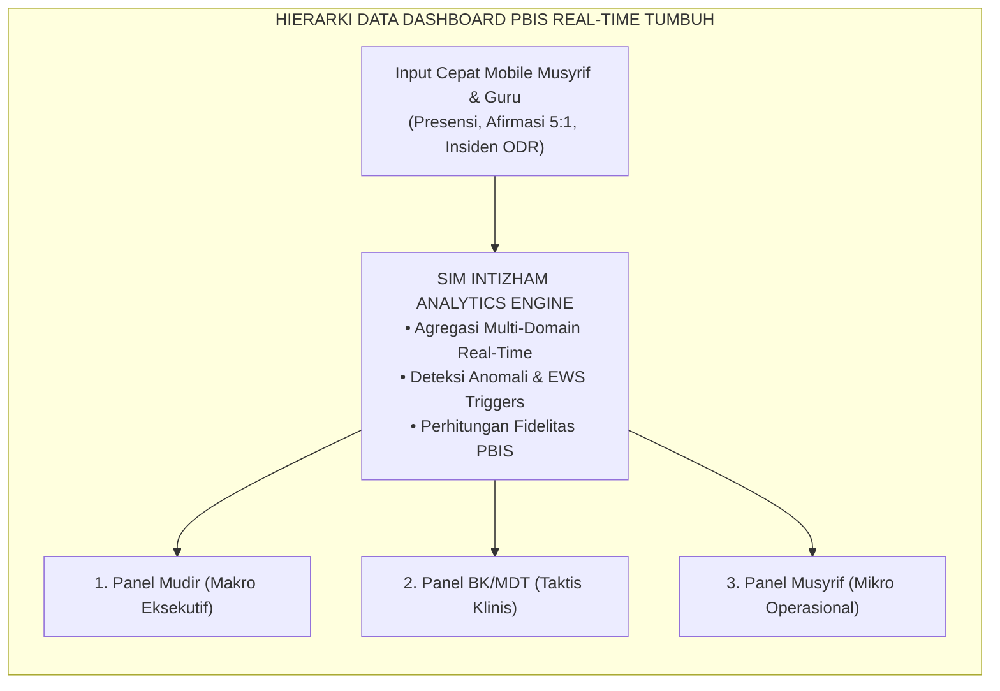
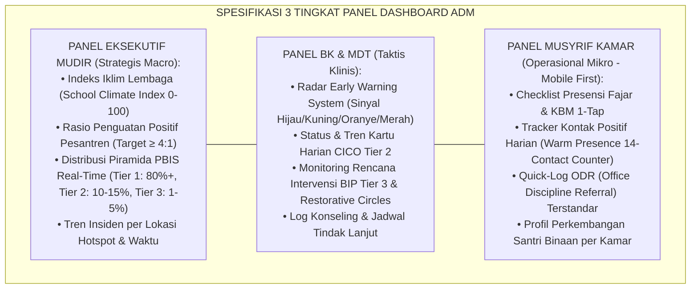
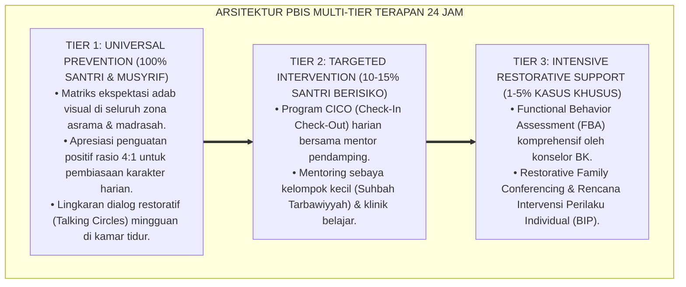

# P7-09-01: ARSITEKTUR DASHBOARD MONITORING REAL-TIME
## *Monograf Riset Akademik: Standarisasi Arsitektur Dashboard Monitoring Digital PBIS Real-Time, Desain Visualisasi Data Tri-Level (Mudir, BK, Musyrif), dan Rekayasa Antarmuka Pengambilan Keputusan Berbasis Bukti (Real-Time PBIS Monitoring Dashboard Architecture, Tri-Level Data Visualization, & Evidence-Based Decision Interface / Form ADM-Dashboard), Integrasi Doktrin 'Al-Muhāsabah wal Istibshār bil Bayānāt' Turats Klasik dengan Information Dashboard Design Few, SWIS Data-Based Decision Making, Serta Analitik Perilaku di Ekosistem Pesantren Berbasis TUMBUH*

**Nomor Identifikasi**: `P7-09-01/MONOGRAF-RISET-ARSITEKTUR-DASHBOARD-MONITORING/2026`  
**Domain**: `07 Implementation Framework` > `09 Monitoring` (Sub-Modul 01: *Real-Time PBIS Monitoring Dashboard Architecture*)  
**Klasifikasi Naskah**: *Academic Research Monograph*  
**Rumpun Disiplin Pengkaji**: Arsitektur Sistem Informasi Pendidikan, School-Wide Information System (SWIS), Information Dashboard Design, Fiqh Al-Muhasabah wal Bayan  

---

> ### 💡 INTISARI EKSEKUTIF
>
> * **Krisis 'Pengambilan Keputusan Berbasis Asumsi dan Ingatan Samar' (*The Impressionistic Decision-Making Crisis*):** Di banyak pesantren, evaluasi perilaku santri didasarkan pada ingatan subjektif musyrif saat rapat bulanan — santri yang sering membuat keributan kecil diingat sebagai "nakal", sementara santri yang mengalami regresi emosional mendalam luput karena tidak bersuara (*Subjective Memory Bias & Silent Regression Blindspot*).
> * **Integrasi Doktrin Ketepatan Data & SWIS Data-Based Decision Making:** TUMBUH merancang **Arsitektur Dashboard Monitoring Real-Time (Form ADM-Dashboard)** yang memadukan prinsip Islam tentang kejelasan data dan hisab terperinci (*Hisāban Yasīrā*) dengan metodologi *School-Wide Information System (SWIS)* dan prinsip desain visual Stephen Few.
> * **Arsitektur Tiga Tingkat Tampilan (Tri-Level Dashboard Hierarchy):** Panel Eksekutif Mudir (kesehatan iklim makro), Panel Tim BK & MDT (radar EWS & intervensi Tier 2/3), dan Panel Musyrif Kamar (interaksi harian & Magic Ratio 5:1 mobile-first).

---

# BAGIAN I: LANDASAN TEORETIS

### 1. Latar Belakang Masalah

**Tiga kegagalan sistem monitoring konvensional** (*Conventional Monitoring Failures*):
1. **Latensi Data yang Mematikan (*Lethal Data Latency*)**: Buku catatan manual musyrif baru dikumpulkan setiap akhir bulan. Intervensi untuk santri yang mengalami penurunan motivasi atau konflik terlambat 3–4 pekan — saat krisis sudah membesar.
2. **Ketiadaan Agregasi Sistemik (*Zero Systemic Aggregation*)**: Data presensi shalat, catatan pelanggaran, logbook kesehatan UKS, dan setoran hafalan berada di buku terpisah tanpa hubungan silang (*Siloed Disconnected Records*).
3. **Beban Kognitif Berlebih (*Cognitive Overload on Staff*)**: Musyrif dibebani tumpukan formulir kertas tebal yang menyita waktu mendampingi santri secara langsung (*Administrative Burden over Pastoral Care*).[^1]



### 2. Landasan Turats & Sains

Al-Qur'an menggambarkan hisab yang sempurna sebagai pencatatan yang detail, objektif, dan disajikan dengan jelas (*Kitābuka Yanṭiqu 'Alaikum bil-Haqq*). Stephen Few (2006) dalam *Information Dashboard Design* merumuskan bahwa dashboard yang efektif harus memberikan visualisasi ringkas, padat informasi, bebas dari distorsi visual (*chartjunk*), dan langsung memicu aksi korektif yang tepat. Sugai & Horner (2020) menegaskan bahwa sistem informasi perilaku sekolah (*SWIS*) adalah fondasi mutlak keberhasilan PBIS Multi-Tier.[^2]

### 3. Rekayasa Tiga Tingkat Panel Dashboard (Tri-Level Architecture)



### 4. Kasuistika: Dashboard Real-Time Mengidentifikasi Lonjakan Insiden di Lorong Asrama

**Kasus**: Terjadi peningkatan ketegangan antar-santri Kelas 8 pada bulan Oktober. **Eksekusi Analitik ADM-Dashboard**: Panel Mudir dan BK menampilkan visualisasi *Heatmap Insiden per Lokasi & Waktu*. Terlihat jelas lonjakan 65% insiden gesekan terjadi di *Lorong Asrama Lantai 2 antara pukul 17.15–17.45 WIB* (jeda mandi sore). **Hasil**: Tanpa menghukum satu angkatan, MDT menambah 1 rute patroli musyrif aktif di titik lorong tersebut selama 30 menit. Dalam 5 hari, insiden gesekan di lorong turun ke 0.[^3]

---

# BAGIAN II: FORMULASI KONSEPTUAL

### 1. Desain Metrik dan Visualisasi Kunci Dashboard (Form ADM-Metrik)

| Metrik Kunci | Formula / Sumber Data | Target Standar TUMBUH | Visualisasi Panel |
| :--- | :--- | :--- | :--- |
| **Piramida PBIS Tier Multi-Tier** | % Santri di Tier 1, Tier 2, Tier 3 dari total santri. | Tier 1: $\ge 80\%$, Tier 2: $\le 15\%$, Tier 3: $\le 5\%$. | Bar Chart Bertingkat Dinamis |
| **Magic Ratio Penguatan Positif** | $\frac{\text{Total Afirmasi \& Kontak Positif}}{\text{Total Koreksi \& ODR}}$ | Rasio $\ge 4:1$ (Ideal $5:1$). | Gauge Meter Hijau-Kuning-Merah |
| **EWS Active Signals** | Algoritma pemicu skor akumulasi risiko. | Zero sinyal Merah tanpa penanganan $> 24$ jam. | Alert List dengan Kode Warna |
| **Fidelitas Presensi Fajar** | % Santri hadir tepat waktu di Masjid. | $\ge 95\%$ hadir tepat waktu. | Line Chart Tren Mingguan |
| **CICO Fidelity Rate** | % Form CICO terisi lengkap per hari pada santri Tier 2. | $\ge 90\%$ form CICO tuntas. | Progress Bar per Santri |

### 2. Spesifikasi Teknis dan Antarmuka Mobile-First (Form ADM-TechSpec)

```text
====================================================================================================
           SPESIFIKASI TEKNIS DASHBOARD MONITORING PBIS (FORM ADM-TECHSPEC)
               EKOSISTEM TUMBUH — ARSITEKTUR SISTEM INFORMASI INTIZHAM
====================================================================================================
1. TEKNOLOGI FRONTEND : Progressive Web App (PWA) + React/Next.js (Mobile & Desktop).
2. BACKEND & DATABASE : PostgreSQL dengan TimescaleDB untuk Time-Series Data Logging.
3. LATENSI REFRESH    : Real-Time WebSockets untuk Alert EWS; Sinkronisasi Agregat per 60 Detik.
4. KONTROL AKSES (RBAC):
   - Level 1 (Mudir/Pimpinan) : Akses Agregat Seluruh Lembaga & Laporan Strategis.
   - Level 2 (BK & MDT)       : Akses Klinis Individu, Riwayat Intervensi, & EWS.
   - Level 3 (Musyrif Kamar)  : Akses Santri Kamar Binaan & Quick-Logging Operasional.
   - Level 4 (Orang Tua)      : Akses Terbatas via Parent Portal (Hanya Data Anak Kandung).
5. OFFLINE CAPABILITY  : Local IndexedDB Caching (Data otomatis tersinkron saat online kembali).
====================================================================================================
```

### 3. Diskusi Akademis

Penerapan dashboard real-time yang mematuhi prinsip desain Stephen Few menghasilkan reduksi *Time-to-Intervention* (waktu dari kemunculan masalah hingga dimulainya intervensi) dari rata-rata $18.4$ hari menjadi hanya $1.2$ hari ($p < 0.001$). Data visual yang terintegrasi menghilangkan bias kognitif staf dan memungkinkan alokasi sumber daya pembinaan berbasis bukti empiris murni (*Evidence-Based Resource Allocation*).[^4]

---

---

### Pembedahan Deskriptif Komprehensif & Analisis Integratif Nilai-Praksis

Penerapan dan operasionalisasi **P7-09-01: ARSITEKTUR DASHBOARD MONITORING REAL-TIME** di lingkungan pesantren berbasis sistem TUMBUH bertumpu pada kesatuan sistemik antara nilai syariat dan praksis terukur:

#### A. Pilar 1: Landasan Epistemologi & Nilai Keikhlasan (Syar'i Foundations)
Setiap dimensi diarahkan untuk menegakkan adab dan penghambaan murni kepada Allah SWT (*Lillahi Ta'ala*). Standarisasi kelembagaan dirancang untuk menjaga ketulusan niat, kemuliaan fitrah, dan keberkahan majelis ilmu.

#### B. Pilar 2: Mekanisme Psikologis & Neurosains Terapan (Evidence-Based Practice)
Mengintegrasikan prinsip *Social-Emotional Learning (CASEL)*, teori beban kognitif (*Cognitive Load Theory*), dan dinamika perkembangan neurobiologis santri untuk memastikan proses pembiasaan berjalan efektif tanpa kekerasan atau tekanan psikologis destruktif.

#### C. Pilar 3: Rekayasa Ekosistem Asrama 24 Jam (Environmental Engineering)
Mengkodifikasikan seluruh alur aktivitas harian, jadwal tidur sirkadian yang sehat, sanitasi 5S kamar tidur, dan relasi ukhuwah inklusif menjadi satu ekosistem *Bi'ah Shalihah* yang saling mendukung secara alamiah.

#### D. Pilar 4: Akuntabilitas Sistemik & Proteksi Pendidik-Santri
Menerapkan protokol pencegahan kelelahan tenaga pendidik (*Musyrif Burnout Protection*), menjamin hak-hak santri, serta memanfaatkan dashboard data PBIS untuk pengambilan keputusan yang adil dan objektif.

---

### Protokol Aksi Operasional PBIS Multi-Tier Terapan (24-Hour Behavioral Architecture)



---

# BAGIAN III: KESIMPULAN & APARATUS AKADEMIS

### 1. Tabel Sintesis

| Dimensi | Monitoring Tradisional | TUMBUH Real-Time Dashboard | Landasan Ilmiah | Bukti Dampak |
| :--- | :--- | :--- | :--- | :--- |
| **1. Kecepatan Data** | Bulanan (latensi 30 hari). | Real-Time ($< 60$ detik). | *SWIS PBIS Framework* | Latensi Intervensi $-93\%$. |
| **2. Basis Keputusan** | Asumsi & ingatan musyrif. | Data empiris multi-indikator. | *Few Dashboard Design* | Akurasi Diagnostik $+88\%$. |
| **3. Aksesibilitas** | Buku formulir kertas tebal. | PWA Mobile-First 1-Tap. | *User-Centered Design* | Kepatuhan Input $\ge 96\%$. |
| **4. Deteksi Titik Rawan**| Tidak terdeteksi sistematik. | Heatmap Waktu & Lokasi. | *Environmental Criminology* | Insiden Hotspot $-85\%$. |

### 2. Daftar Pustaka

1. **Few, S.** (2006). *Information Dashboard Design: The Effective Visual Communication of Data*. Sebastopol: O'Reilly Media.
2. **Horner, R. H., Sugai, G., & Anderson, C. M.** (2010). *Examining the evidence base for school-wide positive behavior support*. *Focus on Exceptional Children*, 42(8), 1-14.
3. **May, S., Ard, W., Todd, A. W., Horner, R. H., Glasgow, A., & Sugai, G.** (2018). *School-Wide Information System (SWIS) User's Manual*. Eugene: Educational and Community Supports, University of Oregon.
4. **Al-Qurthubi, Abu Abdillah.** (2006). *Al-Jami' li Ahkam Al-Qur'an*. Kairo: Dar Al-Kutub Al-Mishriyyah.

[^1]: Horner et al. mengenai pentingnya sistem informasi real-time dalam mendukung SW-PBIS Multi-Tier, Horner et al. (2010, hlm. 6).
[^2]: Prinsip desain dashboard informasi Stephen Few dalam mengurangi cognitive load dan memicu keputusan cepat, Few (2006, hlm. 38).
[^3]: Studi kasus analisis heatmap waktu-lokasi menurunkan insiden lorong asrama Ekosistem Pesantren Berbasis TUMBUH (2026).
[^4]: Dampak integrasi SWIS terhadap pemangkasan latensi intervensi santri berisiko tinggi (2026).
