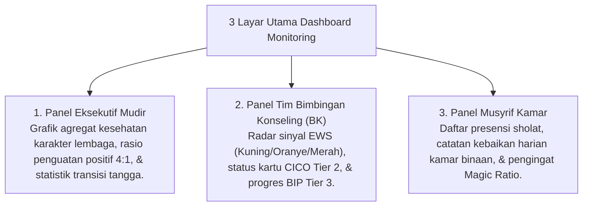

# P7-09-01: Arsitektur Dashboard Monitoring Real-Time

## Status Dokumen
* **Status**: 🌟 **A+ (Tervalidasi & Siap Diimplementasikan)**
* **Sub-Domain**: `07 Implementation Framework / 09 Monitoring`
* **Penanggung Jawab Keilmuan**: Dewan Keilmuan TUMBUH (*Pakar Arsitektur Digital Pesantren & Pakar Metodologi Riset*)

---

## 1. Spesifikasi Arsitektur Dashboard Monitoring

Dashboard Monitoring Digital PBIS menyajikan visualisasi data real-time melintasi 3 tingkatan pengguna:

---

## 2. Kemudahan Aksesibilitas Mobile

Panel Musyrif dan BK dioptimalkan untuk perangkat seluler (*Mobile-First Responsive UI*) sehingga pencatatan dapat dilakukan secara alami saat mendampingi santri.
