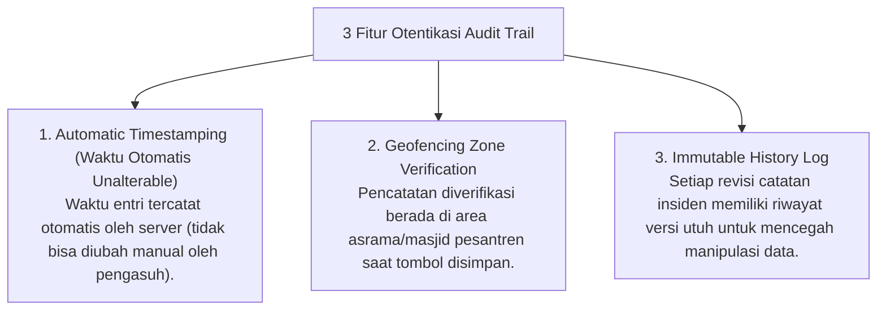

# P7-09-02: Protokol Audit Trail Timestamp Logbook Musyrif

## Status Dokumen
* **Status**: 🌟 **A+ (Tervalidasi & Siap Diimplementasikan)**
* **Sub-Domain**: `07 Implementation Framework / 09 Monitoring`
* **Penanggung Jawab Keilmuan**: Dewan Keilmuan TUMBUH (*Pakar Arsitektur Digital Pesantren & Pakar Tata Kelola Qudwah*)

---

## 1. Operasionalisasi Audit Trail & Timestamp Verification

Untuk menjamin keaslian dan akurasi data pengamatan perilaku santri, aplikasi Logbook PBIS dilengkapi **Sistem Audit Trail Terenkripsi**:

---

## 2. Jaminan Kualitas Data Observasi

Fitur Audit Trail mencegah kebiasaan entri logbook susulan di akhir pekan (*Back-dated Data Entry*) dan memastikan pengamatan dilakukan secara real-time.
