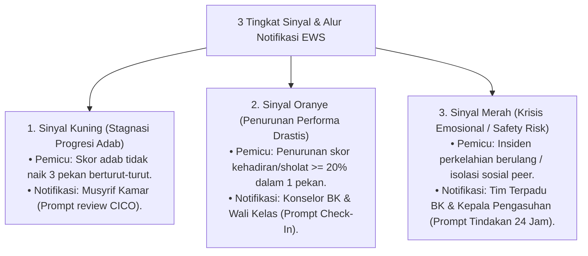

# P7-09-03: Algoritma EWS Trigger dan Alur Notifikasi Sinyal

## Status Dokumen
* **Status**: 🌟 **A+ (Tervalidasi & Siap Diimplementasikan)**
* **Sub-Domain**: `07 Implementation Framework / 09 Monitoring`
* **Penanggung Jawab Keilmuan**: Dewan Keilmuan TUMBUH (*Pakar Arsitektur Digital Pesantren & Pakar Bimbingan Konseling*)

---

## 1. Algoritma Deteksi Early Warning System (EWS)

Sistem EWS memproses data logbook harian untuk mendeteksi 3 jenis sinyal kecenderungan masalah santri:

---

## 2. Responsifitas Notifikasi Prioritas

Notifikasi Sinyal Merah dikirimkan sebagai *Push Notification* dengan prioritas tinggi ke ponsel pintar Konselor BK dan Kepala Pengasuhan.
