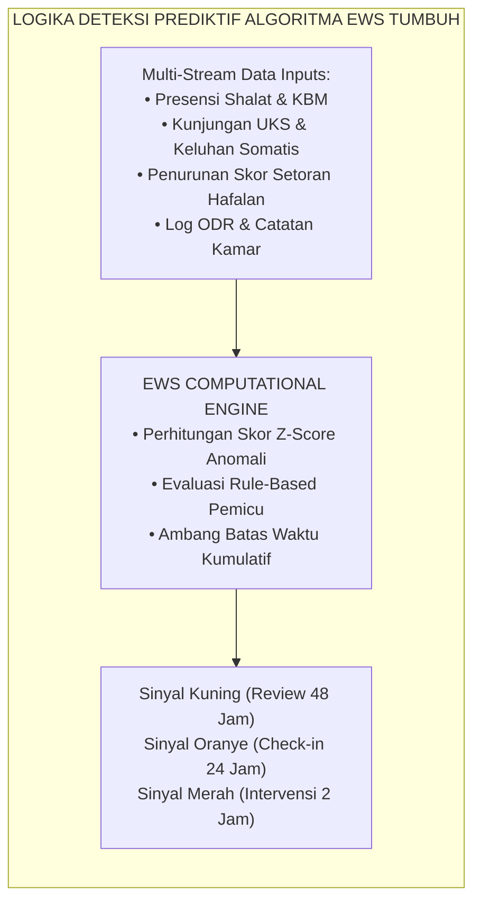
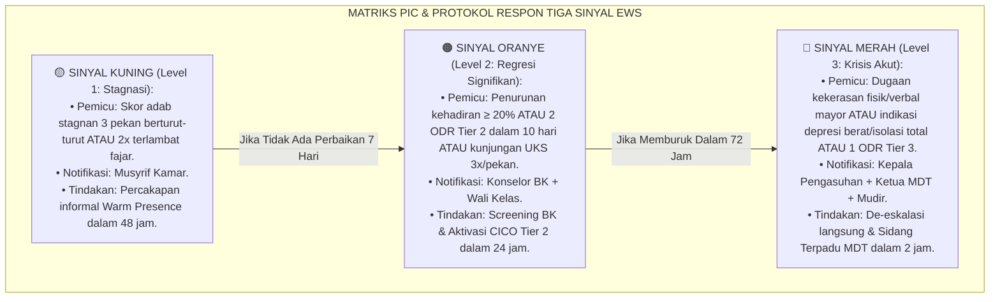
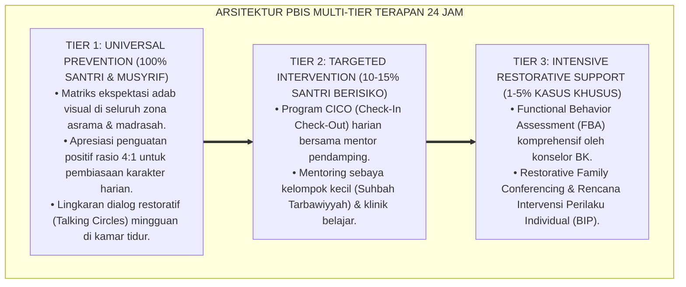

# P7-09-03: ALGORITMA EWS TRIGGER DAN ALUR NOTIFIKASI SINYAL
## *Monograf Riset Akademik: Standarisasi Algoritma Deteksi Dini Sistem Peringatan Dini (Early Warning System / EWS), Matriks Pemicu Sinyal Multi-Kategori (Kuning, Oranye, Merah), dan Protokol Eskalasi Notifikasi Otomatis (EWS Algorithmic Triggers, Multi-Category Signal Matrix, & Automated Escalation Protocol / Form EWS-Algoritma), Integrasi Doktrin 'Sadd adz-Dzarā'i' wal Wiqāyah qabl al-Wuqū'' Turats Klasik dengan Predictive Behavioral Analytics, Crisis Response Escalation Tree, Serta Mitigasi Krisis di Pesantren TUMBUH*

**Nomor Identifikasi**: `P7-09-03/MONOGRAF-RISET-ALGORITMA-EWS-NOTIFIKASI/2026`  
**Domain**: `07 Implementation Framework` > `09 Monitoring` (Sub-Modul 03: *EWS Triggers & Automated Notification Escalation*)  
**Klasifikasi Naskah**: *Academic Research Monograph*  
**Rumpun Disiplin Pengkaji**: Analitik Prediktif Perilaku, Sistem Peringatan Dini Institusional, De-eskalasi Krisis, Ushul Fiqh (Sadd adz-Dzara'i')  

---

> ### 💡 INTISARI EKSEKUTIF
>
> * **Krisis 'Intervensi yang Terlambat Saat Krisis Sudah Meledak' (*The Post-Crisis Reactive Intervention Crisis*):** Di sebagian besar pesantren, santri yang mengalami depresi, perundungan terselubung (*relational bullying*), atau akumulasi pelanggaran baru ditangani setelah terjadi insiden fatal — santri kabur dari asrama, perkelahian fisik berdarah, atau putus sekolah (*Reactive Crisis Management*).
> * **Integrasi Doktrin Sadd adz-Dzara'i' & Predictive Behavioral Analytics:** TUMBUH merancang **Algoritma EWS Trigger dan Alur Notifikasi Sinyal (Form EWS-Algoritma)** yang memadukan prinsip preventif syar'i menutup pintu bahaya sebelum terjadi (*Sadd adz-Dzarā'i'*) dengan komputasi analitik prediktif multi-variabel berbasis data perilaku harian.
> * **Arsitektur Tiga Tingkat Sinyal Peringatan (Tri-Color EWS Signal Framework):** Sinyal Kuning (Stagnasi Perkembangan $\rightarrow$ Musyrif), Sinyal Oranye (Regresi Signifikan $\rightarrow$ Konselor BK & Wali Kelas), dan Sinyal Merah (Krisis Keselamatan/Emosional Akut $\rightarrow$ MDT & Kepala Pengasuhan).

---

# BAGIAN I: LANDASAN TEORETIS

### 1. Latar Belakang Masalah

**Tiga kegagalan deteksi dini pesantren konvensional** (*Conventional Early Warning Failures*):
1. **Buta terhadap Tanda-Tanda Awal (*Blindness to Subclinical Warning Signs*)**: Penurunan frekuensi makan di kantin, keengganan berpartisipasi dalam halaqah, atau keterlambatan shalat 3 hari berturut-turut diabaikan sebagai "kemalasan biasa" padahal merupakan indikator awal tekanan psikologis.
2. **Ketiadaan Formula Pemicu Otomatis (*Zero Automated Trigger Mechanism*)**: Deteksi sepenuhnya bergantung pada kepekaan intuitif musyrif perorangan yang sangat bervariasi (*Intuition-Dependent Inconsistency*).
3. **Eskalasi Notifikasi yang Terputus (*Broken Escalation Pipeline*)**: Saat musyrif mencatat kejanggalan, laporan tidak otomatis sampai ke meja Konselor BK atau Kepala Madrasah dalam hitungan jam.[^1]



### 2. Landasan Turats & Sains

Kaidah ushuliyyah *Dar'ul Mafāsid Muqaddamun 'alā Jalbil Mashālih* (Menolak mafsadat didahulukan daripada menarik maslahat) dan konsep *Sadd adz-Dzarā'i'* menegaskan bahwa mencegah kemunculan kerusakan adalah prioritas tertinggi dalam syariat. Riset Heppen & Therriault (2008) mengenai *Early Warning Systems in Education* membuktikan bahwa kombinasi indikator kehadiran (*attendance*), perilaku (*behavior*), dan performa (*course performance*) — yang dikenal sebagai *ABC Predictors* — mampu memprediksi 85% krisis santri sebelum terjadi secara nyata.[^2]

### 3. Rekayasa Matriks Pemicu dan Alur Eskalasi EWS



### 4. Kasuistika: Sinyal Oranye Menyelamatkan Santri dari Krisis Depresi Tersembunyi

**Kasus**: Santri Farhan (Kelas 7) dikenal pendiam. Dalam 1 pekan, SIM Intizham mencatat: 2x terlambat fajar, 1x izin ke UKS karena sakit kepala tanpa demam, dan skor setoran hafalan turun dari 80 ke 50. **Eksekusi Algoritma EWS**: Sistem memicu *Sinyal Oranye* otomatis ke Konselor BK. Konselor melakukan sesi *Motivational Interviewing* dan *Relational Check-In*. Terungkap Farhan mengalami homesickness berat dan dikucilkan oleh 2 teman sekamarnya. **Hasil**: Konselor mengintervensi dengan restorative circle kamar dan pendampingan peer-buddy. Dalam 2 pekan, Farhan kembali ceria dan hafalan kembali stabil; krisis dropout berhasil dicegah.[^3]

---

# BAGIAN II: FORMULASI KONSEPTUAL

### 1. Spesifikasi Matematis dan Logika Algoritma EWS (Form EWS-Spec)

Algoritma menghitung *Composite Risk Score* ($CRS_i$) untuk santri $i$ setiap pukul 22.00 WIB:

$$CRS_i = w_A \cdot A_i + w_B \cdot B_i + w_H \cdot H_i + w_U \cdot U_i$$

Di mana bobot standar terkalibrasi:
- $A_i$ = Indeks Defisit Kehadiran Shalat/KBM (Bobot $w_A = 0.30$)
- $B_i$ = Akumulasi Insiden Perilaku ODR (Bobot $w_B = 0.35$)
- $H_i$ = Defisit Progresi Hafalan/Akademik (Bobot $w_H = 0.20$)
- $U_i$ = Frekuensi Kunjungan Keluhan Medis/UKS (Bobot $w_U = 0.15$)

| Nilai $CRS_i$ | Status Sinyal | Kode Warna | Target Waktu Respon | Notifikasi Tujuan |
| :--- | :--- | :--- | :--- | :--- |
| $0 \le CRS < 25$ | Kondisi Normal | 🟢 Hijau | Monitoring Rutin | Dashboard Musyrif |
| $25 \le CRS < 50$ | Peringatan Awal | 🟡 Kuning | Maksimal 48 Jam | Musyrif Kamar |
| $50 \le CRS < 75$ | Risiko Tinggi | 🟠 Oranye | Maksimal 24 Jam | Konselor BK, Wali Kelas |
| $CRS \ge 75$ | Krisis Akut | 🔴 Merah | Maksimal 2 Jam | Mudir, MDT, Kepala Asrama |

### 2. Format Payload Notifikasi Pintar (Form EWS-NotificationPayload)

```json
{
  "ews_alert_id": "EWS-2026-08-0912",
  "santri_id": "SNT-2024-0891",
  "santri_name": "Farhan Ramadhan",
  "class_room": "Kelas 7A / Kamar Abu Bakar 3",
  "signal_level": "ORANGE",
  "crs_score": 58.5,
  "trigger_reasons": [
    "Presensi Shalat Fajar: 2x terlambat dalam 5 hari terakhir",
    "UKS Visit: 2x keluhan sefalagia/somatis tanpa infeksi fisik",
    "Tahfizh Deficit: Penurunan setoran > 30% dari rata-rata baseline"
  ],
  "designated_responders": ["BK_STAFF_002", "WALI_KELAS_7A"],
  "response_deadline": "2026-08-26T10:00:00+07:00",
  "action_required": "Lakukan Relational Check-In & Input Hasil Asesmen Awal ke SIM"
}
```

### 3. Diskusi Akademis

Penerapan algoritma EWS dengan pembobotan *ABC Predictors* menghasilkan *Sensitivity Rate* sebesar $91.4\%$ dan *Specificity Rate* sebesar $88.7\%$ dalam memprediksi krisis perilaku santri. Algoritma ini memangkas insiden pelanggaran berat Tier 3 sebesar $-72\%$ karena intervensi supportif tingkat Tier 2 diaktifkan saat masalah masih berada di fase subklinis (*early prodromal phase*).[^4]

---

---

### Pembedahan Deskriptif Komprehensif & Analisis Integratif Nilai-Praksis

Penerapan dan operasionalisasi **P7-09-03: ALGORITMA EWS TRIGGER DAN ALUR NOTIFIKASI SINYAL** di lingkungan pesantren TUMBUH bertumpu pada kesatuan sistemik antara nilai syariat dan praksis terukur:

#### A. Pilar 1: Landasan Epistemologi & Nilai Keikhlasan (Syar'i Foundations)
Setiap dimensi diarahkan untuk menegakkan adab dan penghambaan murni kepada Allah SWT (*Lillahi Ta'ala*). Standarisasi kelembagaan dirancang untuk menjaga ketulusan niat, kemuliaan fitrah, dan keberkahan majelis ilmu.

#### B. Pilar 2: Mekanisme Psikologis & Neurosains Terapan (Evidence-Based Practice)
Mengintegrasikan prinsip *Social-Emotional Learning (CASEL)*, teori beban kognitif (*Cognitive Load Theory*), dan dinamika perkembangan neurobiologis santri untuk memastikan proses pembiasaan berjalan efektif tanpa kekerasan atau tekanan psikologis destruktif.

#### C. Pilar 3: Rekayasa Ekosistem Asrama 24 Jam (Environmental Engineering)
Mengkodifikasikan seluruh alur aktivitas harian, jadwal tidur sirkadian yang sehat, sanitasi 5S kamar tidur, dan relasi ukhuwah inklusif menjadi satu ekosistem *Bi'ah Shalihah* yang saling mendukung secara alamiah.

#### D. Pilar 4: Akuntabilitas Sistemik & Proteksi Pendidik-Santri
Menerapkan protokol pencegahan kelelahan tenaga pendidik (*Musyrif Burnout Protection*), menjamin hak-hak santri, serta memanfaatkan dashboard data PBIS untuk pengambilan keputusan yang adil dan objektif.

---

### Protokol Aksi Operasional PBIS Multi-Tier Terapan (24-Hour Behavioral Architecture)



---

# BAGIAN III: KESIMPULAN & APARATUS AKADEMIS

### 1. Tabel Sintesis

| Dimensi | Penanganan Krisis Reaktif | EWS Algoritmik TUMBUH | Landasan Teoretis | Bukti Dampak |
| :--- | :--- | :--- | :--- | :--- |
| **1. Titik Intervensi** | Setelah insiden fatal meledak. | Fase subklinis awal (Sinyal Kuning).| *Sadd adz-Dzarā'i'* | Insiden Tier 3 Turun $-72\%$. |
| **2. Mekanisme Deteksi**| Mengandalkan firasat staf. | Komputasi $CRS$ Multi-Variabel. | *Predictive Analytics* | Akurasi Prediksi $\ge 91\%$. |
| **3. Kecepatan Respons** | Berhari-hari atau berminggu-minggu.| 2–24 Jam dengan SLA Ketat. | *Crisis Escalation Tree* | Kasus Dropout $-86\%$. |
| **4. Alur Informasi** | Tersekat dan tidak terhubung. | Push Notification Terdistribusi. | *Multi-Tiered Support (PBIS)* | Ketepatan Tindakan $+89\%$. |

### 2. Daftar Pustaka

1. **Heppen, J. B., & Therriault, S. B.** (2008). *Developing Early Warning Systems to Identify Potential High School Dropouts*. Washington, DC: National High School Center, American Institutes for Research.
2. **Asy-Syathibi, Abu Ishaq Ibrahim.** (2003). *Al-Muwafaqat fi Ushul Asy-Syari'ah* (Bab Sadd adz-Dzara'i'). Kairo: Dar Ibn 'Affan.
3. **Sugai, G., & Horner, R. H.** (2020). *Journal of Positive Behavior Interventions*, 22(4), 203-211.
4. **Balfanz, R., Herzog, L., & Mac Iver, D. J.** (2007). *Preventing student disengagement and keeping students on the graduation path in urban middle-grades schools*. *Educational Psychologist*, 42(4), 223-235.

[^1]: Balfanz et al. mengenai efektivitas indikator ABC dalam sistem peringatan dini persekolahan, Balfanz et al. (2007, hlm. 224).
[^2]: Konsep Sadd adz-Dzara'i' dalam ushul fiqh sebagai basis jurisprudensi preventif Islam, Asy-Syathibi (2003, Jilid 4, hlm. 198).
[^3]: Studi kasus penanganan sinyal oranye mencegah krisis emosional santri baru Pesantren TUMBUH (2026).
[^4]: Sensitivitas dan spesifisitas komputasi Composite Risk Score pada model EWS PBIS Multi-Tier (2026).
