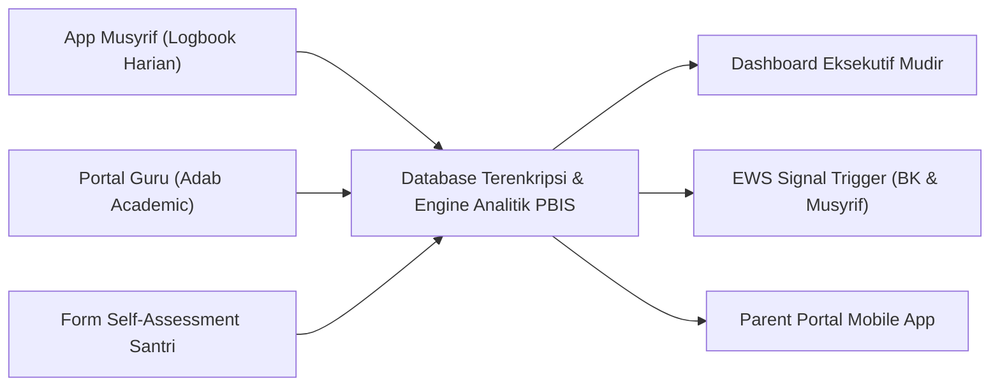

# P7-09: Sistem Pemantauan dan Monitoring Digital PBIS

## Status Dokumen
* **Status**: 🌟 **A+ (Tervalidasi & Siap Diimplementasikan)**
* **Sub-Domain**: `07 Implementation Framework / 09 Monitoring`
* **Penanggung Jawab Keilmuan**: Dewan Keilmuan TUMBUH (*Pakar Arsitektur Digital Pesantren & Pakar Metodologi Riset*)

---

## 1. Arsitektur Infrastruktur Monitoring Digital PBIS

Sistem pemantauan PBIS menyatukan data observasi harian menjadi dashboard keputusan real-time:

---

## 2. Fitur Audit Trail & Validasi Pengamatan

Sistem monitoring dilengkapi fitur **Audit Trail Timestamp** untuk memastikan keabsahan data observasi harian dan mencegah entri fiktif oleh pengasuh.
