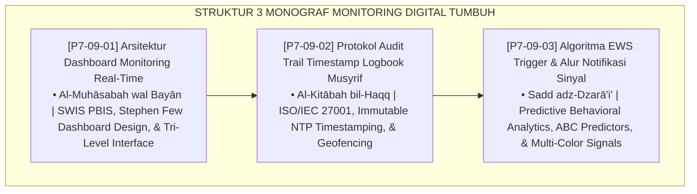

# P7-09: DOKUMEN INDUK SISTEM PEMANTAUAN DAN MONITORING DIGITAL PBIS
## *Arsitektur dan Standarisasi Dashboard Monitoring Real-Time Tri-Level, Protokol Audit Trail Terenkripsi dengan Geofencing, dan Algoritma Early Warning System (EWS) Multi-Sinyal sebagai Tiga Pilar Monitoring Digital Terpadu (Real-Time Dashboard Form ADM, Audit Trail Protocol Form ATL, Serta EWS Signal Triggers Form EWS) di Ekosistem TUMBUH Pesantren*

**Nomor Identifikasi**: `P7-09/DOKUMEN-INDUK-SISTEM-MONITORING-DIGITAL-PBIS/2026`  
**Domain**: `07 Implementation Framework` > `09 Monitoring` (Gugus Sub-Domain 09: *Real-Time Dashboard, Audit Trail Verification, & EWS Predictive Signals*)  
**Klasifikasi Naskah**: *Master Architecture & Navigation Monograph*  
**Rumpun Disiplin Pengkaji**: Arsitektur Sistem Informasi Pesantren, Integritas Data Digital ISO/IEC 27001, Analitik Prediktif Perilaku, SWIS PBIS Multi-Tier  

---

> ### 💡 INTISARI EKSEKUTIF
>
> * **Kedudukan Strategis Gugus Monitoring Digital PBIS:** Gugus ini adalah sistem saraf pusat (*central nervous system*) ekosistem pengasuhan TUMBUH. Melalui integrasi data real-time, audit trail tak terbantahkan, dan deteksi prediktif, seluruh tim pengasuhan bertransisi dari penanganan reaktif menjadi pendampingan proaktif berbasis data (*From Reactive Guesswork to Proactive Precision*).
> * **Triad Monitoring Digital TUMBUH:** (1) **Dashboard Real-Time** yang memvisualisasikan kesehatan iklim lembaga melintasi 3 tingkatan pengguna, (2) **Protokol Audit Trail** yang menjamin keaslian dan akurasi observasi lapangan secara kriptografis, dan (3) **Algoritma EWS** yang mendeteksi risiko santri di fase subklinis sebelum meledak menjadi krisis.
> * **3 Monograf Riset Komprehensif:** Form ADM-Dashboard, Form ATL-Logbook, dan Form EWS-Algoritma.

---

## 📑 PETA NAVIGASI TIGA MONOGRAF

---

## 📚 DESKRIPSI RINGKAS 3 BERKAS MONOGRAF

1. **[P7-09-01: Arsitektur Dashboard Monitoring Real-Time](file:///c:/xampp/htdocs/tumbuh/07%20Implementation%20Framework/09%20Monitoring/P7-09-01-Arsitektur-Dashboard-Monitoring-Real-Time.md)**  
   *Spesifikasi panel visual tri-level (Mudir, BK, Musyrif), visualisasi metrik PBIS, heatmap waktu-lokasi, mobile-first PWA, dan Form ADM-Dashboard.*
2. **[P7-09-02: Protokol Audit Trail Timestamp Logbook Musyrif](file:///c:/xampp/htdocs/tumbuh/07%20Implementation%20Framework/09%20Monitoring/P7-09-02-Protokol-Audit-Trail-Timestamp-Logbook-Musyrif.md)**  
   *Otentikasi server-side NTP unalterable, verifikasi zona geofencing GPS, immutable audit log SHA-256, eliminasi data rapelan, dan Form ATL-Logbook.*
3. **[P7-09-03: Algoritma EWS Trigger dan Alur Notifikasi Sinyal](file:///c:/xampp/htdocs/tumbuh/07%20Implementation%20Framework/09%20Monitoring/P7-09-03-Algoritma-EWS-Trigger-dan-Alur-Notifikasi-Sinyal.md)**  
   *Komputasi Composite Risk Score (CRS), matriks pemicu sinyal Kuning/Oranye/Merah, alur eskalasi otomatis berbasis SLA ketat, dan Form EWS-Algoritma.*

---

## 🎯 STANDAR PENJAMINAN MUTU SISTEM MONITORING

Penerapan gugus **Sistem Pemantauan dan Monitoring Digital PBIS** menjamin bahwa:
1. **Keputusan Pembinaan Selalu Berbasis Bukti Faktual Murni (*Evidence-Based Practice Guarantee*)**: Dashboard real-time menghilangkan bias ingatan dan subjektivitas staf.
2. **Data Observasi Memiliki Nilai Integritas Forensik Tertinggi (*Data Integrity & Trust Guarantee*)**: Audit trail menjamin zero pemalsuan atau manipulasi catatan santri.
3. **Tidak Ada Santri yang Mengalami Krisis Tanpa Deteksi Dini (*Zero Unnoticed Regression Guarantee*)**: Algoritma EWS mendeteksi anomali perilaku dalam hitungan jam untuk intervensi preventif segera.
