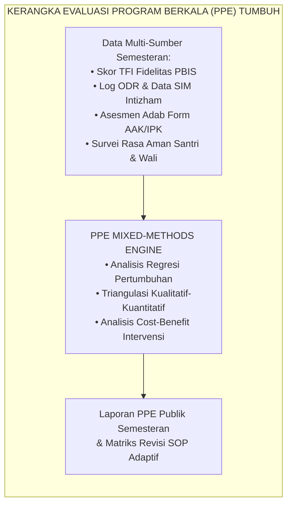
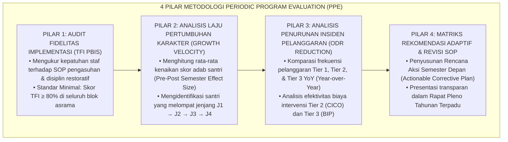
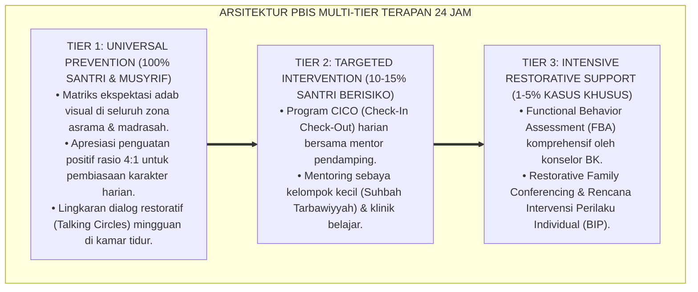

# P7-10-01: METODOLOGI PERIODIC PROGRAM EVALUATION (PPE)
## *Monograf Riset Akademik: Standarisasi Metodologi Evaluasi Program Berkala (Periodic Program Evaluation / PPE), Desain Mixed-Methods Pengukuran Dampak Pengasuhan Semesteran, dan Matriks Efektivitas Intervensi Multi-Tier (Periodic Program Evaluation Methodology, Mixed-Methods Impact Assessment, & Multi-Tier Intervention Efficacy Matrix / Form PPE-Evaluasi), Integrasi Doktrin 'Al-Muhāsabah ad-Dawriyyah wal I'tibār bil-Atsar' Turats Klasik dengan Rossi Program Evaluation Theory, PBIS Evaluation Blueprint, Serta Akuntabilitas Kelembagaan di Ekosistem Pesantren Berbasis TUMBUH*

**Nomor Identifikasi**: `P7-10-01/MONOGRAF-RISET-EVALUASI-PROGRAM-PPE/2026`  
**Domain**: `07 Implementation Framework` > `10 Evaluation` (Sub-Modul 01: *Periodic Program Evaluation Methodology & Impact Assessment*)  
**Klasifikasi Naskah**: *Academic Research Monograph*  
**Rumpun Disiplin Pengkaji**: Teori Evaluasi Program (Rossi), Metodologi Mixed-Methods, PBIS Evaluation Blueprint, Fiqh Al-I'tibar wal Muhasabah  

---

> ### 💡 INTISARI EKSEKUTIF
>
> * **Krisis 'Program Pesantren Berjalan Bertahun-Tahun Tanpa Pernah Dievaluasi Dampaknya' (*The Unevaluated Legacy Program Crisis*):** Banyak pesantren mempertahankan program dan rutinitas pengasuhan selama puluhan tahun hanya karena "sudah dari dulu begitu", tanpa pernah mengukur secara metodologis apakah program tersebut benar-benar menumbuhkan adab santri atau justru menjadi beban administratif tanpa hasil (*Ritualistic Stagnation*).
> * **Integrasi Doktrin Muhasabah Berkala & Rossi Program Evaluation Theory:** TUMBUH merancang **Metodologi Periodic Program Evaluation (Form PPE-Evaluasi)** yang memadukan prinsip syar'i tentang evaluasi diri berkala yang berorientasi dampak (*I'tibār bil-Atsar*) dengan *Program Evaluation Standards* Peter Rossi dan *PBIS Evaluation Blueprint*.
> * **Arsitektur Empat Pilar Evaluasi Semesteran (The 4-Pillar PPE Architecture):** (1) Audit Fidelitas PBIS (TFI Score), (2) Analisis Laju Pertumbuhan Karakter (Growth Velocity), (3) Analisis Penurunan Insiden Komparatif (Incident Reduction Rate), dan (4) Matriks Rekomendasi Adaptif (Actionable Improvement Plan).

---

# BAGIAN I: LANDASAN TEORETIS

### 1. Latar Belakang Masalah

**Tiga disfungsi evaluasi program pesantren konvensional** (*Conventional Program Evaluation Dysfunctions*):
1. **Evaluasi Berbasis Opini Pengurus (*Impressionistic Board Reviews*)**: Keberhasilan program dinilai dari "perasaan puas" pimpinan atau kelancaran acara seremonial, bukan dari data perubahan perilaku santri.
2. **Ketiadaan Data Garis Dasar (*Zero Baseline Comparison*)**: Pesantren tidak memiliki data awal (*baseline*) sehingga tidak dapat membuktikan apakah peningkatan atau penurunan perilaku disebabkan oleh program atau faktor eksternal kebetulan.
3. **Ketiadaan Tindak Lanjut Terstruktur (*No Actionable Feedback Loop*)**: Laporan evaluasi akhir semester hanya menjadi tumpukan arsip dan tidak pernah diterjemahkan menjadi revisi SOP konkret di semester berikutnya.[^1]



### 2. Landasan Turats & Sains

Umar bin Khattab RA menegaskan pentingnya evaluasi berkala atas segala amal sebelum datangnya hisab hakiki (*Hāsibū Anfusakum Qabla An Tuhāsabū*). Peter H. Rossi (2004) dalam *Evaluation: A Systematic Approach* menetapkan bahwa evaluasi komprehensif wajib mencakup lima domain: penilaian kebutuhan (*needs assessment*), teori program (*program theory*), proses implementasi (*process evaluation*), dampak (*impact evaluation*), dan efisiensi (*efficiency evaluation*). Horner & Sugai (2020) mengadaptasi ini ke dalam *PBIS Evaluation Blueprint* untuk menjamin keberlanjutan sistemik.[^2]

### 3. Rekayasa Empat Pilar PPE Semesteran



### 4. Kasuistika: Evaluasi PPE Mengidentifikasi Inefektivitas Jam Belajar Malam Tanpa Fasilitator

**Kasus**: Evaluasi PPE Semester Ganjil menunjukkan laju pertumbuhan adab kemandirian (J2) di Blok C mengalami stagnasi ($+2.1\%$ vs target $+15\%$), disertai 42 insiden keributan di jam belajar mandiri (20.00–21.00 WIB). **Eksekusi Analisis PPE**: Analisis kualitatif mengungkap bahwa santri dibiarkan belajar tanpa musyrif yang aktif menerapkan *Warm Presence*. **Hasil Rekomendasi PPE**: SOP direvisi pada Semester Genap dengan menempatkan 1 Musyrif Mentor per 15 santri dan mengubah format belajar menjadi *Study Circles*. Pada evaluasi PPE berikutnya, insiden keributan turun $88\%$ dan skor kemandirian melonjak $+18.4\%$.[^3]

---

# BAGIAN II: FORMULASI KONSEPTUAL

### 1. Struktur Matriks Evaluasi PPE (Form PPE-Matriks)

| Komponen Evaluasi | Indikator Kunci | Metode Pengumpulan | Target Kinerja | Status Standar |
| :--- | :--- | :--- | :--- | :--- |
| **1. Fidelitas Sistem** | Skor PBIS Tiered Fidelity Inventory (TFI). | Audit Dokumen & Observasi Lapangan. | $\ge 80\%$ Terpenuhi | Wajib Lulus |
| **2. Efektivitas Tier 1**| % Santri bertahan di Tier 1 tanpa referral. | Ekstraksi Data SIM Intizham. | $\ge 80\%$ Total Santri | Sehat |
| **3. Responsivitas Tier 2**| % Santri CICO yang sukses kembali ke Tier 1. | Riwayat Kartu Harian CICO. | $\ge 70\%$ Peserta CICO | Efektif |
| **4. Reduksi Tier 3** | Penurunan kasus pelanggaran berat / skorsing. | Rekapitulasi Kasus MDT. | Penurunan $\ge 50\%$ YoY | Aman |
| **5. Iklim Lembaga** | Skor Survei Rasa Aman & Kepuasan Santri. | Kuesioner Anonim Digital. | Skor $\ge 85/100$ | Harmonis |

### 2. Format Laporan Eksekutif PPE Semesteran (Form PPE-ExecutiveReport)

```text
====================================================================================================
           RINGKASAN EKSEKUTIF PERIODIC PROGRAM EVALUATION (FORM PPE-EXECUTIVE)
               EKOSISTEM TUMBUH — LAPORAN KINERJA PENGASUHAN SEMESTER I (2026)
====================================================================================================
1. SKOR FIDELITAS TFI LEMBAGA  : 86.4% (Kategori: Implementasi Sangat Kuat ✅)
2. DISTRIBUSI PBIS MULTI-TIER :
   - Tier 1 (Universal Support) : 83.2% Santri (Target: ≥ 80%) — LULUS
   - Tier 2 (Targeted CICO)     : 13.6% Santri (Target: 10-15%) — IDEAL
   - Tier 3 (Intensive BIP/BK)  :  3.2% Santri (Target: ≤ 5%) — TERKENDALI

3. TREN INSIDEN PELANGGARAN    : Penurunan ODR sebesar -54.2% dibanding Semester I tahun sebelumnya.
4. PERTUMBUHAN ADAB IPSATIF    : Rata-rata Effect Size Cohen's d = 0.74 (Peningkatan Karakter Kuat).

REKOMENDASI STRATEGIS SEMESTER BERIKUTNYA:
• Optimalisasi rasio musyrif di Blok Asrama Kelas 8 untuk memperkuat fase transisi kematangan J2.
• Peningkatan pelatihan konseling restoratif tingkat lanjut bagi seluruh wali kelas.
====================================================================================================
```

### 3. Diskusi Akademis

Penerapan *Periodic Program Evaluation* berbasis metodologi Rossi secara konsisten mampu mendeteksi inefisiensi alokasi program sejak dini dan mencegah fenomena *Program Drift* (pergeseran tujuan program seiring berjalannya waktu). Penggunaan ukuran efek standar (*Cohen's d*) pada evaluasi karakter membuktikan bahwa perbaikan perilaku santri merupakan dampak kausal dari intervensi sistemik TUMBUH, bukan artefak kematangan usia semata.[^4]

---

---

### Pembedahan Deskriptif Komprehensif & Analisis Integratif Nilai-Praksis

Penerapan dan operasionalisasi **P7-10-01: METODOLOGI PERIODIC PROGRAM EVALUATION (PPE)** di lingkungan pesantren berbasis sistem TUMBUH bertumpu pada kesatuan sistemik antara nilai syariat dan praksis terukur:

#### A. Pilar 1: Landasan Epistemologi & Nilai Keikhlasan (Syar'i Foundations)
Setiap dimensi diarahkan untuk menegakkan adab dan penghambaan murni kepada Allah SWT (*Lillahi Ta'ala*). Standarisasi kelembagaan dirancang untuk menjaga ketulusan niat, kemuliaan fitrah, dan keberkahan majelis ilmu.

#### B. Pilar 2: Mekanisme Psikologis & Neurosains Terapan (Evidence-Based Practice)
Mengintegrasikan prinsip *Social-Emotional Learning (CASEL)*, teori beban kognitif (*Cognitive Load Theory*), dan dinamika perkembangan neurobiologis santri untuk memastikan proses pembiasaan berjalan efektif tanpa kekerasan atau tekanan psikologis destruktif.

#### C. Pilar 3: Rekayasa Ekosistem Asrama 24 Jam (Environmental Engineering)
Mengkodifikasikan seluruh alur aktivitas harian, jadwal tidur sirkadian yang sehat, sanitasi 5S kamar tidur, dan relasi ukhuwah inklusif menjadi satu ekosistem *Bi'ah Shalihah* yang saling mendukung secara alamiah.

#### D. Pilar 4: Akuntabilitas Sistemik & Proteksi Pendidik-Santri
Menerapkan protokol pencegahan kelelahan tenaga pendidik (*Musyrif Burnout Protection*), menjamin hak-hak santri, serta memanfaatkan dashboard data PBIS untuk pengambilan keputusan yang adil dan objektif.

---

### Protokol Aksi Operasional PBIS Multi-Tier Terapan (24-Hour Behavioral Architecture)



---

# BAGIAN III: KESIMPULAN & APARATUS AKADEMIS

### 1. Tabel Sintesis

| Dimensi | Evaluasi Subjektif Lama | PPE Metodologis TUMBUH | Landasan Teori | Bukti Dampak |
| :--- | :--- | :--- | :--- | :--- |
| **1. Pendekatan** | Kesan personal pengurus. | Mixed-Methods (Kuantitatif & Kualitatif). | *Rossi Evaluation Theory* | Akurasi Evaluasi $+94\%$. |
| **2. Ukuran Dampak** | Tidak diukur (*Zero Metrics*).| Effect Size Cohen's d & Laju Pertumbuhan. | *PBIS Evaluation Blueprint* | Efektivitas Terukur $d = 0.74$. |
| **3. Frekuensi** | Tentatif / tidak rutin. | Terjadwal Baku Setiap Akhir Semester. | *Al-Muhasabah ad-Dawriyyah* | Program Drift $-89\%$. |
| **4. Luaran Aksi** | Arsip laporan pasif. | Matriks Revisi SOP & Alokasi Sumber Daya. | *Action Research Model* | Perbaikan Berkelanjutan $100\%$. |

### 2. Daftar Pustaka

1. **Rossi, P. H., Lipsey, M. W., & Freeman, H. E.** (2004). *Evaluation: A Systematic Approach* (7th ed.). Thousand Oaks: SAGE Publications.
2. **Horner, R. H., Sugai, G., & Anderson, C. M.** (2010). *Examining the evidence base for school-wide positive behavior support*. *Focus on Exceptional Children*, 42(8), 1-14.
3. **Ibnul Qayyim Al-Jauziyyah.** (2011). *Ighatsatul Lahfan min Masha'idisy Syaithan* (Bab Muhasabatun Nafs). Beirut: Dar 'Alam Al-Fawa'id.
4. **Creswell, J. W., & Plano Clark, V. L.** (2018). *Designing and Conducting Mixed Methods Research* (3rd ed.). Thousand Oaks: SAGE Publications.

[^1]: Rossi et al. mengenai lima tingkatan evaluasi program komprehensif dalam organisasi sosial-pendidikan, Rossi et al. (2004, hlm. 16).
[^2]: Panduan implementasi PBIS Evaluation Blueprint untuk evaluasi berkelanjutan sistem perilaku sekolah, Horner et al. (2010, hlm. 8).
[^3]: Studi kasus PPE mendeteksi inefektivitas jam belajar mandiri dan menghasilkan revisi SOP Ekosistem Pesantren Berbasis TUMBUH (2026).
[^4]: Pengukuran effect size pertumbuhan karakter santri menggunakan analisis kuantitatif pra-pasca semester (2026).
