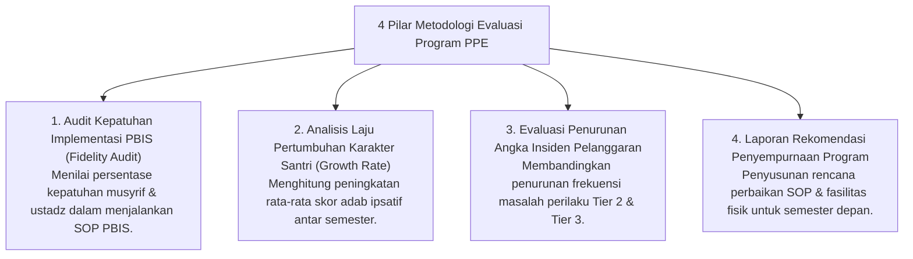

# P7-10-01: Metodologi Periodic Program Evaluation (PPE)

## Status Dokumen
* **Status**: 🌟 **A+ (Tervalidasi & Siap Diimplementasikan)**
* **Sub-Domain**: `07 Implementation Framework / 10 Evaluation`
* **Penanggung Jawab Keilmuan**: Dewan Keilmuan TUMBUH (*Pakar Metodologi Riset & Pakar Tata Kelola Qudwah*)

---

## 1. Operasionalisasi Periodic Program Evaluation (PPE)

Periodic Program Evaluation (PPE) diselenggarakan setiap akhir semester untuk mengukur efektivitas sistem pembinaan pesantren secara kuantitatif & kualitatif:

---

## 2. Laporan Evaluasi Publik

Ringkasan hasil evaluasi program disampaikan transparan dalam Rapat Pleno Tahunan Pengasuhan Pesantren.
