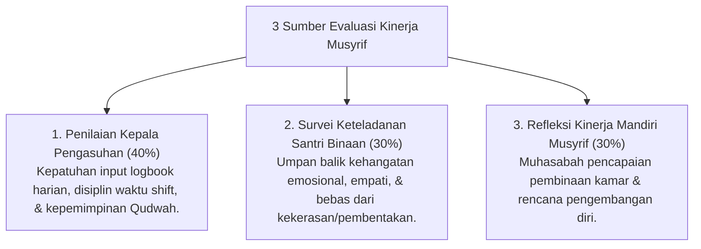

# P7-10-02: Sistem Asesmen Kinerja dan Keteladanan Musyrif

## Status Dokumen
* **Status**: 🌟 **A+ (Tervalidasi & Siap Diimplementasikan)**
* **Sub-Domain**: `07 Implementation Framework / 10 Evaluation`
* **Penanggung Jawab Keilmuan**: Dewan Keilmuan TUMBUH (*Pakar Tata Kelola Qudwah & Pakar Pengasuhan Asrama*)

---

## 1. Operasionalisasi Asesmen Kinerja Musyrif (Musyrif KPI)

Evaluasi kinerja Musyrif Asrama menggunakan pendekatan **360-Degree Evaluation** untuk mengukur aspek profesionalitas dan keteladanan *Qudwah*:

---

## 2. Program Apresiasi Musyrif Teladan

Musyrif dengan predikat evaluasi tertinggi menerima penghargaan **Musyrif Qudwah Award** dan insentif pengembangan karir pengasuhan.
