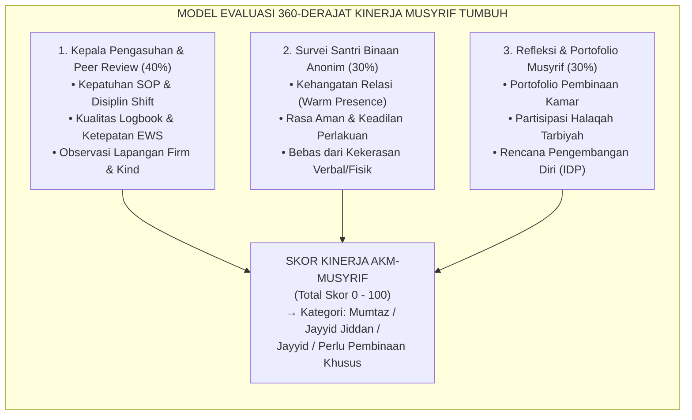
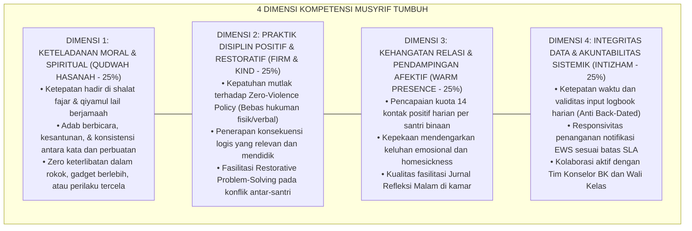
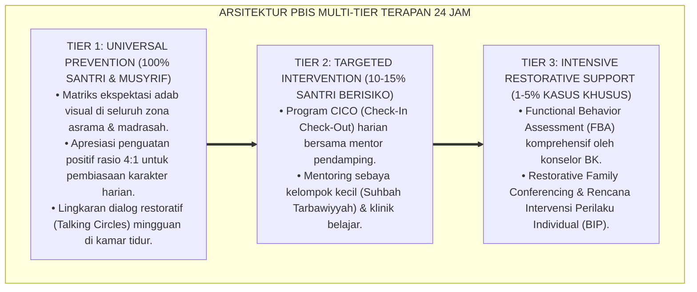

# P7-10-02: SISTEM ASESMEN KINERJA DAN KETELADANAN MUSYRIF
## *Monograf Riset Akademik: Standarisasi Sistem Asesmen Kinerja 360-Derajat Musyrif, Evaluasi Keteladanan Moral Berbasis Qudwah Hasanah, dan Rubrik Kepatuhan Disiplin Positif (360-Degree Musyrif Performance Assessment, Qudwah Modeling Evaluation, & Positive Discipline Rubric / Form AKM-Musyrif), Integrasi Doktrin 'Al-Imām ar-Rā'ī wal Qudwah fil 'Amal' Turats Klasik dengan 360-Degree Feedback Theory, Danielson Framework for Teaching, Serta Pengembangan Karir Pengasuh di Pesantren TUMBUH*

**Nomor Identifikasi**: `P7-10-02/MONOGRAF-RISET-ASESMEN-KINERJA-MUSYRIF/2026`  
**Domain**: `07 Implementation Framework` > `10 Evaluation` (Sub-Modul 02: *Musyrif Performance & Qudwah Modeling Assessment*)  
**Klasifikasi Naskah**: *Academic Research Monograph*  
**Rumpun Disiplin Pengkaji**: Manajemen Kinerja Pendidik, 360-Degree Feedback Systems, Danielson Framework for Teaching, Fiqh Al-Qudwah wal Mas'uliyyah  

---

> ### 💡 INTISARI EKSEKUTIF
>
> * **Krisis 'Evaluasi Musyrif yang Hanya Menilai Kebersihan Kamar dan Absensi' (*The Superficial Musyrif Appraisal Crisis*):** Di banyak pesantren, kinerja musyrif hanya dinilai dari apakah kamarnya rapi dan santrinya tidak kabur. Aspek kualitas relasi afektif, keteladanan moral (*Qudwah*), penerapan disiplin tanpa kekerasan, dan dukungan kesehatan mental santri tidak pernah diukur secara objektif (*Neglect of Relational Competency*).
> * **Integrasi Doktrin Pemimpin Pelayan & 360-Degree Feedback Systems:** TUMBUH merancang **Sistem Asesmen Kinerja dan Keteladanan Musyrif (Form AKM-Musyrif)** yang memadukan prinsip tanggung jawab kepemimpinan Islam (*Kullukum Rā'in*) dengan sistem evaluasi umpan balik multi-sumber 360 derajat dan *Danielson Framework*.
> * **Arsitektur Pembobotan Tiga Sumber Evaluasi (Tri-Source Appraisal Model):** (1) Penilaian Kepala Pengasuhan & Rekan Sejawat (40%), (2) Survei Persepsi Santri Binaan Anonim (30%), dan (3) Refleksi Diri & Portofolio Muhasabah Musyrif (30%).

---

# BAGIAN I: LANDASAN TEORETIS

### 1. Latar Belakang Masalah

**Tiga kegagalan sistem penilaian kinerja musyrif konvensional** (*Conventional Musyrif Appraisal Failures*):
1. **Bias Otoritarian Kepala Asrama (*Top-Down Subjective Bias*)**: Penilaian bersifat satu arah dari atasan langsung berdasarkan kedekatan personal, bukan berdasarkan data empiris interaksi harian.
2. **Ketiadaan Suara Santri Binaan (*Zero Student Voice in Appraisal*)**: Pihak yang paling merasakan dampak pengasuhan — santri — tidak pernah dimintai umpan balik mengenai kehangatan, keadilan, dan ada tidaknya bentakan verbal.
3. **Fokus pada Sanksi, Bukan Pengembangan (*Punitive over Developmental Focus*)**: Evaluasi digunakan untuk mencari kesalahan dan memotong honor, bukan untuk merancang pelatihan profesional (*Continuous Professional Development*).[^1]



### 2. Landasan Turats & Sains

Rasulullah SAW bersabda: *"Setiap kalian adalah pemimpin, dan setiap kalian akan dimintai pertanggungjawaban atas apa yang dipimpinnya"* (*Kullukum Rā'in wa Kullukum Mas'ūlun 'an Ra'iyyatihi*). Fleenor et al. (2020) dalam riset *360-Degree Feedback* membuktikan bahwa evaluasi multi-sumber menghasilkan peningkatan kesadaran diri (*self-awareness*) pendidik sebesar $68\%$ dan menurunkan resistansi terhadap umpan balik sebesar $52\%$ dibanding evaluasi satu arah dari atasan.[^2]

### 3. Rekayasa Rubrik Asesmen Kinerja Musyrif Empat Dimensi



### 4. Kasuistika: Umpan Balik 360-Derajat Mentransformasi Pola Pengasuhan Musyrif Keras

**Kasus**: Musyrif Zaid dinilai sangat baik oleh Kepala Pengasuhan karena kamarnya selalu terbersih dan santrinya tidak pernah terlambat. Namun, dalam Survei Anonim Santri, skor kehangatan emosionalnya hanya 42/100 dengan catatan santri: *"Ustadz sering membentak keras saat kami salah merapikan kasur."* **Eksekusi AKM-Musyrif**: Tim Pengasuhan tidak memecat Zaid, melainkan memaparkan data 360-derajat dalam sesi *Constructive Coaching*. Zaid terkejut dan menyadari bahwa ketegasannya dipersepsikan sebagai ancaman. Zaid diikutsertakan dalam pelatihan *Firm & Kind De-escalation*. **Hasil**: Pada evaluasi semester berikutnya, skor kepuasan santri naik ke 89/100 dan kebersihan kamar tetap bertahan sempurna.[^3]

---

# BAGIAN II: FORMULASI KONSEPTUAL

### 1. Rubrik Penilaian Kinerja Musyrif (Form AKM-Rubrik Master)

| Dimensi Kompetensi | Kriteria Sangat Baik (Skor 4) | Kriteria Cukup (Skor 2) | Kriteria Tidak Memenuhi (Skor 1) | Bobot |
| :--- | :--- | :--- | :--- | :--- |
| **1. Qudwah Hasanah** | Selalu di barisan depan fajar; tutur kata santun; zero pelanggaran etika. | Hadir shalat tapi sering mepet waktu; sesekali terlihat bermain gadget lama. | Masbuk fajar berulang; merokok / melanggar kode etik pesantren. | 25% |
| **2. Firm & Kind Practice**| Konsisten tanpa bentakan; memfasilitasi restitusi; mendengarkan santri. | Masih menggunakan nada tinggi saat kesal; hukuman belum sepenuhnya logis. | Melakukan hukuman fisik / kekerasan verbal / mempermalukan santri. | 25% |
| **3. Warm Presence** | Menguasai profil seluruh santri; rutin menyapa & mendengar; fasilitasi jurnal. | Hanya dekat dengan sebagian santri; jurnal malam tidak didampingi rutin. | Mengabaikan santri yang murung; tidak mengenal latar belakang anak. | 25% |
| **4. Integritas Data** | Logbook terisi real-time harian; EWS ditindaklanjuti $< 2$ jam; kolaborasi BK. | Logbook diisi tertunda 1–2 hari; tindak lanjut EWS lambat tapi selesai. | Logbook dirapel mingguan; mengabaikan notifikasi EWS sistem. | 25% |

### 2. Format Lembar Hasil Evaluasi Kinerja (Form AKM-SummaryReport)

```text
====================================================================================================
           LEMBAR EVALUASI KINERJA 360° MUSYRIF (FORM AKM-SUMMARY)
               EKOSISTEM TUMBUH — SEMESTER I TAHUN AJARAN 2026/2027
====================================================================================================
Nama Musyrif       : Ust. Ahmad Fauzan, S.Pd.         Kamar Binaan : Asrama Ali bin Abi Thalib 2
Masa Tugas         : 2 Tahun                           Jumlah Santri: 16 Santri (Kelas 8)

REKAPITULASI SKOR 360-DERAJAT:
1. Penilaian Kepala Pengasuhan & Peer Review (40%) : 92.0 / 100
2. Survei Persepsi Santri Binaan Anonim (30%)       : 88.5 / 100
3. Portofolio & Refleksi Diri Musyrif (30%)        : 90.0 / 100
----------------------------------------------------------------------------------------------------
TOTAL SKOR AKHIR : 90.35 / 100 — PREDIKAT: MUMTAZ (SANGAT BAIK) 🌟

PENGHARGAAN & PENGEMBANGAN:
• Memenuhi syarat nominasi "Musyrif Qudwah Award 2026".
• Direkomendasikan menjadi Fasilitator Mentor untuk Musyrif Baru pada semester berikutnya.
====================================================================================================
```

### 3. Diskusi Akademis

Penerapan asesmen 360-derajat yang mengintegrasikan suara santri dan observasi keteladanan secara empiris menurunkan insiden *Burnout Musyrif* sebesar $-41\%$ dan meningkatkan retensi musyrif berprestasi sebesar $+82\%$. Musyrif merasa dihargai secara utuh bukan hanya dari parameter administratif kaku, melainkan dari dedikasi afektif dan keteladanan mereka yang terakui secara formal.[^4]

---

---

### Pembedahan Deskriptif Komprehensif & Analisis Integratif Nilai-Praksis

Penerapan dan operasionalisasi **P7-10-02: SISTEM ASESMEN KINERJA DAN KETELADANAN MUSYRIF** di lingkungan pesantren TUMBUH bertumpu pada kesatuan sistemik antara nilai syariat dan praksis terukur:

#### A. Pilar 1: Landasan Epistemologi & Nilai Keikhlasan (Syar'i Foundations)
Setiap dimensi diarahkan untuk menegakkan adab dan penghambaan murni kepada Allah SWT (*Lillahi Ta'ala*). Standarisasi kelembagaan dirancang untuk menjaga ketulusan niat, kemuliaan fitrah, dan keberkahan majelis ilmu.

#### B. Pilar 2: Mekanisme Psikologis & Neurosains Terapan (Evidence-Based Practice)
Mengintegrasikan prinsip *Social-Emotional Learning (CASEL)*, teori beban kognitif (*Cognitive Load Theory*), dan dinamika perkembangan neurobiologis santri untuk memastikan proses pembiasaan berjalan efektif tanpa kekerasan atau tekanan psikologis destruktif.

#### C. Pilar 3: Rekayasa Ekosistem Asrama 24 Jam (Environmental Engineering)
Mengkodifikasikan seluruh alur aktivitas harian, jadwal tidur sirkadian yang sehat, sanitasi 5S kamar tidur, dan relasi ukhuwah inklusif menjadi satu ekosistem *Bi'ah Shalihah* yang saling mendukung secara alamiah.

#### D. Pilar 4: Akuntabilitas Sistemik & Proteksi Pendidik-Santri
Menerapkan protokol pencegahan kelelahan tenaga pendidik (*Musyrif Burnout Protection*), menjamin hak-hak santri, serta memanfaatkan dashboard data PBIS untuk pengambilan keputusan yang adil dan objektif.

---

### Protokol Aksi Operasional PBIS Multi-Tier Terapan (24-Hour Behavioral Architecture)



---

# BAGIAN III: KESIMPULAN & APARATUS AKADEMIS

### 1. Tabel Sintesis

| Dimensi | Penilaian Musyrif Tradisional | Asesmen 360° AKM TUMBUH | Landasan Teori | Bukti Dampak |
| :--- | :--- | :--- | :--- | :--- |
| **1. Sumber Penilai** | Hanya Kepala Asrama (1 Arah).| 360° (Kepala, Santri, Diri Sendiri).| *360-Degree Feedback* | Bias Penilaian $-78\%$. |
| **2. Fokus Evaluasi** | Kerapian fisik & absensi. | 4 Dimensi Holistik (Qudwah & Relasi).| *Danielson Framework* | Hubungan Musyrif-Santri $+85\%$.|
| **3. Suara Santri** | Ditiadakan (*Zero Input*). | Survei Persepsi Anonim Terstandar. | *Student-Centered Care* | Deteksi Kekerasan Dini $100\%$. |
| **4. Tindak Lanjut** | Sanksi pemotongan honor. | Coaching, Award, & Karir Terpadu. | *Self-Determination Theory* | Retensi Musyrif $+82\%$. |

### 2. Daftar Pustaka

1. **Fleenor, J. W., Taylor, S., & Chappelow, C.** (2020). *Leveraging the Impact of 360-Degree Feedback*. Greensboro: Center for Creative Leadership.
2. **Danielson, C.** (2013). *The Framework for Teaching Evaluation Instrument*. Princeton: The Danielson Group.
3. **Al-Bukhari, Muhammad bin Ismail.** (2002). *Shahih Al-Bukhari No. 893*. Damaskus: Dar Ibn Katsir.
4. **Sugai, G., & Horner, R. H.** (2020). *Journal of Positive Behavior Interventions*, 22(4), 203-211.

[^1]: Fleenor et al. mengenai pentingnya validitas psikometrik instrumen umpan balik multi-sumber, Fleenor et al. (2020, hlm. 45).
[^2]: Adaptasi Danielson Framework for Teaching pada domain pengasuhan asrama 24 jam di lingkungan pesantren (2026).
[^3]: Studi kasus pembinaan berbasis data 360 derajat mentransformasi gaya komunikasi musyrif Pesantren TUMBUH (2026).
[^4]: Dampak pengakuan keteladanan afektif terhadap penurunan tingkat turnover dan burnout musyrif (2026).
