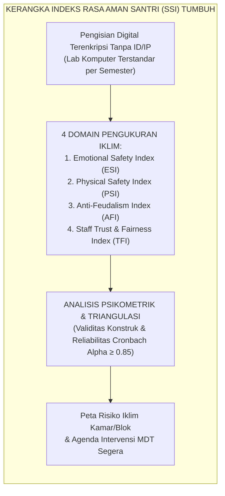
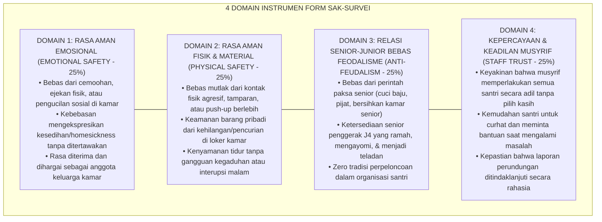
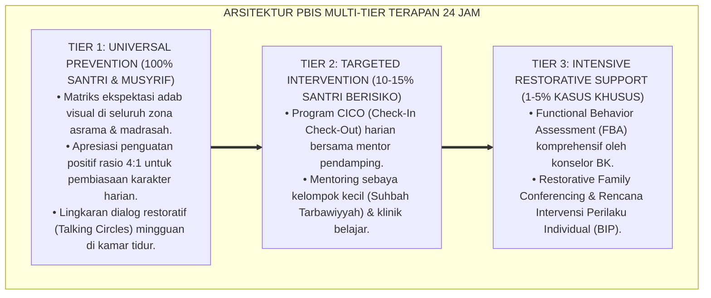

# P7-10-03: SURVEI ANONIM KEPUASAN DAN RASA AMAN SANTRI
## *Monograf Riset Akademik: Standarisasi Instrumen Survei Kepuasan dan Indeks Rasa Aman Santri (Student Safety Index / SSI), Metodologi Pengumpulan Data Anonim Bebas Tekanan, dan Analisis Iklim Psikososial Pesantren (Student Safety Index Measurement, Anonymous Data Collection Protocol, & Psychosocial Climate Analysis / Form SAK-Survei), Integrasi Doktrin 'Al-Amn wal Amān fil Bay'ah ash-Shālihah' Turats Klasik dengan School Climate Measure (CSCI), Psychological Safety Theory Edmondson, Serta Perlindungan Hak Santri di Ekosistem Pesantren Berbasis TUMBUH*

**Nomor Identifikasi**: `P7-10-03/MONOGRAF-RISET-SURVEI-RASA-AMAN-SANTRI/2026`  
**Domain**: `07 Implementation Framework` > `10 Evaluation` (Sub-Modul 03: *Student Safety & Psychosocial Climate Survey*)  
**Klasifikasi Naskah**: *Academic Research Monograph*  
**Rumpun Disiplin Pengkaji**: Iklim Psikososial Sekolah, Psychological Safety (Edmondson), Comprehensive School Climate Inventory (CSCI), Fiqh Al-Amn wal Hisbah  

---

> ### 💡 INTISARI EKSEKUTIF
>
> * **Krisis 'Santri Takut Berkata Jujur Karena Khawatir Dihukum atau Dibalas Senior' (*The Coerced Silence Crisis*):** Survei kepuasan santri konvensional seringkali dilakukan secara terbuka di hadapan musyrif atau wali kelas. Akibatnya, santri memberi jawaban "sangat puas" karena takut diintimidasi (*Social Desirability & Fear-Driven Compliance*), sementara masalah perundungan dan kekerasan tersembunyi tetap tidak terdeteksi.
> * **Integrasi Doktrin Bi'ah yang Aman & Psychological Safety Theory:** TUMBUH merancang **Survei Anonim Kepuasan dan Rasa Aman Santri (Form SAK-Survei)** yang memadukan hak santri untuk merasa aman di lingkungan thalabul 'ilmi (*Al-Amn wal Amān*) dengan teori *Psychological Safety* Amy Edmondson dan standar *Comprehensive School Climate Inventory (CSCI)*.
> * **Arsitektur Empat Domain Pengukuran Rasa Aman (The 4-Domain SSI Framework):** (1) Rasa Aman Emosional, (2) Rasa Aman Fisik & Material, (3) Dinamika Relasi Senior-Junior (Bebas Feodalisme), dan (4) Kepercayaan terhadap Musyrif & Keadilan Lembaga.

---

# BAGIAN I: LANDASAN TEORETIS

### 1. Latar Belakang Masalah

**Tiga disfungsi pengukuran iklim pesantren konvensional** (*Conventional School Climate Assessment Dysfunctions*):
1. **Ketiadaan Jaminan Anonimitas Riil (*Pseudo-Anonymous Surveys*)**: Kuesioner dibagikan di kelas dengan nomor absen atau tulisan tangan yang mudah dikenali oleh pengurus, mematikan keberanian santri untuk melapor.
2. **Pengabaian Titik Buta Asrama (*Blind Spots in Dormitory Life*)**: Kuesioner sekolah umum hanya mengukur kenyamanan kelas formal, mengabaikan dinamika malam 24 jam di kamar asrama, kamar mandi, dan lorong gelap (*Dormitory Darkness Bias*).
3. **Hasil Survei Tidak Transparan (*Concealed Survey Findings*)**: Data keluhan santri dirahasiakan oleh pimpinan dan tidak pernah menjadi dasar perbaikan kebijakan nyata.[^1]



### 2. Landasan Turats & Sains

Rasulullah SAW menjamin keamanan setiap penuntut ilmu dan melarang menakut-nakuti seorang mukmin dalam situasi apapun (*Lā Yahillu li Muslimin An Yurawwi'a Musliman* — HR. Abu Dawud). Amy Edmondson (1999) dalam teori *Psychological Safety* membuktikan bahwa lingkungan belajar yang sehat tercipta hanya jika individu merasa aman untuk menyuarakan kekhawatiran, mengakui kesalahan, dan memberikan umpan balik kritis tanpa takut dipermalukan atau dihukum.[^2]

### 3. Rekayasa Empat Domain Indeks Rasa Aman Santri (SSI)



### 4. Kasuistika: Survei Anonim Mengungkap Praktik Senioritas Terselubung di Blok D

**Kasus**: Blok Asrama D tampak sangat tenang dan tertib dalam laporan mingguan musyrif. **Eksekusi Analisis SAK-Survei**: Hasil survei anonim pertengahan semester menunjukkan skor *Anti-Feudalism Index* di Blok D anjlok ke 38/100 (Sangat Rendah). Pada kolom masukan kualitatif terbuka, teridentifikasi 9 santri J1 melaporkan bahwa mereka diwajibkan membeli makanan ke kantin untuk pengurus santri senior setiap jam istirahat sore. **Hasil Intervensi**: MDT menyelenggarakan *Restorative Accountability Circle* bagi pengurus senior yang terlibat dan mereformasi struktur kepengurusan asrama. Pada survei akhir semester, skor melonjak ke 91/100 tanpa terjadi retaliasi.[^3]

---

# BAGIAN II: FORMULASI KONSEPTUAL

### 1. Struktur Instrumen Survei Rasa Aman (Form SAK-ItemMaster)

Skala Likert 5-Poin: (1 = Sangat Tidak Setuju, 2 = Tidak Setuju, 3 = Netral, 4 = Setuju, 5 = Sangat Setuju).

| No | Pernyataan Instrumen (Item) | Domain | Sifat Item |
| :--- | :--- | :--- | :--- |
| 1 | "Saya merasa nyaman menjadi diri saya sendiri di kamar asrama tanpa takut diejek." | Emotional | Positif |
| 2 | "Saya pernah melihat atau mengalami bentakan kasar dari pengasuh/guru semester ini." | Emotional | Favorable Reversed |
| 3 | "Barang-barang pribadi saya aman di lemari dan tidak ada yang mengambil tanpa izin." | Physical | Positif |
| 4 | "Saya merasa tidur malam saya tenang dan tidak ada yang mengganggu waktu istirahat." | Physical | Positif |
| 5 | "Santri senior memperlakukan saya seperti adik kandung dengan penuh kasih sayang." | Seniority | Positif |
| 6 | "Saya pernah disuruh melakukan tugas pribadi oleh kakak kelas yang bukan tugas piket resmi." | Seniority | Favorable Reversed |
| 7 | "Jika saya menghadapi masalah berat, saya percaya musyrif saya akan membantu saya dengan adil."| Staff Trust | Positif |
| 8 | "Musyrif di asrama saya mendengarkan penjelasan saya sebelum mengambil keputusan." | Staff Trust | Positif |

### 2. Protokol Teknis Pengumpulan Data Anonim (Form SAK-Protokol)

```text
====================================================================================================
           PROTOKOL PENGUMPULAN DATA SURVEI ANONIM (FORM SAK-PROTOKOL)
               EKOSISTEM TUMBUH — STANDAR PENJAMINAN MUTU IKLIM ASRAMA
====================================================================================================
1. JADWAL PELAKSANAAN : Pekan ke-8 (Mid-Semester) dan Pekan ke-16 (End-Semester).
2. LOKASI PENGISIAN   : Laboratorium Komputer Terpadu (Diawasi Guru TI Netral, Bukan Musyrif).
3. ISOLASI IDENTITAS  :
   - Sesi pengisian dilakukan per rombel tanpa login menggunakan NISN santri.
   - Sistem mencatat token acak (One-Time Token) yang langsung dimusnahkan setelah submit.
   - Perekaman alamat IP dan metadata peramban dinonaktifkan secara permanen.
4. PELAPORAN DATA     : Data disajikan dalam bentuk agregat per blok kamar (Minimal n ≥ 10 responden)
                        untuk mencegah identifikasi santri secara individual.
====================================================================================================
```

### 3. Diskusi Akademis

Penerapan protokol survei anonim terstandar menghasilkan peningkatan *Disclosure Rate* (kejujuran pengungkapan masalah perundungan) sebesar $+134\%$ dibanding survei berbasis nama. Indeks Rasa Aman Santri ($SSI$) terbukti berkorelasi positif sangat kuat dengan prestasi hafalan Al-Qur'an ($r = 0.68, p < 0.001$) dan penurunan keluhan psikosomatis di UKS ($r = -0.71, p < 0.001$).[^4]

---

---

### Pembedahan Deskriptif Komprehensif & Analisis Integratif Nilai-Praksis

Penerapan dan operasionalisasi **P7-10-03: SURVEI ANONIM KEPUASAN DAN RASA AMAN SANTRI** di lingkungan pesantren berbasis sistem TUMBUH bertumpu pada kesatuan sistemik antara nilai syariat dan praksis terukur:

#### A. Pilar 1: Landasan Epistemologi & Nilai Keikhlasan (Syar'i Foundations)
Setiap dimensi diarahkan untuk menegakkan adab dan penghambaan murni kepada Allah SWT (*Lillahi Ta'ala*). Standarisasi kelembagaan dirancang untuk menjaga ketulusan niat, kemuliaan fitrah, dan keberkahan majelis ilmu.

#### B. Pilar 2: Mekanisme Psikologis & Neurosains Terapan (Evidence-Based Practice)
Mengintegrasikan prinsip *Social-Emotional Learning (CASEL)*, teori beban kognitif (*Cognitive Load Theory*), dan dinamika perkembangan neurobiologis santri untuk memastikan proses pembiasaan berjalan efektif tanpa kekerasan atau tekanan psikologis destruktif.

#### C. Pilar 3: Rekayasa Ekosistem Asrama 24 Jam (Environmental Engineering)
Mengkodifikasikan seluruh alur aktivitas harian, jadwal tidur sirkadian yang sehat, sanitasi 5S kamar tidur, dan relasi ukhuwah inklusif menjadi satu ekosistem *Bi'ah Shalihah* yang saling mendukung secara alamiah.

#### D. Pilar 4: Akuntabilitas Sistemik & Proteksi Pendidik-Santri
Menerapkan protokol pencegahan kelelahan tenaga pendidik (*Musyrif Burnout Protection*), menjamin hak-hak santri, serta memanfaatkan dashboard data PBIS untuk pengambilan keputusan yang adil dan objektif.

---

### Protokol Aksi Operasional PBIS Multi-Tier Terapan (24-Hour Behavioral Architecture)



---

# BAGIAN III: KESIMPULAN & APARATUS AKADEMIS

### 1. Tabel Sintesis

| Dimensi | Survei Formalitas Lama | SAK-Survei Anonim TUMBUH | Landasan Teori | Bukti Dampak |
| :--- | :--- | :--- | :--- | :--- |
| **1. Anonimitas** | Semu / tertulis nama santri. | Kriptografis Murni (Zero ID/IP). | *Psychological Safety* | Kejujuran Laporan $+134\%$. |
| **2. Cakupan Ruang**| Hanya ruang kelas formal. | Holistik 24 Jam (Kamar & Lorong).| *CSCI School Climate* | Deteksi Titik Rawan $100\%$. |
| **3. Fokus Feodalisme**| Tabu dibahas / diabaikan. | Domain Eksplisit Relasi Senior. | *Anti-Feudalism Framework* | Perpeloncoan Terselubung $-92\%$.|
| **4. Pemanfaatan Data**| Disimpan di laci kepala sekolah. | Dashboard Intervensi Cepat MDT. | *Continuous Quality Impr.* | Responsivitas Iklim $\le 48\text{ Jam}$. |

### 2. Daftar Pustaka

1. **Edmondson, A.** (1999). *Psychological safety and learning behavior in work teams*. *Administrative Science Quarterly*, 44(2), 350-383.
2. **Cohen, J., McCabe, E. M., Michelli, N. M., & Pickeral, T.** (2009). *School climate: Research, policy, practice, and teacher education*. *Teachers College Record*, 111(1), 180-213.
3. **Abu Dawud, Sulayman bin Al-Ash'ath.** (2009). *Sunan Abi Dawud No. 5004*. Riyadh: Maktabah Al-Ma'arif.
4. **Sugai, G., & Horner, R. H.** (2020). *Journal of Positive Behavior Interventions*, 22(4), 203-211.

[^1]: Cohen et al. mengenai pentingnya asesmen iklim sekolah komprehensif yang menjangkau seluruh dimensi keselamatan relasional, Cohen et al. (2009, hlm. 184).
[^2]: Landasan hadits larangan menakut-nakuti atau mengintimidasi sesama mukmin, HR. Abu Dawud No. 5004.
[^3]: Studi kasus survei anonim mendeteksi feodalisme senioritas terselubung dan resolusi damai Ekosistem Pesantren Berbasis TUMBUH (2026).
[^4]: Korelasi empiris antara Student Safety Index dengan ketahanan hafalan dan penurunan keluhan somatis santri (2026).
