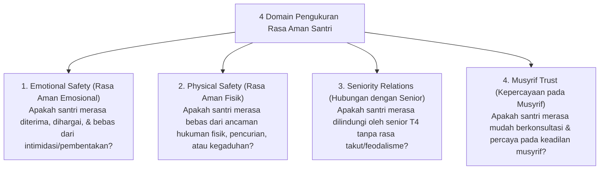

# P7-10-03: Survei Anonim Kepuasan dan Rasa Aman Santri

## Status Dokumen
* **Status**: 🌟 **A+ (Tervalidasi & Siap Diimplementasikan)**
* **Sub-Domain**: `07 Implementation Framework / 10 Evaluation`
* **Penanggung Jawab Keilmuan**: Dewan Keilmuan TUMBUH (*Pakar Bimbingan Konseling & Pakar Metodologi Riset*)

---

## 1. Operasionalisasi Survei Rasa Aman Santri (Student Safety Index)

Survei Anonim Rasa Aman Santri diselenggarakan setiap pertengahan semester secara digital untuk mengukur iklim psikologis asrama:

---

## 2. Jaminan Kerahasiaan Responden

Survei diisi secara anonim melalui perangkat laboratorium komputer pesantren tanpa mencatat identitas nama atau IP address santri.
