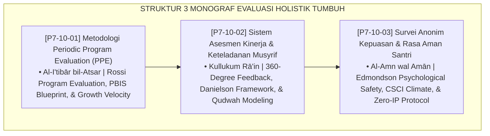

# P7-10: DOKUMEN INDUK METODOLOGI EVALUASI PROGRAM DAN KINERJA MUSYRIF
## *Arsitektur dan Standarisasi Periodic Program Evaluation (PPE), Sistem Asesmen 360-Derajat Kinerja Musyrif Berbasis Qudwah, dan Survei Anonim Indeks Rasa Aman Santri sebagai Tiga Pilar Evaluasi Holistik (Program Evaluation Form PPE, Musyrif 360 Appraisal Form AKM, Serta Student Safety Survey Form SAK) di Ekosistem TUMBUH Pesantren*

**Nomor Identifikasi**: `P7-10/DOKUMEN-INDUK-EVALUASI-PROGRAM-KINERJA/2026`  
**Domain**: `07 Implementation Framework` > `10 Evaluation` (Gugus Sub-Domain 10: *Periodic Program Evaluation, Musyrif 360 Appraisal, & Student Safety Climate Survey*)  
**Klasifikasi Naskah**: *Master Architecture & Navigation Monograph*  
**Rumpun Disiplin Pengkaji**: Teori Evaluasi Program Rossi, 360-Degree Performance Systems, Psychological Safety Edmondson, Fiqh Al-Muhasabah wal Mas'uliyyah  

---

> ### 💡 INTISARI EKSEKUTIF
>
> * **Kedudukan Strategis Gugus Evaluasi Program dan Kinerja:** Gugus ini adalah cermin akuntabilitas objektif (*objective accountability mirror*) lembaga. Melalui metodologi evaluasi dampak yang kokoh, penilaian musyrif yang adil dan memanusiakan, serta pendengaran tulus atas suara santri, pesantren memastikan setiap rupiah, waktu, dan energi pembinaan menghasilkan pertumbuhan adab yang terukur (*From Assumptions to Measured Impact*).
> * **Triad Evaluasi Holistik TUMBUH:** (1) **Periodic Program Evaluation (PPE)** untuk menguji efektivitas sistemik semesteran, (2) **Asesmen Kinerja 360° Musyrif** untuk mengevaluasi keteladanan dan kompetensi pengasuh secara adil, dan (3) **Survei Anonim Rasa Aman Santri** untuk memotret iklim psikologis nyata asrama tanpa bias ketakutan.
> * **3 Monograf Riset Komprehensif:** Form PPE-Evaluasi, Form AKM-Musyrif, dan Form SAK-Survei.

---

## 📑 PETA NAVIGASI TIGA MONOGRAF

---

## 📚 DESKRIPSI RINGKAS 3 BERKAS MONOGRAF

1. **[P7-10-01: Metodologi Periodic Program Evaluation (PPE)](file:///c:/xampp/htdocs/tumbuh/07%20Implementation%20Framework/10%20Evaluation/P7-10-01-Metodologi-Periodic-Program-Evaluation-PPE.md)**  
   *Metodologi mixed-methods evaluasi dampak semesteran, audit TFI fidelitas PBIS, analisis effect size pertumbuhan karakter, dan Form PPE-Evaluasi.*
2. **[P7-10-02: Sistem Asesmen Kinerja dan Keteladanan Musyrif](file:///c:/xampp/htdocs/tumbuh/07%20Implementation%20Framework/10%20Evaluation/P7-10-02-Sistem-Asesmen-Kinerja-dan-Keteladanan-Musyrif.md)**  
   *Sistem penilaian 360-derajat multi-sumber (Kepala 40%, Santri 30%, Diri Sendiri 30%), 4 dimensi kompetensi pengasuhan, Musyrif Qudwah Award, dan Form AKM-Musyrif.*
3. **[P7-10-03: Survei Anonim Kepuasan dan Rasa Aman Santri](file:///c:/xampp/htdocs/tumbuh/07%20Implementation%20Framework/10%20Evaluation/P7-10-03-Survei-Anonim-Kepuasan-dan-Rasa-Aman-Santri.md)**  
   *Instrumen Student Safety Index (SSI) 4 domain (emosional, fisik, anti-feodalisme, kepercayaan staf), protokol anonimitas lab komputer, dan Form SAK-Survei.*

---

## 🎯 STANDAR PENJAMINAN MUTU SISTEM EVALUASI

Penerapan gugus **Metodologi Evaluasi Program dan Kinerja Musyrif** menjamin bahwa:
1. **Seluruh Program Pengasuhan Teruji Efektivitasnya Secara Ilmiah (*Validated Program Efficacy Guarantee*)**: Evaluasi PPE mencegah program berjalan tanpa arah dan tanpa dampak.
2. **Pengasuh Dinilai Berdasarkan Keteladanan Nyata dan Kasih Sayang (*Holistic Appraisal Guarantee*)**: Asesmen 360° menghargai integritas moral dan kehangatan relasi musyrif.
3. **Santri Memiliki Ruang Aman Mutlak untuk Bersuara Jujur (*Uncensored Student Voice Guarantee*)**: Survei anonim membongkar segala bentuk kekerasan atau ketidakadilan tersembunyi.
