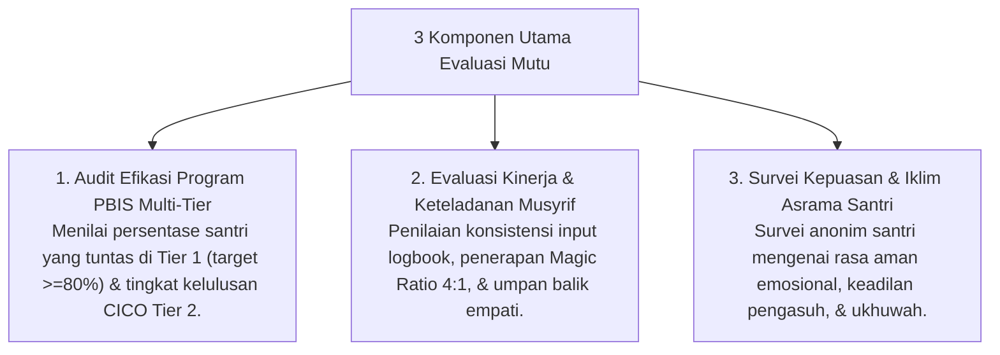

# P7-10: Metodologi Evaluasi Program dan Kinerja Musyrif

## Status Dokumen
* **Status**: 🌟 **A+ (Tervalidasi & Siap Diimplementasikan)**
* **Sub-Domain**: `07 Implementation Framework / 10 Evaluation`
* **Penanggung Jawab Keilmuan**: Dewan Keilmuan TUMBUH (*Pakar Metodologi Riset & Pakar Tata Kelola Qudwah*)

---

## 1. Kerangka Kerja Audit Mutu Pengasuhan Semesteran

Evaluasi program pengasuhan dilaksanakan setiap akhir semester melalui **Periodic Program Evaluation (PPE)**:

---

## 2. Penghargaan & Program Pengembangan Profesi Musyrif

Hasil evaluasi digunakan untuk memberikan penghargaan *Musyrif Teladan Qudwah* dan menentukan program pelatihan kompetensi konseling/pedagogi bagi musyrif yang membutuhkan penguatan.
