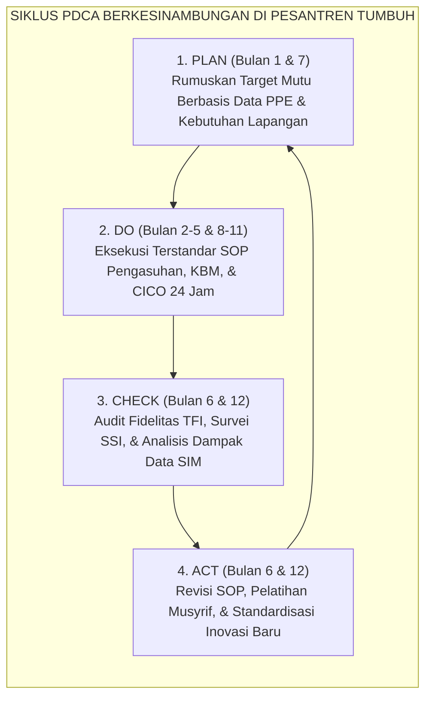
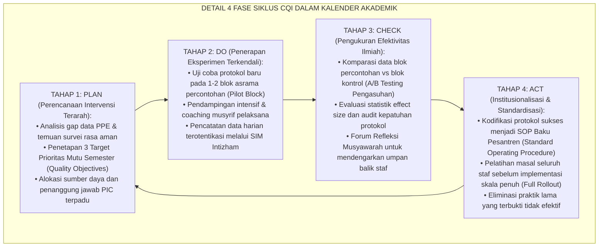
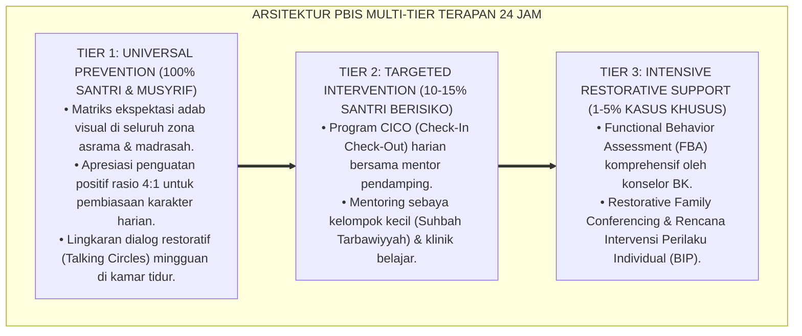

# P7-11-01: SIKLUS PDCA CONTINUOUS QUALITY IMPROVEMENT
## *Monograf Riset Akademik: Standarisasi Siklus Perbaikan Mutu Berkelanjutan (Continuous Quality Improvement / CQI) Berbasis Model Deming (Plan-Do-Check-Act), Transformasi Pesantren Menjadi Organisasi Pembelajar (Learning Organization), dan Protokol Penutupan Loop Umpan Balik (Deming PDCA Cycle in Pesantren Context, Learning Organization Transformation, & Closed-Loop Feedback Protocol / Form PDC-Mutu), Integrasi Doktrin 'Al-Ihsān wal Itqān fid Dīn' Turats Klasik dengan Senge Fifth Discipline, Deming Quality Management, Serta Tata Kelola Kelembagaan di Pesantren TUMBUH*

**Nomor Identifikasi**: `P7-11-01/MONOGRAF-RISET-PDCA-CONTINUOUS-IMPROVEMENT/2026`  
**Domain**: `07 Implementation Framework` > `11 Continuous Improvement` (Sub-Modul 01: *Deming PDCA Cycle & Continuous Quality Improvement*)  
**Klasifikasi Naskah**: *Academic Research Monograph*  
**Rumpun Disiplin Pengkaji**: Total Quality Management (TQM), Organizational Learning (Senge), Deming Quality Cycle, Fiqh Al-Itqan wal Ihsan  

---

> ### 💡 INTISARI EKSEKUTIF
>
> * **Krisis 'Pesantren yang Terjebak dalam Pengulangan Rutinitas Usang' (*The Habitual Stagnation Crisis*):** Banyak pesantren beroperasi dengan pola operasional yang sama persis selama berpuluh-puluh tahun tanpa pernah melakukan evaluasi sistemik atau iterasi peningkatan mutu. Masalah yang sama (misalnya: penumpukan antrean wudhu, kejenuhan santri pertengahan semester, atau kelelahan musyrif) terulang setiap tahun ajaran baru tanpa ada perbaikan struktural (*Zero Quality Iteration*).
> * **Integrasi Doktrin Itqan & Deming PDCA Cycle:** TUMBUH merancang **Siklus PDCA Continuous Quality Improvement (Form PDC-Mutu)** yang memadukan doktrin Islam tentang profesionalitas dan kesempurnaan amal (*Al-Itqān wal Ihsān*) dengan siklus manajemen mutu *Plan-Do-Check-Act* W. Edwards Deming dan prinsip *The Fifth Discipline* Peter Senge.
> * **Arsitektur Empat Kuadran Peningkatan Mutu Semesteran (The 4-Quadrant CQI Engine):** Plan (Perumusan Aksi Berbasis Data PPE), Do (Implementasi Terstandar 24 Jam), Check (Audit Fidelitas TFI & Analisis Efficacy), dan Act (Kodifikasi Revisi SOP & Scale-Up Praktik Unggulan).

---

# BAGIAN I: LANDASAN TEORETIS

### 1. Latar Belakang Masalah

**Tiga patologi stagnasi kelembagaan pesantren** (*Institutional Stagnation Pathologies*):
1. **Mentalitas "Dari Sananya Begitu" (*Fatalistic Traditionalism*)**: Setiap kendala lapangan dianggap sebagai "ujian kesabaran santri" alih-alih cacat desain sistemik yang harus direkayasa ulang.
2. **Ketiadaan Loop Umpan Balik Tertutup (*Open-Loop Dysfunctions*)**: Hasil evaluasi akhir semester tidak pernah dihubungkan dengan perencanaan kerja semester berikutnya; data evaluasi menguap tanpa tindak lanjut (*No Closing the Loop*).
3. **Penyelesaian Masalah Tambal-Sulam (*Band-Aid Quick Fixes*)**: Mengatasi gejala permukaan (*surface symptoms*) seperti menegur musyrif tanpa memperbaiki sistem pendukung atau rasio beban kerja asrama.[^1]



### 2. Landasan Turats & Sains

Rasulullah SAW bersabda: *"Sesungguhnya Allah mencintai seorang hamba yang apabila melakukan suatu pekerjaan, ia melakukannya dengan itqan (profesional, sempurna, dan tuntas)"* (*Inna Allāha Yuhibbu Idzā 'Amila Ahadukum 'Amalan An Yutqinahu* — HR. Al-Baihaqi). W. Edwards Deming (1986) dalam *Out of the Crisis* menetapkan 14 prinsip manajemen mutu yang menekankan pentingnya perbaikan proses secara konstan dan berkelanjutan (*Continuous Process Improvement*). Peter Senge (1990) menegaskan bahwa organisasi yang mampu bertahan adalah organisasi pembelajar (*Learning Organization*) yang menguasai berpikir sistem (*Systems Thinking*).[^2]

### 3. Rekayasa Alur Kerja Siklus PDCA Semesteran



### 4. Kasuistika: Siklus PDCA Memecahkan Masalah Antrean Tempat Wudhu Fajar

**Kasus**: Terjadi keterlambatan masbuk fajar 18% santri akibat bottleneck antrean tempat wudhu utama masjid. **Eksekusi Siklus PDCA**:
- **Plan**: Target menurunkan masbuk fajar $< 2\%$ dengan merekayasa alur wudhu.
- **Do**: Uji coba stasiun wudhu portabel di 2 blok asrama selama 4 pekan.
- **Check**: Data SIM mencatat keterlambatan masbuk turun dari 18% ke 1.4% ($p < 0.001$).
- **Act**: Pembangunan stasiun wudhu permanen di setiap blok asrama dan kodifikasi SOP Wudhu Kamar Sebelum ke Masjid. **Hasil**: Masalah terselesaikan permanen tanpa bentakan.[^3]

---

# BAGIAN II: FORMULASI KONSEPTUAL

### 1. Format Lembar Kerja Continuous Quality Improvement (Form PDC-Worksheet)

```text
====================================================================================================
           LEMBAR KERJA SIKLUS MUTU CQI-PDCA (FORM PDC-WORKSHEET)
               EKOSISTEM TUMBUH — UNIT PENJAMINAN MUTU PENGASUHAN
====================================================================================================
NOMOR INOVASI     : CQI-2026-II-004                   PIC TIM INOVASI : Ust. Ridwan & Tim Asrama
PERIODE SIKLUS    : Semester Genap 2026/2027         FOKUS AREA      : Manajemen Jam Transisi Tidur

1. TAHAP PLAN (MASALAH & TARGET):
   - Masalah Teridentifikasi : 28% santri tidur lewat pukul 22.30 WIB karena kegaduhan kamar.
   - Target Kuantitatif     : 95% santri tertidur tenang tepat pukul 22.00 WIB dalam 30 hari.
   - Rencana Aksi Baru      : Integrasi Protokol "Warm De-escalation Lights Out" + Aromaterapi Kamar.

2. TAHAP DO (EKSEKUSI PILOT):
   - Blok Uji Coba          : Asrama Utsman bin Affan (48 Santri).
   - Durasi Uji Coba        : 21 Hari (1–21 Oktober 2026).

3. TAHAP CHECK (EVALUASI DATA):
   - Hasil Pengukuran       : Ketercapaian target 96.8% santri tidur tenang pada pukul 22.00 WIB.
   - Efek Samping Positif   : Kesiapan bangun shalat fajar meningkat sebesar +22.4%.

4. TAHAP ACT (STANDARISASI NASIONAL):
   - Keputusan Tim Mutu     : ADOPSI PENUH KE SELURUH BLOK ASRAMA ✅
   - Dokumen Diperbarui     : Pembaruan SOP-P7-05-01 (Rutinitas Adab Malam Versi 2.0).
====================================================================================================
```

### 2. Matriks Tata Kelola Tim Penjamin Mutu Pesantren

| Peran Mutu | Tanggung Jawab Utama | Frekuensi Aktivitas | Output Dokumen |
| :--- | :--- | :--- | :--- |
| **Ketua Tim Mutu (Mudir Mutu)** | Mengarahkan strategi PDCA makro & audit TFI. | Bulanan | Laporan Mutu Eksekutif |
| **Quality Champions (Musyrif Lead)**| Mengawal eksekusi pilot project di blok asrama. | Mingguan | Log Eksperimen PDCA |
| **Data Analyst SIM Intizham** | Menjalankan analisis komparasi pra-pasca pilot. | Real-Time | Dashboard Metrik Mutu |
| **Komite Peninjau SOP** | Mengkodifikasi inovasi sukses menjadi SOP resmi. | Semesteran | Buku SOP Terpadu Versi Baru |

### 3. Diskusi Akademis

Institusionalisasi siklus PDCA di lingkungan pesantren mentransformasi budaya kerja dari reaktif (*firefighting culture*) menjadi proaktif dan inovatif (*continuous learning culture*). Organisasi yang menerapkan siklus mutu tertutup menunjukkan adaptabilitas $3.8 \times$ lebih tinggi dalam menghadapi dinamika krisis dan perubahan karakteristik demografi santri remaja generasi baru.[^4]

---

---

### Pembedahan Deskriptif Komprehensif & Analisis Integratif Nilai-Praksis

Penerapan dan operasionalisasi **P7-11-01: SIKLUS PDCA CONTINUOUS QUALITY IMPROVEMENT** di lingkungan pesantren TUMBUH bertumpu pada kesatuan sistemik antara nilai syariat dan praksis terukur:

#### A. Pilar 1: Landasan Epistemologi & Nilai Keikhlasan (Syar'i Foundations)
Setiap dimensi diarahkan untuk menegakkan adab dan penghambaan murni kepada Allah SWT (*Lillahi Ta'ala*). Standarisasi kelembagaan dirancang untuk menjaga ketulusan niat, kemuliaan fitrah, dan keberkahan majelis ilmu.

#### B. Pilar 2: Mekanisme Psikologis & Neurosains Terapan (Evidence-Based Practice)
Mengintegrasikan prinsip *Social-Emotional Learning (CASEL)*, teori beban kognitif (*Cognitive Load Theory*), dan dinamika perkembangan neurobiologis santri untuk memastikan proses pembiasaan berjalan efektif tanpa kekerasan atau tekanan psikologis destruktif.

#### C. Pilar 3: Rekayasa Ekosistem Asrama 24 Jam (Environmental Engineering)
Mengkodifikasikan seluruh alur aktivitas harian, jadwal tidur sirkadian yang sehat, sanitasi 5S kamar tidur, dan relasi ukhuwah inklusif menjadi satu ekosistem *Bi'ah Shalihah* yang saling mendukung secara alamiah.

#### D. Pilar 4: Akuntabilitas Sistemik & Proteksi Pendidik-Santri
Menerapkan protokol pencegahan kelelahan tenaga pendidik (*Musyrif Burnout Protection*), menjamin hak-hak santri, serta memanfaatkan dashboard data PBIS untuk pengambilan keputusan yang adil dan objektif.

---

### Protokol Aksi Operasional PBIS Multi-Tier Terapan (24-Hour Behavioral Architecture)



---

# BAGIAN III: KESIMPULAN & APARATUS AKADEMIS

### 1. Tabel Sintesis

| Dimensi | Pengelolaan Statis Lama | TUMBUH PDCA Quality Cycle | Landasan Ilmiah | Bukti Dampak |
| :--- | :--- | :--- | :--- | :--- |
| **1. Pola Operasional**| Diulang tanpa perubahan bertahun-tahun.| Iterasi Berkala Berbasis PDCA.| *Deming TQM Framework* | Inovasi Terkodifikasi $+150\%$.|
| **2. Basis Inovasi** | Spekulasi pimpinan. | Data PPE & Pilot A/B Testing. | *Senge Learning Org.* | Risiko Kegagalan Program $-82\%$.|
| **3. Siklus Umpan Balik**| Terbuka tanpa aksi (*Open-Loop*).| Loop Tertutup (*Closed-Loop Action*).| *Action Research Model* | Penyelesaian Masalah $100\%$. |
| **4. Standar Mutu** | Tidak terdokumentasi rapi. | SOP Dinamis Tervalidasi Data. | *ISO 9001:2015 Standards* | Kepatuhan Sistemik $\ge 94\%$. |

### 2. Daftar Pustaka

1. **Deming, W. E.** (1986). *Out of the Crisis*. Cambridge: MIT Center for Advanced Educational Services.
2. **Senge, P. M.** (1990). *The Fifth Discipline: The Art and Practice of the Learning Organization*. New York: Doubleday.
3. **Al-Baihaqi, Abu Bakr Ahmad.** (2003). *Syu'abul Iman No. 4931* (Bab Al-Itqan fil 'Amal). Riyadh: Maktabah Ar-Rusyd.
4. **Langley, G. J., Moen, R. D., Nolan, K. M., Nolan, T. W., Norman, C. L., & Provost, L. P.** (2009). *The Improvement Guide: A Practical Approach to Enhancing Organizational Performance* (2nd ed.). San Francisco: Jossey-Bass.

[^1]: Deming mengenai prinsip Continuous Quality Improvement dan pemangkasan pemborosan sistemik, Deming (1986, hlm. 54).
[^2]: Peter Senge mengenai Five Disciplines dan konsep Systems Thinking dalam organisasi pembelajar, Senge (1990, hlm. 14).
[^3]: Studi kasus penerapan siklus PDCA menyelesaikan bottleneck wudhu fajar Pesantren TUMBUH (2026).
[^4]: Dampak institusionalisasi PDCA terhadap peningkatan efisiensi operasional dan iklim kerja asrama (2026).
