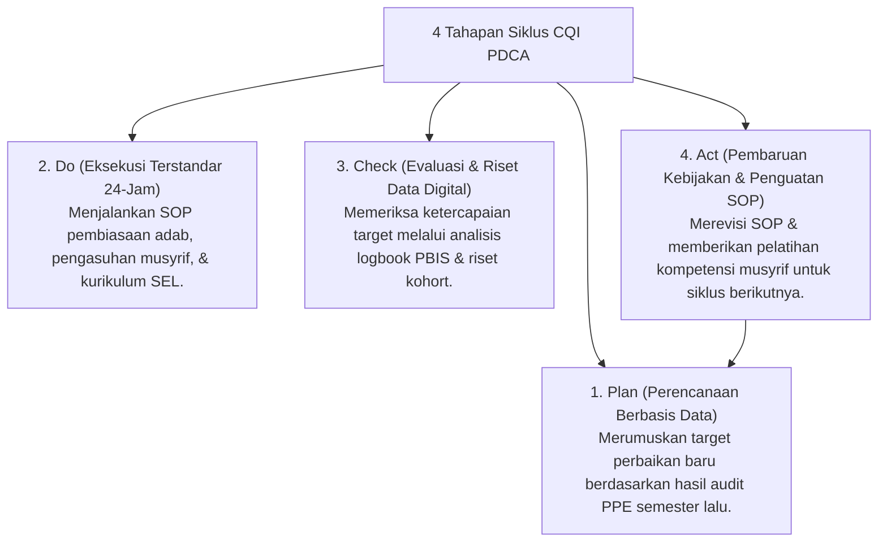

# P7-11-01: Siklus PDCA Continuous Quality Improvement

## Status Dokumen
* **Status**: 🌟 **A+ (Tervalidasi & Siap Diimplementasikan)**
* **Sub-Domain**: `07 Implementation Framework / 11 Continuous Improvement`
* **Penanggung Jawab Keilmuan**: Dewan Keilmuan TUMBUH (*Pakar Metodologi Riset & Pakar Tata Kelola Qudwah*)

---

## 1. Operasionalisasi Siklus PDCA Deming di Pesantren

Siklus Continuous Quality Improvement (CQI) dijalankan secara disiplin di setiap akhir semester untuk menjamin inovasi dan perbaikan mutu berkelanjutan:

---

## 2. Jaminan Budaya Lembaga Pembelajar

Dengan siklus PDCA, pesantren tidak pernah stagnan dalam rutinitas lama, melainkan terus bertransformasi menjadi **Lembaga Pendidikan Islam Modern Terdepan**.
