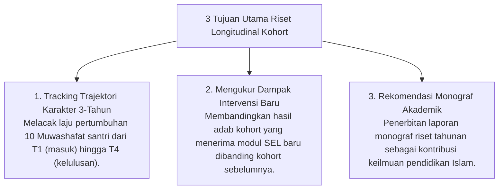

# P7-11-02: Metodologi Riset Longitudinal Kohort Angkatan

## Status Dokumen
* **Status**: 🌟 **A+ (Tervalidasi & Siap Diimplementasikan)**
* **Sub-Domain**: `07 Implementation Framework / 11 Continuous Improvement`
* **Penanggung Jawab Keilmuan**: Dewan Keilmuan TUMBUH (*Pakar Metodologi Riset & Pakar Arsitektur Digital Pesantren*)

---

## 1. Operasionalisasi Longitudinal Cohort Research

Dewan Keilmuan menyelenggarakan riset longitudinal untuk melacak dan membandingkan trajektori perkembangan karakter santri melintasi beberapa angkatan (*Cross-Cohort Analytics*):

---

## 2. Pemanfaatan Terapan Hasil Riset

Hasil riset kohort dipublikasikan dalam seri monograf akademis pesantren dan dijadikan acuan pengasuhan nasional.
