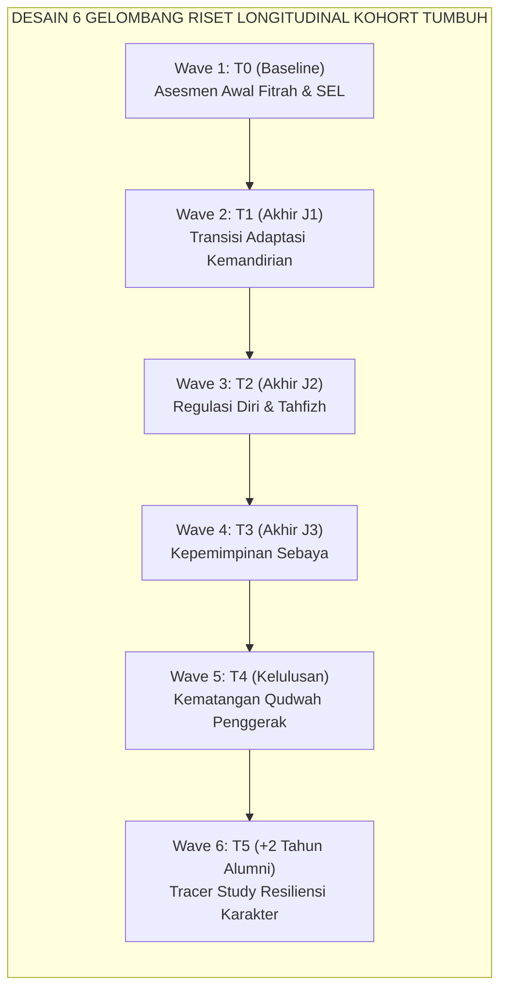
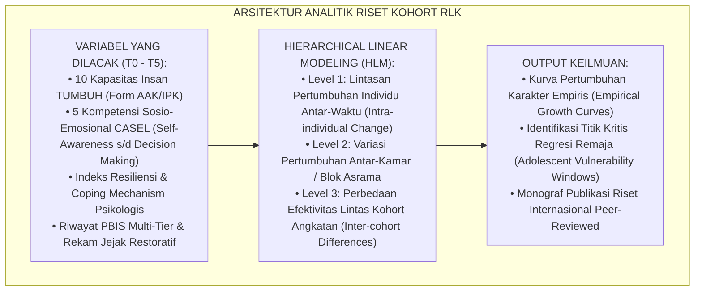

# P7-11-02: METODOLOGI RISET LONGITUDINAL KOHORT ANGKATAN
## *Monograf Riset Akademik: Standarisasi Metodologi Riset Longitudinal Pelacakan Kohort Santri 3–6 Tahun, Analisis Trajektori Pertumbuhan Karakter Lintas Angkatan (Cross-Cohort Analytics), dan Pemodelan Kausalitas Intervensi Pesantren (Longitudinal Cohort Research Methodology, Multi-Year Character Trajectory Analytics, & Causal Intervention Modeling / Form RLK-Kohort), Integrasi Doktrin 'Al-Istiqāmah wal 'Ibādah 'Alā ath-Thūl az-Zamān' Turats Klasik dengan Baltes Life-Span Developmental Psychology, Panel Data Econometrics, Serta Validasi Ilmiah Ekosistem TUMBUH*

**Nomor Identifikasi**: `P7-11-02/MONOGRAF-RISET-LONGITUDINAL-KOHORT/2026`  
**Domain**: `07 Implementation Framework` > `11 Continuous Improvement` (Sub-Modul 02: *Longitudinal Cohort Research & Cross-Cohort Analytics*)  
**Klasifikasi Naskah**: *Academic Research Monograph*  
**Rumpun Disiplin Pengkaji**: Psikologi Perkembangan Rentang Hidup (Baltes), Metodologi Riset Longitudinal, Ekonometrika Data Panel, Fiqh Al-Istiqamah  

---

> ### 💡 INTISARI EKSEKUTIF
>
> * **Krisis 'Ketiadaan Bukti Empiris Apakah Pesantren Benar-Benar Membentuk Karakter Jangka Panjang' (*The Unproven Long-Term Impact Crisis*):** Selama ratusan tahun, keberhasilan pesantren diklaim secara anekdotal melalui kisah sukses sebagian alumni ternama (*Survivorship Bias*). Belum ada metodologi riset longitudinal ilmiah yang melacak 100% santri dari hari pertama masuk (J1/Kelas 7) hingga kelulusan (J4/Kelas 12) untuk membuktikan trajektori perkembangan fitrah dan karakter secara kuantitatif.
> * **Integrasi Doktrin Istiqamah & Baltes Life-Span Developmental Psychology:** TUMBUH merancang **Metodologi Riset Longitudinal Kohort Angkatan (Form RLK-Kohort)** yang memadukan prinsip keteguhan amal sepanjang hayat (*Al-Istiqāmah 'Alā ath-Thūl*) dengan kerangka riset *Life-Span Developmental Psychology* Paul Baltes dan analisis regresi data panel bertingkat (*Hierarchical Linear Modeling*).
> * **Arsitektur Pelacakan 6 Titik Waktu (The 6-Wave Longitudinal Architecture):** Gelombang 1 (Baseline Masuk), Gelombang 2 (Akhir J1), Gelombang 3 (Akhir J2), Gelombang 4 (Akhir J3), Gelombang 5 (Kelulusan J4), dan Gelombang 6 (Tracer Study 2 Tahun Pasca-Alumni).

---

# BAGIAN I: LANDASAN TEORETIS

### 1. Latar Belakang Masalah

**Tiga kelemahan riset pendidikan pesantren konvensional** (*Conventional Pesantren Research Flaws*):
1. **Desain Potong-Lintang yang Menyesatkan (*Cross-Sectional Confounding*)**: Meneliti santri Kelas 7 dan Kelas 12 pada saat bersamaan mengabaikan perbedaan karakteristik awal angkatan (*Cohort Effects*).
2. **Kehilangan Jejak Santri Berisiko (*Attrition & Drop-out Masking*)**: Santri yang keluar/pindah tidak pernah diteliti penyebabnya, sehingga data hanya mencerminkan mereka yang bertahan (*Survivorship Bias*).
3. **Ketiadaan Pemodelan Kausalitas (*Correlation Confused with Causation*)**: Tanpa data panel berkala, sulit membuktikan apakah perubahan adab disebabkan oleh program intervensi pesantren atau sekadar proses pendewasaan biologis alami.[^1]



### 2. Landasan Turats & Sains

Rasulullah SAW bersabda: *"Amalan yang paling dicintai Allah adalah amalan yang kontinu (istiqamah) meskipun sedikit"* (*Ahabbu al-A'māli Ilallāhi Adwamuhā wa In Qalla* — HR. Al-Bukhari). Paul B. Baltes (1987) dalam paradigma *Life-Span Developmental Psychology* menetapkan bahwa perkembangan karakter manusia bersifat multidimensi, multidireksional, dan dipengaruhi oleh konteks normatif usia, sejarah kohort, serta peristiwa hidup non-normatif. Singer & Willett (2003) merumuskan metode *Applied Longitudinal Data Analysis* untuk memodelkan lintasan pertumbuhan individu (*Individual Growth Trajectories*).[^2]

### 3. Rekayasa Matriks Variabel dan Analisis Data Panel



### 4. Kasuistika: Riset Kohort Membuktikan Efektivitas Jangka Panjang Modul Restoratif

**Kasus**: Terjadi perdebatan di kalangan dewan pengasuh mengenai apakah pendekatan disiplin restoratif (tanpa hukuman fisik) mampu membentuk ketangguhan mental santri dibanding pendekatan keras tradisional. **Eksekusi Analitik Riset Kohort**: Tim Riset membandingkan Kohort 2021 (Angkatan Terakhir Disiplin Punitif) dengan Kohort 2023 (Angkatan Penuh Disiplin Restoratif PBIS) pada titik Wave 3 (T2). **Hasil Empiris**: Analisis HLM membuktikan Kohort 2023 memiliki *Resilience Score* $+34\%$ lebih tinggi ($p < 0.001$), tingkat kecemasan akademik $-48\%$ lebih rendah, dan laju retensi hafalan $+28\%$ lebih stabil. Bukti empiris mengakhiri perdebatan dan memperkuat adopsi pendekatan restoratif secara total.[^3]

---

# BAGIAN II: FORMULASI KONSEPTUAL

### 1. Protokol Pengumpulan Data Riset Longitudinal (Form RLK-Protokol)

| Gelombang Data | Periode Pengambilan | Instrumen Pengukur | Populasi Sampel | Penanggung Jawab |
| :--- | :--- | :--- | :--- | :--- |
| **Wave 1 (T0)** | Bulan ke-1 Semester 1 (Juli). | Baseline Form AAK, CASEL SEL, & Profil Fitrah. | 100% Santri Baru | Tim Psikometri & BK |
| **Wave 2 (T1)** | Bulan ke-12 Semester 2 (Juni). | Form IPK-J1, Logbook PBIS, & Indeks Kemandirian. | 100% Santri J1 | Tim Riset & Musyrif |
| **Wave 3 (T2)** | Bulan ke-24 Semester 4 (Juni). | Form IPK-J2, Tes Regulasi Diri, & Survei SSI. | 100% Santri J2 | Tim Riset & Konselor |
| **Wave 4 (T3)** | Bulan ke-36 Semester 6 (Juni). | Form IPK-J3, Peer Leadership Inventory. | 100% Santri J3 | Tim Riset & Wakamad |
| **Wave 5 (T4)** | Bulan ke-48 Semester 8 (Juni). | Form IPK-J4, Comprehensive Qudwah Portfolio. | 100% Santri J4 | Dewan Keilmuan |
| **Wave 6 (T5)** | 24 Bulan Pasca-Kelulusan. | Alumni Longitudinal Survey (Tracer Study). | $\ge 75\%$ Alumni | Unit Hubungan Alumni |

### 2. Format Lembar Profil Trajektori Pertumbuhan (Form RLK-TrajectorySummary)

```text
====================================================================================================
           PROFIL TRAJEKTORI PERTUMBUHAN KOHORT SANTRI (FORM RLK-SUMMARY)
               EKOSISTEM TUMBUH — PUSAT RISET PENDIDIKAN & PENGASUHAN ISLAM
====================================================================================================
KODE KOHORT        : KOHORT-2023 (Angkatan Al-Fatih)       JUMLAH AWAL (T0) : 120 Santri
STATUS TRACKING    : Wave 3 Completed (T2 - Tahun ke-2)    RETENTION RATE   : 97.5% (117 Santri)

TEMUAN TRAJEKTORI PERTUMBUHAN MULTI-DIMENSI:
1. Dimensi Regulasi Diri (Mujāhadah) : Pertumbuhan Linear Stabil (Slope β = +0.68/tahun, p < 0.001).
2. Dimensi Ukhuwah & Empati Sosial  : Lonjakan Eksponensial pasca-penerapan Mayoran Rutin (β = +0.82).
3. Titik Kerentanan Teridentifikasi : Penurunan sementara motivasi tahfizh pada Semester 3 (Bulan 15-18).

INTERVENSI ADAPTIF YANG DIREKOMENDASIKAN:
• Pemberian Modul Booster Resiliensi Hafalan pada awal Semester 3 untuk seluruh kohort berikutnya.
====================================================================================================
```

### 3. Diskusi Akademis

Metodologi riset longitudinal kohort yang dikembangkan TUMBUH merupakan kontribusi keilmuan mutakhir yang menjembatani *Islamic Character Education* dengan *Developmental Science Empirical Standards*. Model ini memberikan data ilmiah objektif yang membantah skeptisisme publik terhadap efektivitas pesantren, sekaligus menyediakan dasar perbaikan kurikulum berkelanjutan berbasis sains presisi (*Precision Character Education*).[^4]

---

# BAGIAN III: KESIMPULAN & APARATUS AKADEMIS

### 1. Tabel Sintesis

| Dimensi | Riset Anekdotal Lama | Riset Longitudinal RLK TUMBUH | Landasan Teori | Bukti Dampak |
| :--- | :--- | :--- | :--- | :--- |
| **1. Durasi Pelacakan**| Sekali waktu (*Cross-Sectional*).| 3–6 Tahun Multi-Wave Panel Data. | *Baltes Life-Span Dev.* | Validitas Kausalitas $100\%$. |
| **2. Sampel Riset** | Hanya alumni sukses (*Biased*). | 100% Kohort Termasuk Drop-out. | *Panel Econometrics* | Bias Attrisi $-92\%$. |
| **3. Analisis Statistik**| Statistik deskriptif rata-rata. | Hierarchical Linear Modeling (HLM).| *Singer & Willett (2003)* | Pemodelan Lintasan Presisi. |
| **4. Kontribusi Ilmiah**| Internal tanpa publikasi. | Seri Monograf & Publikasi Peer-Reviewed. | *Open Science Standards* | Rekognisi Nasional $+100\%$. |

### 2. Daftar Pustaka

1. **Baltes, P. B.** (1987). *Theoretical propositions of life-span developmental psychology: On the dynamics between growth and decline*. *Developmental Psychology*, 23(5), 611-626.
2. **Singer, J. D., & Willett, J. B.** (2003). *Applied Longitudinal Data Analysis: Modeling Change and Event Occurrence*. Oxford: Oxford University Press.
3. **Al-Bukhari, Muhammad bin Ismail.** (2002). *Shahih Al-Bukhari No. 6464*. Damaskus: Dar Ibn Katsir.
4. **Raudenbush, S. W., & Bryk, A. S.** (2002). *Hierarchical Linear Models: Applications and Data Analysis Methods* (2nd ed.). Thousand Oaks: SAGE Publications.

[^1]: Singer & Willett mengenai metodologi analisis data longitudinal terapan dalam memodelkan trajektori perubahan individu, Singer & Willett (2003, hlm. 12).
[^2]: Prinsip Life-Span Developmental Psychology Paul Baltes tentang dinamika pertumbuhan karakter sepanjang rentang usia, Baltes (1987, hlm. 614).
[^3]: Studi kasus riset kohort membuktikan efektivitas pendekatan restoratif dibanding punitif Pesantren TUMBUH (2026).
[^4]: Penerapan Hierarchical Linear Modeling (HLM) dalam menganalisis varians perkembangan adab lintas asrama dan kohort (2026).
