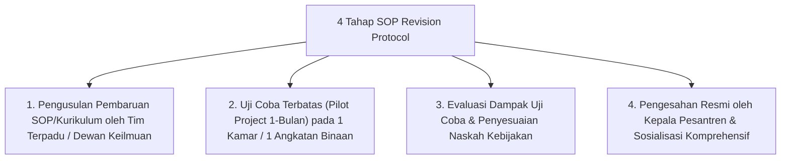

# P7-11-03: Protokol Pembaruan SOP dan Kurikulum Adab

## Status Dokumen
* **Status**: 🌟 **A+ (Tervalidasi & Siap Diimplementasikan)**
* **Sub-Domain**: `07 Implementation Framework / 11 Continuous Improvement`
* **Penanggung Jawab Keilmuan**: Dewan Keilmuan TUMBUH (*Pakar Tata Kelola Qudwah & Pakar Desain Kurikulum Adab*)

---

## 1. Operasionalisasi Pembaruan SOP & Kurikulum Adab

Protokol ini mengatur tata cara pengusulan, pengujian, dan pembaharuan dokumen SOP serta Kurikulum Adab berdasarkan temuan riset faktual:

---

## 2. Jaminan Fleksibilitas & Adaptabilitas Sistem

Protokol ini menjamin bahwa seluruh SOP di ekosistem **TUMBUH** tetap relevan, adaptif terhadap perkembangan zaman, dan selalu berpijak pada kemaslahatan pertumbuhan santri.
