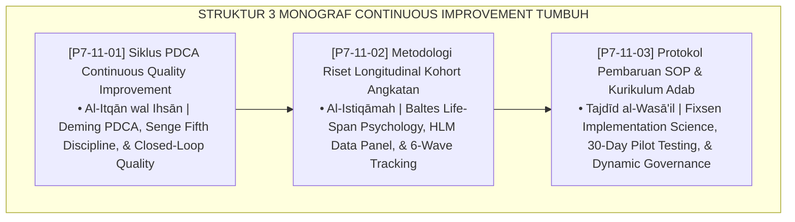

# P7-11: DOKUMEN INDUK SIKLUS IMPROVEMENT BERKELANJUTAN DAN RISET KOHORT
## *Arsitektur dan Standarisasi Siklus Perbaikan Mutu Berkelanjutan PDCA, Metodologi Riset Longitudinal Kohort Santri 3–6 Tahun, dan Protokol Pembaruan SOP serta Kurikulum Adab Berbasis Bukti sebagai Tiga Pilar Evolusi Kelembagaan (PDCA CQI Engine Form PDC, Longitudinal Research Form RLK, Serta SOP Revision Protocol Form PKA) di Ekosistem TUMBUH Pesantren*

**Nomor Identifikasi**: `P7-11/DOKUMEN-INDUK-CONTINUOUS-IMPROVEMENT-RISET-KOHORT/2026`  
**Domain**: `07 Implementation Framework` > `11 Continuous Improvement` (Gugus Sub-Domain 11: *Continuous Quality Improvement, Cohort Longitudinal Research, & Adaptive SOP Protocol*)  
**Klasifikasi Naskah**: *Master Architecture & Navigation Monograph*  
**Rumpun Disiplin Pengkaji**: Total Quality Management (Deming), Riset Longitudinal Psikologi Rentang Hidup (Baltes), Implementation Science (Fixsen), Fiqh At-Tajdid wal Itqan  

---

> ### 💡 INTISARI EKSEKUTIF
>
> * **Kedudukan Strategis Gugus Continuous Improvement dan Riset Kohort:** Gugus ini adalah motor evolusi dan pembaruan (*evolutionary engine*) ekosistem TUMBUH. Melalui metodologi perbaikan mutu berulang (PDCA), pembuktian empiris jangka panjang pelacakan kohort santri, dan tata kelola pembaruan SOP berbasis uji coba terkendali, pesantren mentransformasi dirinya menjadi institusi pembelajar kelas dunia yang adaptif tanpa kehilangan akar spiritualitas otentiknya (*Ever-Evolving, Firmly Rooted*).
> * **Triad Continuous Improvement TUMBUH:** (1) **Siklus PDCA CQI** untuk iterasi perbaikan mutu operasional semesteran, (2) **Riset Longitudinal Kohort** untuk memvalidasi kausalitas pembentukan karakter jangka panjang, dan (3) **Protokol Pembaruan SOP** untuk menjamin regulasi selalu adaptif berbasis pengujian ilmiah.
> * **3 Monograf Riset Komprehensif:** Form PDC-Mutu, Form RLK-Kohort, dan Form PKA-Protokol.

---

## 📑 PETA NAVIGASI TIGA MONOGRAF

---

## 📚 DESKRIPSI RINGKAS 3 BERKAS MONOGRAF

1. **[P7-11-01: Siklus PDCA Continuous Quality Improvement](file:///c:/xampp/htdocs/tumbuh/07%20Implementation%20Framework/11%20Continuous%20Improvement/P7-11-01-Siklus-PDCA-Continuous-Quality-Improvement.md)**  
   *Siklus Plan-Do-Check-Act semesteran, penjaminan mutu total (TQM), organisasi pembelajar, standarisasi inovasi operasional, dan Form PDC-Mutu.*
2. **[P7-11-02: Metodologi Riset Longitudinal Kohort Angkatan](file:///c:/xampp/htdocs/tumbuh/07%20Implementation%20Framework/11%20Continuous%20Improvement/P7-11-02-Metodologi-Riset-Longitudinal-Kohort-Angkatan.md)**  
   *Desain 6 gelombang pelacakan santri (T0 hingga T5 pasca-kelulusan), pemodelan trajektori karakter HLM, pembuktian kausalitas empiris, dan Form RLK-Kohort.*
3. **[P7-11-03: Protokol Pembaruan SOP dan Kurikulum Adab](file:///c:/xampp/htdocs/tumbuh/07%20Implementation%20Framework/11%20Continuous%20Improvement/P7-11-03-Protokol-Pembaruan-SOP-dan-Kurikulum-Adab.md)**  
   *Protokol pembaruan kebijakan berbasis 4 tahap (usulan empiris, pilot testing 30 hari, revisi naskah, pengesahan pleno), pelatihan mandatori, dan Form PKA-Protokol.*

---

## 🎯 STANDAR PENJAMINAN MUTU PERBAIKAN BERKELANJUTAN

Penerapan gugus **Siklus Improvement Berkelanjutan dan Riset Kohort** menjamin bahwa:
1. **Lembaga Tidak Pernah Terjebak dalam Rutinitas Usang (*Anti-Stagnation Guarantee*)**: Siklus PDCA memastikan setiap inefisiensi terdeteksi dan direkayasa ulang.
2. **Klaim Keberhasilan Pesantren Tervalidasi Data Ilmiah Internasional (*Empirical Character Proof Guarantee*)**: Riset longitudinal membuktikan efektivitas kausal pengasuhan secara tak terbantahkan.
3. **Setiap Kebijakan Baru Telah Teruji Aman dan Efektif Sebelum Diterapkan Penuh (*Risk-Free Policy Evolution Guarantee*)**: Pilot testing 30 hari melindungi seluruh santri dari disrupsi kebijakan mendadak.
