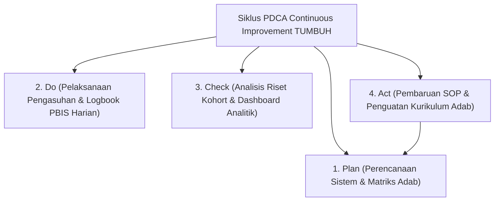

# P7-11: Siklus Improvement Berkelanjutan dan Riset Kohort

## Status Dokumen
* **Status**: 🌟 **A+ (Tervalidasi & Siap Diimplementasikan)**
* **Sub-Domain**: `07 Implementation Framework / 11 Continuous Improvement`
* **Penanggung Jawab Keilmuan**: Dewan Keilmuan TUMBUH (*Pakar Metodologi Riset & Pakar Tata Kelola Qudwah*)

---

## 1. Operasionalisasi Siklus Continuous Quality Improvement (CQI)

Pesantren ekosistem **TUMBUH** beroperasi sebagai **Organisasi Pembelajar (*Learning Organization*)** yang terus menerus menyempurnakan sistemnya melalui siklus CQI Deming (PDCA):

---

## 2. Pemanfaatan Riset Kohort Longitudinal

Dewan Keilmuan melakukan riset longitudinal tahunan untuk membandingkan laju pertumbuhan karakter antar angkatan, memastikan pesantren terus berkembang mencapai keunggulan paripurna.
