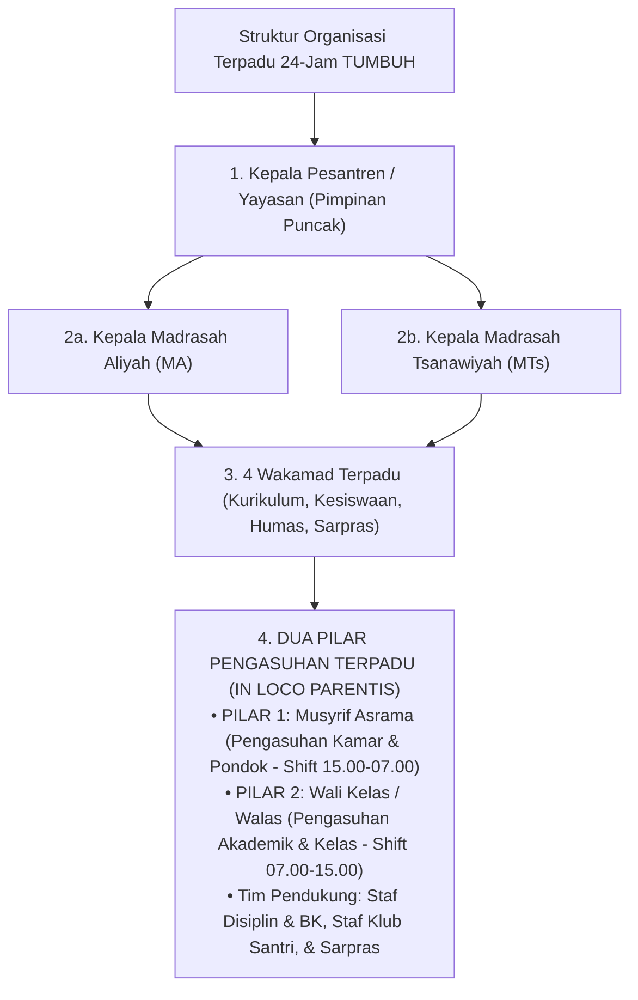
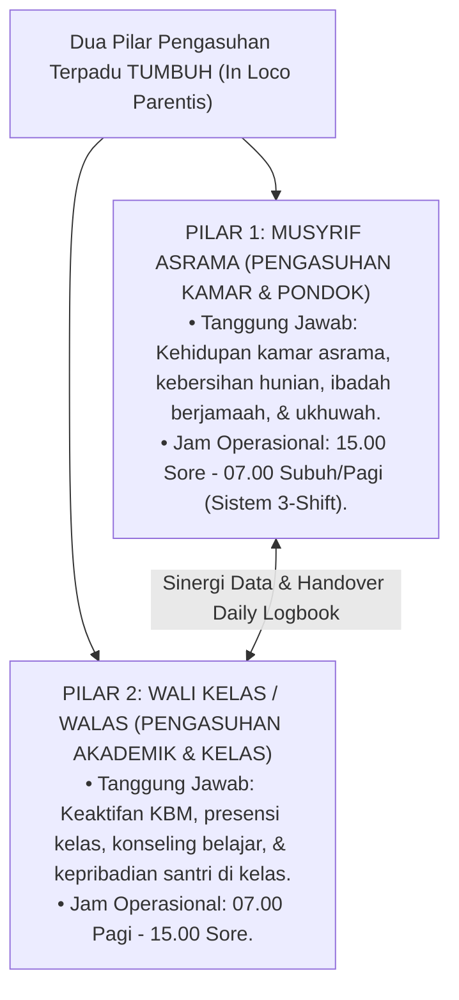
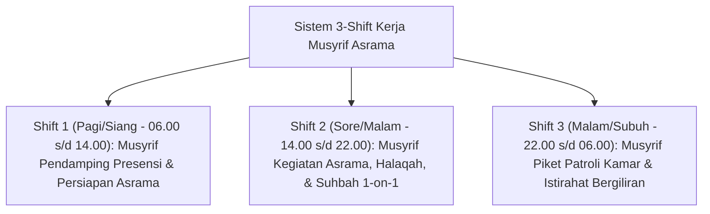

# MONOGRAF RISET AKADEMIK: STRUKTUR ORGANISASI TERPADU 24-JAM DAN TATA KELOLA PENGASUHAN PESANTREN
## Evaluasi Sistemik: Eliminasi Dikotomi Madrasah-Asrama, Dual-Pillar Pengasuhan (Musyrif Asrama & Wali Kelas Walas), Batas Tugas Operasional, RACI Matrix, SOP Shift Musyrif Anti-Burnout, dan Pengawasan Zero Violence

**Dewan Riset & Keilmuan Ekosistem TUMBUH**  
*Dipublikasikan sebagai Naskah Monograf Riset Ilmiah (Jurnal Kebijakan & Tata Kelola Lembaga Pesantren)*  
*Dokumen Rujukan Induk: Domain 07 Implementation Framework & Book Series Volume 03*

---

## ABSTRAK

> **Latar Belakang**: Patologi tata kelola pesantren konvensional sering kali dipicu oleh dikotomi kaku (*dualisme struktural*) antara kegiatan akademik madrasah dan kehidupan asrama pondok, atau pemahaman keliru yang menganggap pengasuhan hanya tugas Musyrif semata. Padahal, pengasuhan holistik (*In Loco Parentis*) adalah sinergi terpadu antara pengasuhan karakter kamar oleh Musyrif dan pengasuhan akademik/perilaku kelas oleh Wali Kelas (Walas).
>
> **Tujuan Penelitian**: Merumuskan dan memvalidasi **Konsep Dual-Pillar Pengasuhan Terpadu (Musyrif Asrama & Wali Kelas Walas)**, merinci hirarki organisasi non-dikotomis 24-jam, menetapkan *job description* fungsional Staf Pengasuhan, Staf Disiplin & BK, dan Staf Klub Santri, merumuskan Matriks RACI, dan menetapkan SOP Shift Kerja Musyrif Anti-Burnout.
>
> **Hasil Riset**: Terstruktur Arsitektur Dual-Pillar Pengasuhan: (1) **Pilar 1: Musyrif Asrama** (Pengasuhan Karakter Kamar & Pondok - Jam 15.00-07.00); dan (2) **Pilar 2: Wali Kelas / Walas** (Pengasuhan Akademik & Perilaku Kelas - Jam 07.00-15.00), yang terhubung secara sinergis melalui *Logbook Musyrif App*.
>
> **Kata Kunci**: *Implementation Framework, Dual-Pillar Caretaking, Musyrif Asrama, Wali Kelas Walas, In Loco Parentis, Handover Mechanism, RACI Matrix, Shift System Anti-Burnout.*

---

## 1. PENDAHULUAN & DIALEKTIKA STRUKTUR ORGANISASI

Tata kelola pesantren modern menuntut penegakan konsep **Pengasuhan Terpadu (*Holistic Caretaking / In Loco Parentis*)** yang memosisikan Musyrif Asrama dan Wali Kelas (Walas) sebagai dua pilar sejajar pendamping pertumbuhan santri.

---

## 2. KONSEPTUALISASI DUAL-PILLAR PENGASUHAN TERPADU (DUAL-PILLAR CARETAKING)

Fungsi *Pengasuhan* dalam Ekosistem TUMBUH tidak dibebankan secara tunggal kepada Musyrif, melainkan dibagi secara profesional ke dalam **Dua Pilar Pengasuhan**:

### 2.1. Pilar 1: Musyrif Asrama (Pengasuhan Karakter Kamar & Pondok)
* **Tugas Pokok**: Pengasuhan karakter di hunian kamar asrama, kedisiplinan ibadah berjamaah (Subuh, Dzuhur, Ashar, Maghrib, Isya), halaqah Al-Qur'an/Bahasa Arab, dan penanganan problematika harian santri di pondok.

### 2.2. Pilar 2: Wali Kelas / Walas (Pengasuhan Akademik & Perilaku Kelas)
* **Tugas Pokok**: Pengasuhan perkembangan akademik santri di madrasah, pengawasan presensi KBM, bimbingan minat studi, konseling awal problematika kelas, dan pelaporan rutin ke orang tua santri.

---

## 3. MEKANISME HANDOVER & KLARIFIKASI BATAS TUGAS

* **07.00 Pagi (Handover Musyrif $\rightarrow$ Walas)**: Musyrif menyerahkan catatan santri sakit/izin kamar kepada Wali Kelas sebelum KBM dimulai.
* **15.00 Sore (Handover Walas $\rightarrow$ Musyrif)**: Wali Kelas menyerahkan rekapitulasi presensi KBM dan catatan insiden kelas kepada Musyrif Asrama melalui *Logbook Musyrif App*.

---

## 4. MATRIKS RACI BEBAS GESEKAN BIROKRASI

| Fungsi & Kegiatan Pengasuhan | Kepala Pesantren | Kepala MA/MTs | Wakamad Kesiswaan | Pilar 1: Musyrif Asrama | Pilar 2: Wali Kelas (Walas) | Staf Disiplin & BK |
| :--- | :---: | :---: | :---: | :---: | :---: | :---: |
| **Pengasuhan Akademik & KBM (07.00-15.00)** | A | R | C | I | **R (Pengasuh Kelas)** | C |
| **Pengasuhan Kamar & Pondok (15.00-07.00)** | A | I | R | **R (Pengasuh Asrama)** | I | C |
| **Penanganan Kasus Restoratif Tier 2/3**| A | I | A | C | C | **R** |
| **Komunikasi Parent Portal Mobile** | I | I | A | R (Pengasuhan Kamar) | R (Pengasuhan Kelas) | R (Kasus BK) |

*(R: Responsible, A: Accountable, C: Consulted, I: Informed)*

---

## 5. SOP PENGATURAN SHIFT KERJA MUSYRIF (ANTI-BURNOUT)

---

## 6. DAFTAR PUSTAKA
* Edmondson, A. C. (2018). *The Fearless Organization*. John Wiley & Sons.
* Senge, P. M. (1990). *The Fifth Discipline*. Doubleday.
