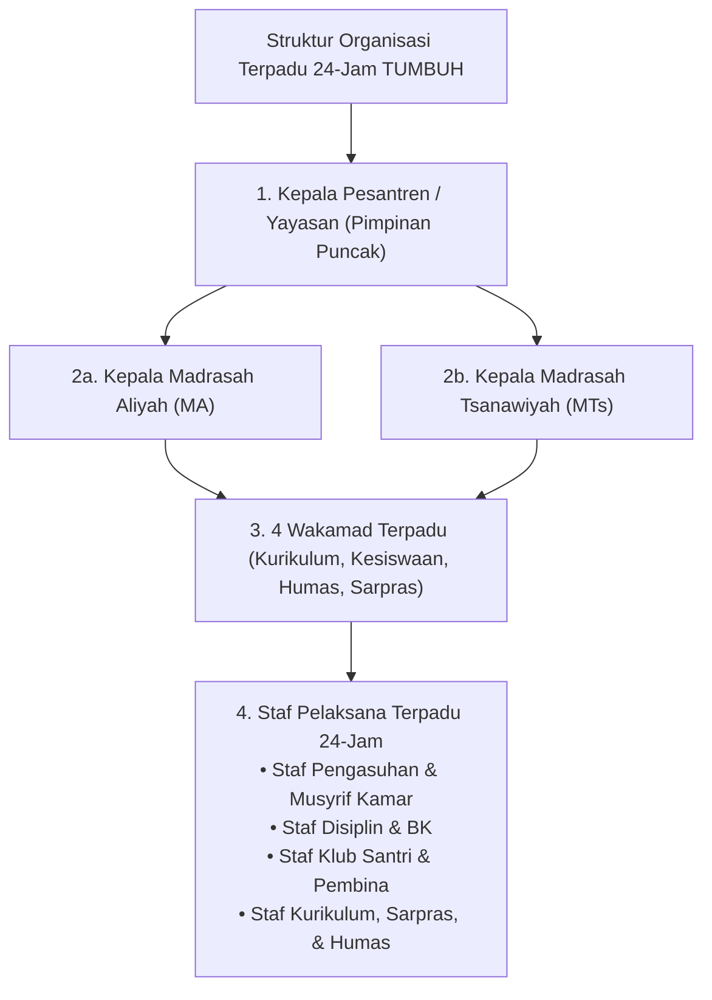
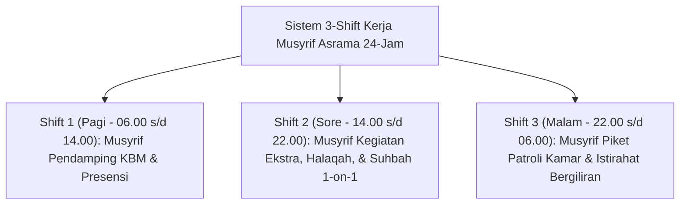

# MONOGRAF RISET AKADEMIK: STRUKTUR ORGANISASI TERPADU 24-JAM DAN TATA KELOLA PENGASUHAN PESANTREN
## Evaluasi Sistemik: Eliminasi Dikotomi Madrasah-Asrama, Job Description Staf Pengasuhan & Musyrif, Staf Disiplin & BK, Staf Klub Santri, Matriks RACI, SOP Shift Musyrif 24-Jam Anti-Burnout, dan Pengawasan Zero Violence

**Dewan Riset & Keilmuan Ekosistem TUMBUH**  
*Dipublikasikan sebagai Naskah Monograf Riset Ilmiah (Jurnal Kebijakan & Tata Kelola Lembaga Pesantren)*  
*Dokumen Rujukan Induk: Domain 07 Implementation Framework & Book Series Volume 03*

---

## ABSTRAK

> **Latar Belakang**: Patologi tata kelola pesantren konvensional sering kali dipicu oleh dikotomi kaku (*dualisme struktural*) antara kegiatan akademik madrasah dan kehidupan asrama pondok, yang memicu perebutan pengaruh birokrasi dan kelelahan kronis (*severe burnout*) pada Musyrif 24-jam. Di samping itu, rincian *job description* staf pengasuhan asrama, staf disiplin & BK, serta pembina klub santri sering kali tidak terumuskan secara spesifik.
>
> **Tujuan Penelitian**: Merumuskan dan memvalidasi hirarki struktur organisasi terpadu 24-jam tanpa dikotomi madrasah-asrama, merinci *job description* fungsional Staf Pengasuhan, Staf Disiplin & BK, dan Staf Klub Santri, merumuskan Matriks RACI Bebas Gesekan Birokrasi, dan menetapkan SOP Pengaturan Shift Kerja Musyrif 24-Jam Anti-Burnout.
>
> **Hasil Riset**: Terbentuk struktur organisasi non-dikotomis 24-jam: Kepala Pesantren $\rightarrow$ Kepala MA & MTs $\rightarrow$ 4 Wakamad Terpadu (Kurikulum, Kesiswaan, Humas, Sarpras) $\rightarrow$ Staf Pelaksana 24-Jam (Staf Pengasuhan, Staf Disiplin & BK, Staf Klub Santri, Musyrif Kamar). Dilengkapi Matriks RACI pembagian wewenang yang tegas dan sistem 3-Shift Kerja Musyrif (Shift Pagi, Sore, Malam) untuk menjamin kesejahteraan fisik & emosional pengasuh.
>
> **Kata Kunci**: *Implementation Framework, Non-Dichotomous Hierarchy, Staf Pengasuhan, Musyrif Kamar, Disiplin & BK, RACI Matrix, Shift System Anti-Burnout, Zero Violence Audit.*

---

## 1. PENDAHULUAN & DIALEKTIKA STRUKTUR ORGANISASI

Tata kelola pesantren modern menuntut pengintegrasian penuh antara kegiatan pengajaran formal madrasah dan kehidupan pengasuhan 24-jam di asrama.

---

## 2. RINCIAN JOB DESCRIPTION STAF OPERASIONAL PENGASUHAN 24-JAM

Berdasarkan rujukan induk tata kelola operasional (`Sistem-Baru-Pembinaan-Santri.md`), ditetapkan rincian tugas pokok dan *job description* bagi staf pengasuhan:

### 2.1. Staf Pengasuhan & Musyrif Kamar
* **Tugas Pokok**: Membentuk karakter serta tradisi luhur pesantren dan mendampingi kehidupan santri 24-jam.
* **Rincian Job Description**:
  1. Kontrol keasrian, kebersihan, dan kerapian hunian kamar santri.
  2. Manajemen prosedur perizinan keluar-masuk bagi santri secara tertib.
  3. Membimbing pelaksanaan ibadah wajib dan sunnah harian (Subuh, Dzuhur, Ashar, Maghrib, Isya, Qiyamul Lail).
  4. Solusi atas problematika harian yang dihadapi santri di asrama.
  5. Mengawasi transisi dan masa orientasi santri baru (Tangga T1).
  6. Menyusun laporan berkala mengenai perkembangan pola asuh santri kepada Wakamad Kesiswaan.

### 2.2. Staf Disiplin & Bimbingan Konseling (BK)
* **Tugas Pokok**: Mengupayakan tegaknya regulasi lembaga melalui pendekatan pembinaan yang konstruktif (*Firm & Kind*).
* **Rincian Job Description**:
  1. Penanggung jawab pengelolaan tata tertib santri berbasis PBIS.
  2. Mencatat rekam jejak poin pelanggaran maupun prestasi dalam *Logbook Musyrif App*.
  3. Menerapkan langkah-langkah edukatif dan disiplin restoratif.
  4. Menyelenggarakan layanan konseling tahap awal bagi santri.
  5. Menindaklanjuti setiap bentuk indikasi tindakan indisipliner tanpa kekerasan.
  6. Menangani resolusi konflik antar-individu santri secara adil (*Ishlah al-Bain*).
  7. Mengirimkan laporan penanganan kasus ke bagian Kesiswaan.

### 2.3. Staf Klub Santri & Pembina Minat Bakat
* **Tugas Pokok**: Memfasilitasi ruang aktualisasi minat, bakat, serta peningkatan kecakapan (*skill*) santri.
* **Rincian Job Description**:
  1. Mengorganisir pendaftaran dan operasional 8 Sekbid OSIS & unit klub santri.
  2. Menetapkan *timeline* jadwal pertemuan rutin mingguan klub.
  3. Memverifikasi tingkat kehadiran dan partisipasi peserta.
  4. Mengonsep ajang kompetisi (*Internal Challenge*) serta pameran hasil karya.
  5. Menjalin koordinasi intensif dengan para pembina ahli.
  6. Mengadakan tinjauan efektivitas program kerja klub secara berkala.

---

## 3. MATRIKS RACI BEBAS GESEKAN BIROKRASI

| Fungsi & Kegiatan Pengasuhan | Kepala Pesantren | Kepala MA/MTs | Wakamad Kesiswaan | Staf Pengasuhan / Musyrif | Staf Disiplin & BK | Wali Kelas |
| :--- | :---: | :---: | :---: | :---: | :---: | :---: |
| **Pengasuhan Asrama 24-Jam & Kamar** | A | I | R | R | C | I |
| **KBM Formal & Kurikulum Diniyyah** | A | R | C | I | I | R |
| **Penanganan Kasus Restoratif Tier 2/3**| A | I | A | C | R | C |
| **Pengelolaan Klub Santri & OSIS** | I | I | A | C | I | R |
| **Komunikasi Parent Portal Mobile** | I | I | A | R | R | R |

*(R: Responsible, A: Accountable, C: Consulted, I: Informed)*

---

## 4. SOP PENGATURAN SHIFT KERJA MUSYRIF 24-JAM (ANTI-BURNOUT)

---

## 5. DAFTAR PUSTAKA
* Edmondson, A. C. (2018). *The Fearless Organization*. John Wiley & Sons.
* Senge, P. M. (1990). *The Fifth Discipline*. Doubleday.
