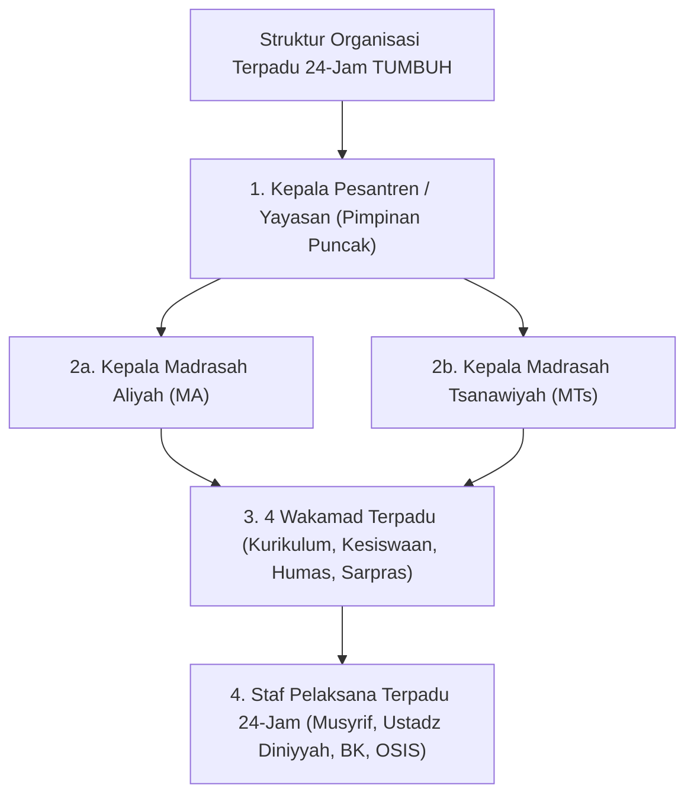
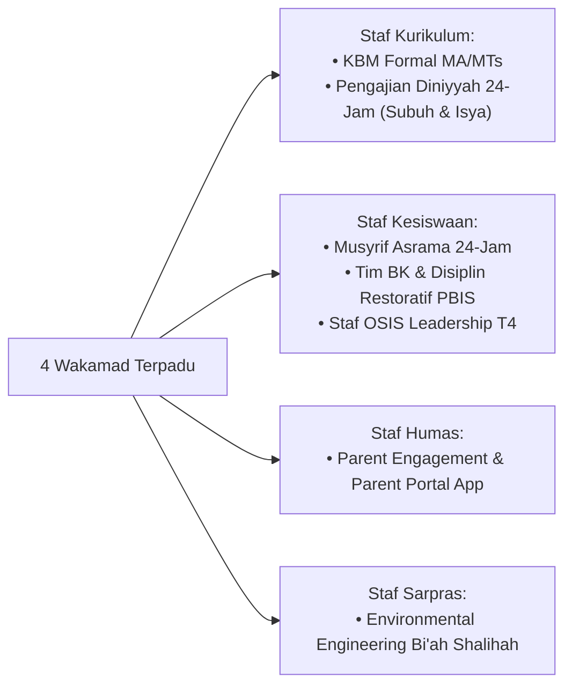

# MONOGRAF RISET AKADEMIK: STRUKTUR ORGANISASI TERPADU 24-JAM DAN TATA KELOLA PENGASUHAN PESANTREN
## Evaluasi Sistemik: Eliminasi Dikotomi Madrasah-Asrama, Servant Leadership, dan Pengawasan Internal Zero Violence

**Dewan Riset & Keilmuan Ekosistem TUMBUH**  
*Dipublikasikan sebagai Naskah Monograf Riset Ilmiah (Jurnal Kebijakan & Tata Kelola Lembaga Pesantren)*  
*Dokumen Rujukan Induk: Domain 07 Implementation Framework & Book Series Volume 03*

---

## ABSTRAK

> **Latar Belakang**: Patologi tata kelola pesantren konvensional sering kali dipicu oleh dikotomi kaku (*dualisme struktural*) antara kegiatan akademik madrasah dan kehidupan asrama pondok. Pemisahan ini menciptakan konflik kewenangan, kebingungan laporan santri, dan kelelahan kerja (*burnout*) bagi pengasuh.
>
> **Tujuan Penelitian**: Merumuskan dan memvalidasi hirarki struktur organisasi terpadu 24-jam tanpa dikotomi madrasah-asrama yang menempatkan Pimpinan Pesantren/Yayasan pada puncak kepemimpinan, membawahi Kepala MA & MTs, 4 Wakamad, dan Staf Pelaksana Terpadu.
>
> **Hasil Riset**: Terbentuk struktur organisasi non-dikotomis 24-jam: Kepala Pesantren $\rightarrow$ Kepala MA & MTs $\rightarrow$ 4 Wakamad (Kurikulum, Kesiswaan, Humas, Sarpras) $\rightarrow$ Staf Pelaksana Terpadu (Pengasuhan Asrama/Musyrif di bawah Kesiswaan; Pengajian Diniyyah 24-jam di bawah Kurikulum).
>
> **Kata Kunci**: *Implementation Framework, Non-Dichotomous Hierarchy, Integrated Staff, Qudwah Leadership, Zero Violence Audit.*

---

## 1. PENDAHULUAN & DIALEKTIKA STRUKTUR ORGANISASI

Tata kelola pesantren modern menuntut pengintegrasian penuh antara kegiatan pengajaran formal madrasah dan kehidupan pengasuhan 24-jam di asrama.

---

## 2. PETA PEMBAGIAN TUGAS STAF PELAKSANA TERPADU

---

## 3. IMPLIKASI TATA KELOLA & AUDIT INTERNAL
- **Pekan Audit Integritas Zero Violence**: Pengawasan semesteran terstruktur untuk menjamin seluruh area pesantren 100% bebas dari intimidasi dan perpeloncoan.

---

## 4. DAFTAR PUSTAKA
* Edmondson, A. C. (2018). *The Fearless Organization*. John Wiley & Sons.
* Senge, P. M. (1990). *The Fifth Discipline*. Doubleday.
