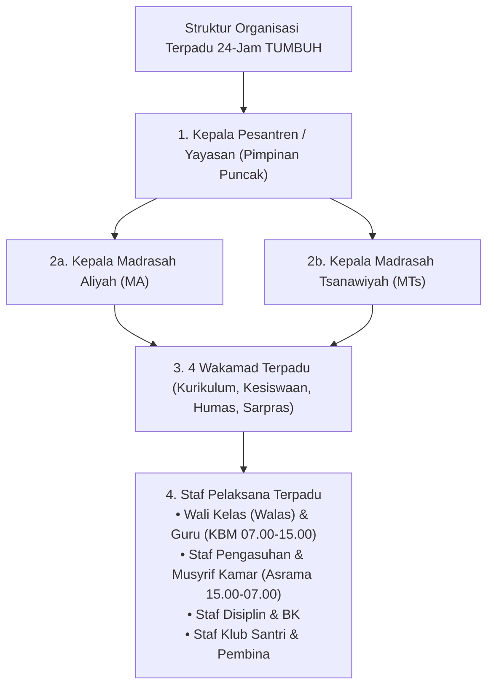
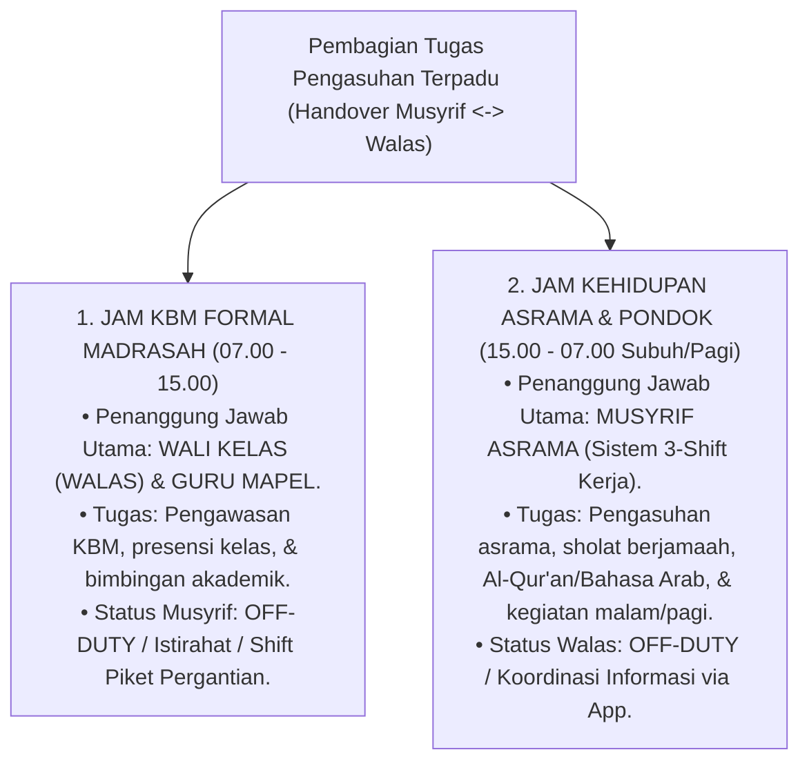
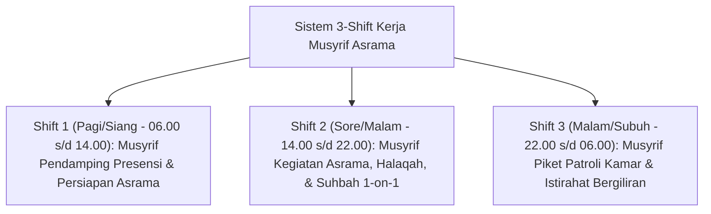

# MONOGRAF RISET AKADEMIK: STRUKTUR ORGANISASI TERPADU 24-JAM DAN TATA KELOLA PENGASUHAN PESANTREN
## Evaluasi Sistemik: Eliminasi Dikotomi Madrasah-Asrama, Batas Tugas Musyrif Asrama vs. Wali Kelas (Walas), Job Description Staf Pengasuhan, Staf Disiplin & BK, Staf Klub Santri, Matriks RACI, SOP Shift Musyrif 24-Jam Anti-Burnout, dan Pengawasan Zero Violence

**Dewan Riset & Keilmuan Ekosistem TUMBUH**  
*Dipublikasikan sebagai Naskah Monograf Riset Ilmiah (Jurnal Kebijakan & Tata Kelola Lembaga Pesantren)*  
*Dokumen Rujukan Induk: Domain 07 Implementation Framework & Book Series Volume 03*

---

## ABSTRAK

> **Latar Belakang**: Patologi tata kelola pesantren konvensional sering kali dipicu oleh dikotomi kaku (*dualisme struktural*) antara kegiatan akademik madrasah dan kehidupan asrama pondok, atau kebingungan pembagian peran di mana Musyrif dianggap harus bertugas 24-jam fisik tanpa henti. Padahal, di madrasah terdapat Wali Kelas (Walas) yang bertanggung jawab penuh selama jam KBM.
>
> **Tujuan Penelitian**: Merumuskan dan memvalidasi hirarki struktur organisasi terpadu 24-jam tanpa dikotomi madrasah-asrama, merinci **Batas Tugas Musyrif Asrama vs. Wali Kelas (Walas)**, menetapkan *job description* fungsional Staf Pengasuhan, Staf Disiplin & BK, dan Staf Klub Santri, merumuskan Matriks RACI, dan menetapkan SOP Shift Kerja Musyrif Anti-Burnout.
>
> **Hasil Riset**: Terstruktur pembagian peran terpadu (*Handover Musyrif <-> Walas*): (1) **Jam KBM Formal (07.00-15.00)** dikendalikan penuh oleh **Wali Kelas & Guru Madrasah** (Musyrif off-duty/istirahat); dan (2) **Jam Asrama & Pondok (15.00-07.00 Subuh)** dikendalikan oleh **Musyrif Asrama** via sistem 3-Shift.
>
> **Kata Kunci**: *Implementation Framework, Non-Dichotomous Hierarchy, Musyrif vs Walas Boundary, Handover Mechanism, Staf Pengasuhan, RACI Matrix, Shift System Anti-Burnout.*

---

## 1. PENDAHULUAN & DIALEKTIKA STRUKTUR ORGANISASI

Tata kelola pesantren modern menuntut pengintegrasian penuh antara kegiatan pengajaran formal madrasah dan kehidupan pengasuhan asrama tanpa membebankan tugas fisik 24-jam nonstop pada individu Musyrif.

---

## 2. KLARIFIKASI BATAS TUGAS: MUSYRIF ASRAMA VS. WALI KELAS (WALAS) MADRASAH

To resolve role ambiguity and prevent educator burnout (*Triad Pertumbuhan*):

### Matriks Handover Informasi Harian (Shift Transition Protocol):
* **07.00 Pagi (Handover Musyrif $\rightarrow$ Walas)**: Musyrif menyerahkan data santri sakit/izin kamar kepada Wali Kelas sebelum KBM dimulai.
* **15.00 Sore (Handover Walas $\rightarrow$ Musyrif)**: Wali Kelas mengomunikasikan catatan presensi KBM dan insiden kelas kepada Musyrif Asrama melalui *Logbook Musyrif App*.

---

## 3. RINCIAN JOB DESCRIPTION STAF OPERASIONAL PENGASUHAN

### 3.1. Musyrif Asrama (Shift Asrama 15.00 - 07.00)
* **Fokus**: Pendampingan kehidupan kamar, kontrol kebersihan, perizinan keluar-masuk, dan bimbingan ibadah berjamaah/Al-Qur'an/Bahasa Arab.
* *Musyrif TIDAK mengawasi kelas KBM madrasah jam 07.00-15.00.*

### 3.2. Wali Kelas / Walas (Shift KBM 07.00 - 15.00)
* **Fokus**: Pembimbingan akademik santri di kelas, monitoring keaktifan KBM, konseling akademik awal, dan komunikasi langsung dengan orang tua mengenai progres studi.

### 3.3. Staf Disiplin & Bimbingan Konseling (BK)
* **Fokus**: Penegakan tata tertib PBIS, pencatatan poin prestasi & pelanggaran di *Logbook App*, konseling tahap awal, dan resolusi konflik adil (*Ishlah al-Bain*).

---

## 4. MATRIKS RACI BEBAS GESEKAN BIROKRASI

| Fungsi & Kegiatan Pengasuhan | Kepala Pesantren | Kepala MA/MTs | Wakamad Kesiswaan | Staf Pengasuhan / Musyrif | Wali Kelas (Walas) | Staf Disiplin & BK |
| :--- | :---: | :---: | :---: | :---: | :---: | :---: |
| **KBM Formal Madrasah (07.00-15.00)** | A | R | C | I | **R** | C |
| **Pengasuhan Asrama (15.00-07.00)** | A | I | R | **R** | I | C |
| **Penanganan Kasus Restoratif Tier 2/3**| A | I | A | C | C | **R** |
| **Komunikasi Parent Portal Mobile** | I | I | A | R (Asrama) | R (Akademik) | R (Kasus) |

*(R: Responsible, A: Accountable, C: Consulted, I: Informed)*

---

## 5. SOP PENGATURAN SHIFT KERJA MUSYRIF (ANTI-BURNOUT)

---

## 6. DAFTAR PUSTAKA
* Edmondson, A. C. (2018). *The Fearless Organization*. John Wiley & Sons.
* Senge, P. M. (1990). *The Fifth Discipline*. Doubleday.
