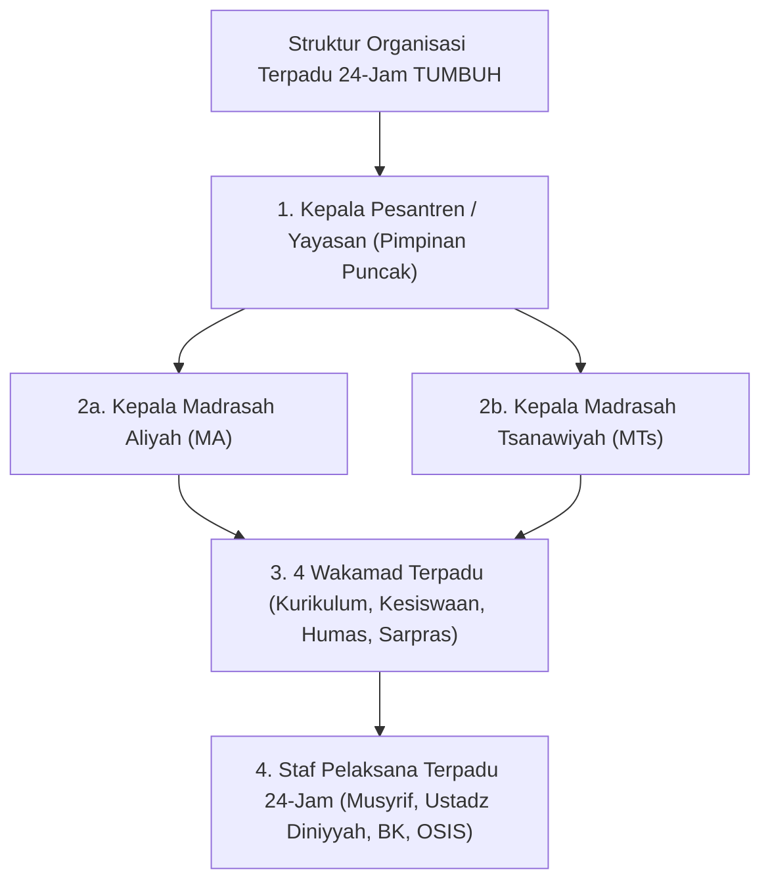
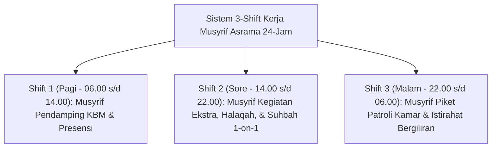

# MONOGRAF RISET AKADEMIK: STRUKTUR ORGANISASI TERPADU 24-JAM DAN TATA KELOLA PENGASUHAN PESANTREN
## Evaluasi Sistemik: Eliminasi Dikotomi Madrasah-Asrama, Matriks RACI Bebas Gesekan Birokrasi, SOP Shift Musyrif 24-Jam Anti-Burnout, dan Pengawasan Zero Violence

**Dewan Riset & Keilmuan Ekosistem TUMBUH**  
*Dipublikasikan sebagai Naskah Monograf Riset Ilmiah (Jurnal Kebijakan & Tata Kelola Lembaga Pesantren)*  
*Dokumen Rujukan Induk: Domain 07 Implementation Framework & Book Series Volume 03*

---

## ABSTRAK

> **Latar Belakang**: Patologi tata kelola pesantren konvensional sering kali dipicu oleh dikotomi kaku (*dualisme struktural*) antara kegiatan akademik madrasah dan kehidupan asrama pondok, yang memicu perebutan pengaruh birokrasi dan kelelahan kronis (*severe burnout*) pada Musyrif 24-jam.
>
> **Tujuan Penelitian**: Merumuskan dan memvalidasi hirarki struktur organisasi terpadu 24-jam tanpa dikotomi madrasah-asrama, merumuskan Matriks RACI Bebas Gesekan Birokrasi, dan menetapkan SOP Pengaturan Shift Kerja Musyrif 24-Jam Anti-Burnout.
>
> **Hasil Riset**: Terbentuk struktur organisasi non-dikotomis 24-jam: Kepala Pesantren $\rightarrow$ Kepala MA & MTs $\rightarrow$ 4 Wakamad Terpadu (Kurikulum, Kesiswaan, Humas, Sarpras) $\rightarrow$ Staf Pelaksana 24-Jam. Dilengkapi Matriks RACI pembagian wewenang yang tegas dan sistem 3-Shift Kerja Musyrif (Shift Pagi, Sore, Malam) untuk menjamin kesejahteraan fisik & emosional pengasuh.
>
> **Kata Kunci**: *Implementation Framework, Non-Dichotomous Hierarchy, RACI Matrix, Shift System Anti-Burnout, Zero Violence Audit.*

---

## 1. PENDAHULUAN & DIALEKTIKA STRUKTUR ORGANISASI

Tata kelola pesantren modern menuntut pengintegrasian penuh antara kegiatan pengajaran formal madrasah dan kehidupan pengasuhan 24-jam di asrama.

---

## 2. MATRIKS RACI BEBAS GESEKAN BIROKRASI

To eliminate jurisdictional conflicts (*turf wars*) between formal madrasah teachers and dormitory Musyrif:

| Fungsi & Kegiatan Pengasuhan | Kepala Pesantren | Kepala MA/MTs | Wakamad Kesiswaan | Musyrif Asrama | Wali Kelas |
| :--- | :---: | :---: | :---: | :---: | :---: |
| **Pengasuhan Asrama 24-Jam & Kamar** | A | I | R | R | C |
| **KBM Formal & Kurikulum Diniyyah** | A | R | C | I | R |
| **Penanganan Kasus Restoratif Tier 2/3**| A | I | R | R | C |
| **Komunikasi Parent Portal Mobile** | I | I | A | R | R |

*(R: Responsible, A: Accountable, C: Consulted, I: Informed)*

---

## 3. SOP PENGATURAN SHIFT KERJA MUSYRIF 24-JAM (ANTI-BURNOUT)

To prevent severe emotional burnout and protect educator well-being (*Triad Pertumbuhan*):

---

## 4. DAFTAR PUSTAKA
* Edmondson, A. C. (2018). *The Fearless Organization*. John Wiley & Sons.
* Senge, P. M. (1990). *The Fifth Discipline*. Doubleday.
