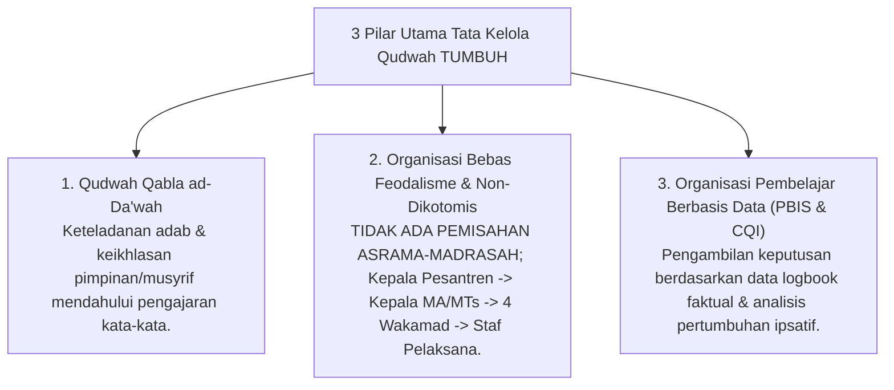
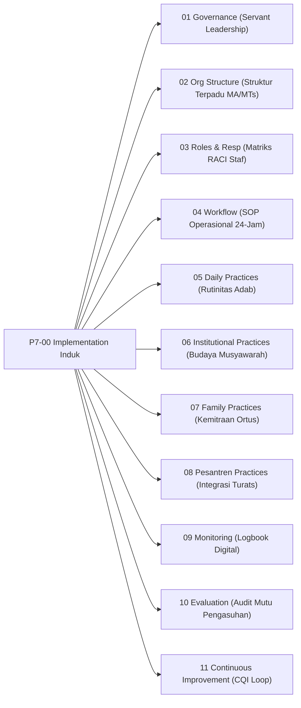

# P7-00: Implementation Framework Induk (Kerangka Implementasi & Tata Kelola Ekosistem TUMBUH)

## Status Dokumen
* **Status**: 🌟 **A+ (Tervalidasi & Induk Baku)**
* **Domain**: Project 7 — `07 Implementation Framework`
* **Penanggung Jawab Keilmuan**: Dewan Keilmuan TUMBUH (*Pakar Tata Kelola Qudwah, Pakar Arsitektur Digital Pesantren, & Pakar Metodologi Riset*)

---

## 1. Pendahuluan & Prinsip Tata Kelola Qudwah (Servant Leadership)

Sesuai Dokumen Induk `AGENTS.md` dan rujukan resmi `source/Sistem-Baru-Pembinaan-Santri.md`, seluruh tata kelola operasional dan implementasi sistem di pesantren ekosistem **TUMBUH** berlandaskan prinsip **Kepemimpinan Qudwah Hasanah (*Servant Leadership*)** dan **Integrasi Utuh 24-Jam (Tanpa Pemisahan Asrama-Madrasah)**.

---

## 2. Struktur Organisasi Terpadu 24-Jam

Struktur pimpinan dan staf pelaksana mengintegrasikan kehidupan madrasah formal dan pengasuhan asrama:
- **Pimpinan Puncak**: Kepala Pesantren / Yayasan.
- **Pimpinan Satuan Pendidikan**: Kepala Madrasah Aliyah (MA) & Kepala Madrasah Tsanawiyah (MTs).
- **Unsur Pembantu Pimpinan (4 Wakamad)**: Wakamad Kurikulum, Wakamad Kesiswaan, Wakamad Humas, & Wakamad Sarpras.
- **Staf Pelaksana Terpadu**:
  - *Kurikulum*: Staf Kurikulum (KBM Formal & Pengajian Subuh/Maghrib/Isya).
  - *Kesiswaan*: Staf OSIS, Staf Pengasuhan (Asrama 24-Jam), Staf Kedisiplinan & BK (SW-PBIS Multi-Tier 1-3), & Staf Klub Santri (Ekskul).
  - *Humas*: Staf Humas (Parent Engagement & Parent Portal).
  - *Sarpras*: Staf Sarpras (Environmental Engineering & Bi'ah Shalihah).

---

## 3. Model Triad Pertumbuhan Simbiotik dalam Implementasi Operasional

- **Santri Tumbuh**: Mendapatkan perlindungan pengasuhan 24 jam yang hangat, iklim asrama yang kondusif (*Bi'ah Shalihah*), dan kejelasan target tangga perkembangan J1–J4.
- **Guru & Musyrif Tumbuh**: Memiliki deskripsi peran yang jelas, terlindungi dari *burnout* melalui rasio pembinaan berkeadilan (1:15-20 santri), dan memperoleh supervisi pengasuhan mingguan.
- **Sistem Lembaga Tumbuh**: Memiliki SOP workflow yang baku, sistem monitoring digital real-time, audit mutu berkala, dan siklus *Continuous Quality Improvement (CQI)*.

---

## 4. Peta Hubungan Sub-Domain Implementasi

---

## 5. Rujukan Keilmuan Multidisiplin

1. **Turats Islam**: *Adab al-Alim wa al-Muta'allim* (Imam An-Nawawi), *Fiqhu ar-Ri'ayah* (Tanggung Jawab Pengasuhan Kepemimpinan), *Al-Imamah wa Qudwah* (Imam Al-Ghazali).
2. **Sains Kontemporer**: *Servant Leadership Theory* (Greenleaf), *School-Wide PBIS Implementation Blueprint* (Sugai & Horner), *Continuous Quality Improvement (CQI) in Education*, *Organizational Learning Theory* (Peter Senge).
