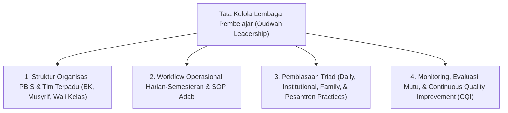

# 07 Implementation Framework (Kerangka Implementasi & Tata Kelola Ekosistem TUMBUH)

Domain ini memuat arsitektur implementasi operasional, struktur organisasi pengasuhan, alur kerja harian-semesteran, kemitraan keluarga, serta sistem pemantauan dan evaluasi mutu lembaga di ekosistem **TUMBUH**. Seluruh tata kelola berlandaskan **Kepemimpinan Qudwah Hasanah (Servant Leadership)**, **Bebas Feodalisme**, dan **Continuous Quality Improvement (CQI)**.

---

## Arsitektur Tata Kelola & Implementasi Lembaga Pembelajar

---

## Indeks Dokumen Induk & 11 Sub-Domain Modul

* 📄 **[P7-00-Implementation-Framework-Induk.md](./P7-00-Implementation-Framework-Induk.md)**: Dokumen Maha-Induk Tata Kelola Lembaga, Kepemimpinan Qudwah, & Standar Operasional TUMBUH.

### Sub-Domain 01: Governance
* 📁 **[01 Governance](./01%20Governance/)**:
  * 📄 [P7-01-Tata-Kelola-Lembaga-dan-Kepemimpinan-Qudwah.md](./01%20Governance/P7-01-Tata-Kelola-Lembaga-dan-Kepemimpinan-Qudwah.md)
  * 📄 [P7-01-01-Prinsip-Servant-Leadership-dan-Qudwah-Qabla-ad-Dawah.md](./01%20Governance/P7-01-01-Prinsip-Servant-Leadership-dan-Qudwah-Qabla-ad-Dawah.md)
  * 📄 [P7-01-02-Kebijakan-Eliminasi-Feodalisme-dan-Pengawasan-Internal.md](./01%20Governance/P7-01-02-Kebijakan-Eliminasi-Feodalisme-dan-Pengawasan-Internal.md)
  * 📄 [P7-01-03-Prinsip-Organisasi-Pembelajar-Berbasis-Data-PBIS.md](./01%20Governance/P7-01-03-Prinsip-Organisasi-Pembelajar-Berbasis-Data-PBIS.md)

### Sub-Domain 02: Organizational Structure
* 📁 **[02 Organizational Structure](./02%20Organizational%20Structure/)**:
  * 📄 [P7-02-Struktur-Organisasi-dan-Tim-Terpadu-Pengasuhan.md](./02%20Organizational%20Structure/P7-02-Struktur-Organisasi-dan-Tim-Terpadu-Pengasuhan.md)
  * 📄 [P7-02-01-Struktur-Hierarki-Terpadu-Kepala-Pesantren-MA-MTs.md](./02%20Organizational%20Structure/P7-02-01-Struktur-Hierarki-Terpadu-Kepala-Pesantren-MA-MTs.md)
  * 📄 [P7-02-02-Pembagian-Tugas-4-Wakamad-dan-Staf-Pelaksana.md](./02%20Organizational%20Structure/P7-02-02-Pembagian-Tugas-4-Wakamad-dan-Staf-Pelaksana.md)
  * 📄 [P7-02-03-SOP-Koordinasi-Tim-Terpadu-PBIS-dan-Kesiswaan.md](./02%20Organizational%20Structure/P7-02-03-SOP-Koordinasi-Tim-Terpadu-PBIS-dan-Kesiswaan.md)

### Sub-Domain 03: Roles and Responsibilities
* 📁 **[03 Roles and Responsibilities](./03%20Roles%20and%20Responsibilities/)**:
  * 📄 [P7-03-Deskripsi-Peran-dan-Tanggung-Jawab-Pengasuhan.md](./03%20Roles%20and%20Responsibilities/P7-03-Deskripsi-Peran-dan-Tanggung-Jawab-Pengasuhan.md)
  * 📄 [P7-03-01-Matriks-RACI-Peran-Pimpinan-Wakamad-dan-Staf.md](./03%20Roles%20and%20Responsibilities/P7-03-01-Matriks-RACI-Peran-Pimpinan-Wakamad-dan-Staf.md)
  * 📄 [P7-03-02-Deskripsi-Peran-Musyrif-Asrama-dan-Rasio-1-15-20.md](./03%20Roles%20and%20Responsibilities/P7-03-02-Deskripsi-Peran-Musyrif-Asrama-dan-Rasio-1-15-20.md)
  * 📄 [P7-03-03-Deskripsi-Peran-Konselor-BK-dan-Mentor-Santri-T4.md](./03%20Roles%20and%20Responsibilities/P7-03-03-Deskripsi-Peran-Konselor-BK-dan-Mentor-Santri-T4.md)

### Sub-Domain 04: Workflow
* 📁 **[04 Workflow](./04%20Workflow/)**:
  * 📄 [P7-04-Alur-Kerja-Operasional-Pengasuhan-dan-Pembinaan.md](./04%20Workflow/P7-04-Alur-Kerja-Operasional-Pengasuhan-dan-Pembinaan.md)
  * 📄 [P7-04-01-Workflow-Harian-Pengasuhan-4-Shift.md](./04%20Workflow/P7-04-01-Workflow-Harian-Pengasuhan-4-Shift.md)
  * 📄 [P7-04-02-SOP-Rapat-Evaluasi-Pengasuhan-Sabtu-Pagi.md](./04%20Workflow/P7-04-02-SOP-Rapat-Evaluasi-Pengasuhan-Sabtu-Pagi.md)
  * 📄 [P7-04-03-Siklus-Workflow-Semesteran-dan-Gateway-Transisi.md](./04%20Workflow/P7-04-03-Siklus-Workflow-Semesteran-dan-Gateway-Transisi.md)

### Sub-Domain 05: Daily Practices
* 📁 **[05 Daily Practices](./05%20Daily%20Practices/)**:
  * 📄 [P7-05-Pembiasaan-Praktik-Harian-dan-Rutinitas-Adab.md](./05%20Daily%20Practices/P7-05-Pembiasaan-Praktik-Harian-dan-Rutinitas-Adab.md)
  * 📄 [P7-05-01-Rutinitas-Adab-Subuh-Hingga-Malam-Santri.md](./05%20Daily%20Practices/P7-05-01-Rutinitas-Adab-Subuh-Hingga-Malam-Santri.md)
  * 📄 [P7-05-02-Praktik-Harian-Musyrif-Warm-Presence-dan-Prompts.md](./05%20Daily%20Practices/P7-05-02-Praktik-Harian-Musyrif-Warm-Presence-dan-Prompts.md)
  * 📄 [P7-05-03-Protokol-Jurnal-Refleksi-Malam-dan-Muhasabah.md](./05%20Daily%20Practices/P7-05-03-Protokol-Jurnal-Refleksi-Malam-dan-Muhasabah.md)

### Sub-Domain 06: Institutional Practices
* 📁 **[06 Institutional Practices](./06%20Institutional%20Practices/)**:
  * 📄 [P7-06-Pembiasaan-Budaya-Lembaga-dan-Iklim-Positif.md](./06%20Institutional%20Practices/P7-06-Pembiasaan-Budaya-Lembaga-dan-Iklim-Positif.md)
  * 📄 [P7-06-01-SOP-Forum-Musyawarah-Restoratif-Bulanan.md](./06%20Institutional%20Practices/P7-06-01-SOP-Forum-Musyawarah-Restoratif-Bulanan.md)
  * 📄 [P7-06-02-Audit-Penegakan-Policy-Zero-Violence-Lembaga.md](./06%20Institutional%20Practices/P7-06-02-Audit-Penegakan-Policy-Zero-Violence-Lembaga.md)
  * 📄 [P7-06-03-Protokol-Majlis-Apresiasi-Karakter-Bulanan.md](./06%20Institutional%20Practices/P7-06-03-Protokol-Majlis-Apresiasi-Karakter-Bulanan.md)

### Sub-Domain 07: Family Practices
* 📁 **[07 Family Practices](./07%20Family%20Practices/)**:
  * 📄 [P7-07-Kemitraan-Pengasuhan-Keluarga-dan-Orang-Tua.md](./07%20Family%20Practices/P7-07-Kemitraan-Pengasuhan-Keluarga-dan-Orang-Tua.md)
  * 📄 [P7-07-01-Kurikulum-Sekolah-Orang-Tua-Majlis-Parenting.md](./07%20Family%20Practices/P7-07-01-Kurikulum-Sekolah-Orang-Tua-Majlis-Parenting.md)
  * 📄 [P7-07-02-Panduan-Penyelarasan-Adab-Rumah-Masa-Liburan.md](./07%20Family%20Practices/P7-07-02-Panduan-Penyelarasan-Adab-Rumah-Masa-Liburan.md)
  * 📄 [P7-07-03-Spesifikasi-dan-Fitur-Parent-Portal-Digital-App.md](./07%20Family%20Practices/P7-07-03-Spesifikasi-dan-Fitur-Parent-Portal-Digital-App.md)

### Sub-Domain 08: Pesantren Practices
* 📁 **[08 Pesantren Practices](./08%20Pesantren%20Practices/)**:
  * 📄 [P7-08-Tradisi-Pesantren-dan-Integrasi-Turats-Klasik.md](./08%20Pesantren%20Practices/P7-08-Tradisi-Pesantren-dan-Integrasi-Turats-Klasik.md)
  * 📄 [P7-08-01-Metodologi-Halaqah-Adab-dan-Kajian-Turats.md](./08%20Pesantren%20Practices/P7-08-01-Metodologi-Halaqah-Adab-dan-Kajian-Turats.md)
  * 📄 [P7-08-02-Tradisi-Khidmah-Sosial-Sukarela-Tanpa-Feodalisme.md](./08%20Pesantren%20Practices/P7-08-02-Tradisi-Khidmah-Sosial-Sukarela-Tanpa-Feodalisme.md)
  * 📄 [P7-08-03-Ritus-Ukhuwah-Mayoran-dan-Qiyamul-Lail-Bersama.md](./08%20Pesantren%20Practices/P7-08-03-Ritus-Ukhuwah-Mayoran-dan-Qiyamul-Lail-Bersama.md)

### Sub-Domain 09: Monitoring
* 📁 **[09 Monitoring](./09%20Monitoring/)**:
  * 📄 [P7-09-Sistem-Pemantauan-dan-Monitoring-Digital-PBIS.md](./09%20Monitoring/P7-09-Sistem-Pemantauan-dan-Monitoring-Digital-PBIS.md)
  * 📄 [P7-09-01-Arsitektur-Dashboard-Monitoring-Real-Time.md](./09%20Monitoring/P7-09-01-Arsitektur-Dashboard-Monitoring-Real-Time.md)
  * 📄 [P7-09-02-Protokol-Audit-Trail-Timestamp-Logbook-Musyrif.md](./09%20Monitoring/P7-09-02-Protokol-Audit-Trail-Timestamp-Logbook-Musyrif.md)
  * 📄 [P7-09-03-Algoritma-EWS-Trigger-dan-Alur-Notifikasi-Sinyal.md](./09%20Monitoring/P7-09-03-Algoritma-EWS-Trigger-dan-Alur-Notifikasi-Sinyal.md)

### Sub-Domain 10: Evaluation
* 📁 **[10 Evaluation](./10%20Evaluation/)**:
  * 📄 [P7-10-Metodologi-Evaluasi-Program-dan-Kinerja-Musyrif.md](./10%20Evaluation/P7-10-Metodologi-Evaluasi-Program-dan-Kinerja-Musyrif.md)
  * 📄 [P7-10-01-Metodologi-Periodic-Program-Evaluation-PPE.md](./10%20Evaluation/P7-10-01-Metodologi-Periodic-Program-Evaluation-PPE.md)
  * 📄 [P7-10-02-Sistem-Asesmen-Kinerja-dan-Keteladanan-Musyrif.md](./10%20Evaluation/P7-10-02-Sistem-Asesmen-Kinerja-dan-Keteladanan-Musyrif.md)
  * 📄 [P7-10-03-Survei-Anonim-Kepuasan-dan-Rasa-Aman-Santri.md](./10%20Evaluation/P7-10-03-Survei-Anonim-Kepuasan-dan-Rasa-Aman-Santri.md)

### Sub-Domain 11: Continuous Improvement
* 📁 **[11 Continuous Improvement](./11%20Continuous%20Improvement/)**:
  * 📄 [P7-11-Siklus-Improvement-Berkelanjutan-dan-Riset-Kohort.md](./11%20Continuous%20Improvement/P7-11-Siklus-Improvement-Berkelanjutan-dan-Riset-Kohort.md)
  * 📄 [P7-11-01-Siklus-PDCA-Continuous-Quality-Improvement.md](./11%20Continuous%20Improvement/P7-11-01-Siklus-PDCA-Continuous-Quality-Improvement.md)
  * 📄 [P7-11-02-Metodologi-Riset-Longitudinal-Kohort-Angkatan.md](./11%20Continuous%20Improvement/P7-11-02-Metodologi-Riset-Longitudinal-Kohort-Angkatan.md)
  * 📄 [P7-11-03-Protokol-Pembaruan-SOP-dan-Kurikulum-Adab.md](./11%20Continuous%20Improvement/P7-11-03-Protokol-Pembaruan-SOP-dan-Kurikulum-Adab.md)
