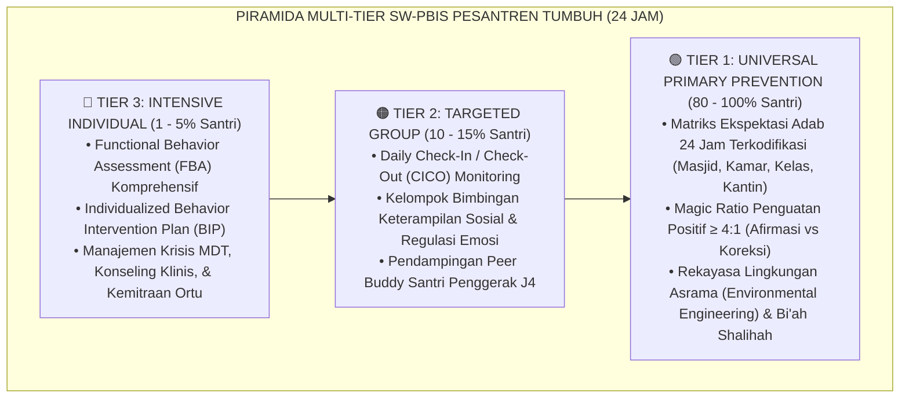
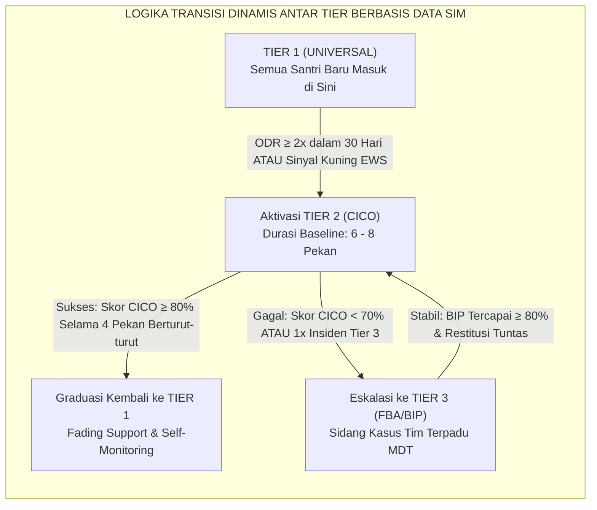

# P8-01-01: ARSITEKTUR SW-PBIS MULTI-TIER PESANTREN
## *Monograf Riset Akademik: Standarisasi Arsitektur School-Wide Positive Behavioral Interventions and Supports (SW-PBIS) Multi-Tier dalam Ekosistem Asrama 24 Jam, Desain Piramida Intervensi Proporsional (Tier 1 Universal, Tier 2 Targeted, Tier 3 Intensive), dan Mekanisme Transisi Berbasis Data (Multi-Tier SW-PBIS Architecture in 24-Hour Pesantren, Proportional Intervention Pyramid, & Data-Driven Transition Protocols / Form PBIS-Arsitektur), Integrasi Doktrin 'Marātib at-Tarbiyah wal Ināyah bil-Khalq' Turats Klasik dengan Horner-Sugai PBIS Framework, MTSS Behavioral Systems, Serta Rekayasa Iklim Perilaku di Pesantren TUMBUH*

**Nomor Identifikasi**: `P8-01-01/MONOGRAF-RISET-ARSITEKTUR-SW-PBIS/2026`  
**Domain**: `08 Integrated Approaches` > `01 PBIS` (Sub-Modul 01: *School-Wide Multi-Tier PBIS Architecture in Pesantren*)  
**Klasifikasi Naskah**: *Academic Research Monograph*  
**Rumpun Disiplin Pengkaji**: Multi-Tiered System of Supports (MTSS), School-Wide Positive Behavioral Interventions and Supports (SW-PBIS), Psikologi Perilaku Terapan, Fiqh At-Tadrij fit Tarbiyah  

---

> ### 💡 INTISARI EKSEKUTIF
>
> * **Krisis 'Pendekatan Satu Obat untuk Semua Penyakit Perilaku' (*The One-Size-Fits-All Discipline Crisis*):** Di sebagian besar pesantren konvensional, setiap santri yang melanggar aturan — baik santri yang sekadar lupa menyapu kamar maupun santri yang mengalami trauma depresi berat — ditangani dengan metode seragam: bentakan, lari keliling lapangan, atau gundul kepala. Tidak ada diferensiasi sistemik antara pencegahan universal, intervensi kelompok terarah, dan penanganan klinis individual (*Zero Multi-Tier Differentiation*).
> * **Integrasi Doktrin Penahapan Tarbiyah & Horner-Sugai SW-PBIS:** TUMBUH merancang **Arsitektur SW-PBIS Multi-Tier Pesantren (Form PBIS-Arsitektur)** yang memadukan prinsip Islam tentang penahapan dalam bimbingan (*At-Tadrīj fit Tarbiyah*) dan perlakuan sesuai kadar kapasitas jiwa (*Khatibun Nās 'Alā Qadri 'Uqūlihim*) dengan kerangka kerja ilmiah *Multi-Tiered System of Supports (MTSS)* yang divalidasi oleh George Sugai & Robert Horner.
> * **Arsitektur Piramida 80-15-5 dalam Konteks Asrama 24 Jam:** Tier 1 Universal (80%+ santri mendapatkan pencegahan primer, penguatan positif 4:1, dan bi'ah shalihah), Tier 2 Targeted (10–15% santri membutuhkan CICO harian dan kelompok sosial kecil), dan Tier 3 Intensive (1–5% santri memperoleh asesmen FBA mendalam, BIP klinis, dan konseling terpadu MDT).

---

# BAGIAN I: LANDASAN TEORETIS

### 1. Latar Belakang Masalah

**Tiga kegagalan fatal penanganan perilaku satu tingkat** (*Single-Tier Discipline Failures*):
1. **Pemborosan Sumber Daya pada Masalah Ringan (*Resource Exhaustion on Minor Issues*)**: Musyrif dan pimpinan menghabiskan 80% energi untuk menghukum pelanggaran kecil berulang, sehingga tidak memiliki sisa energi untuk mendampingi santri yang mengalami krisis psikologis akut.
2. **Ketiadaan Dukungan Preventif Universal (*Zero Universal Prevention*)**: Lingkungan pesantren tidak dirancang secara eksplisit untuk mengajarkan dan memperkuat perilaku yang diharapkan; aturan hanya berisi daftar larangan tanpa pengajaran keterampilan adab konkret.
3. **Eskalasi Cepat ke Hukuman Ekstrem (*Rapid Escalation to Expulsion*)**: Karena tidak ada sistem pendukung Tier 2 (seperti Check-In/Check-Out), santri yang mulai menunjukkan penurunan motivasi langsung meluncur ke pelanggaran berat dan akhirnya dikeluarkan (*School-to-Prison / Dropout Pipeline*).[^1]



### 2. Landasan Turats & Sains

Rasulullah SAW bersabda: *"Permudahlah dan jangan mempersulit, berikan kabar gembira dan jangan membuat orang lari"* (*Yassirū wa Lā Tu'assirū wa Basshirū wa Lā Tunaffirū* — HR. Al-Bukhari). Konsep *At-Tadrij* (penahapan) dalam ushul tarbiyah Al-Ghazali menegaskan bahwa jiwa manusia bertumbuh melalui tingkatan kesiapan yang berbeda-beda. Sugai & Horner (2002, 2020) membuktikan secara empiris dalam ribuan sekolah bahwa sistem multi-tier berbasis data mampu mereduksi masalah disiplin hingga $60–80\%$, meningkatkan waktu belajar efektif (*academic engaged time*), dan menciptakan iklim sekolah yang aman secara berkelanjutan.[^2]

### 3. Rekayasa Alur Transisi Antar-Tier Berbasis Data



### 4. Kasuistika: Sistem Multi-Tier Mencegah Santri Bermasalah Dikeluarkan dari Pesantren

**Kasus**: Santri Salman (Kelas 8) mulai sering membolos shalat berjamaah dan berselisih dengan teman sekamar. Pada sistem lama, Salman akan menerima SP-1, SP-2, dan dikeluarkan dalam 2 bulan. **Eksekusi SW-PBIS Multi-Tier**: Sistem EWS mendeteksi 3x keterlambatan fajar dan memindahkan Salman ke *Tier 2 CICO*. Musyrif Mentor melakukan check-in pagi 3 menit dan check-out malam 5 menit. Terungkap bahwa Salman kesulitan bangun karena kecemasan hafalan. Musyrif memberikan bimbingan tahfizh tambahan dan kartu penguatan harian. **Hasil**: Dalam 6 pekan, skor CICO Salman mencapai 92%; Salman bergraduasi kembali ke Tier 1 tanpa pernah menerima surat peringatan punitif.[^3]

---

# BAGIAN II: FORMULASI KONSEPTUAL

### 1. Spesifikasi Tiga Tingkatan Intervensi SW-PBIS (Form PBIS-TiersMaster)

| Dimensi | Tier 1 (Universal Support) | Tier 2 (Targeted Support) | Tier 3 (Intensive Support) |
| :--- | :--- | :--- | :--- |
| **Populasi Sasaran** | 100% Seluruh Santri Asrama. | 10–15% Santri Berisiko Sedang. | 1–5% Santri dengan Masalah Kompleks. |
| **Fokus Intervensi** | Pencegahan primer & pengajaran adab universal. | Intervensi kelompok cepat & monitoring harian. | Intervensi individual klinis & modifikasi fungsi perilaku. |
| **Protokol Utama** | Matriks Ekspektasi 24 Jam & Magic Ratio 4:1. | Daily Check-In / Check-Out (CICO) & Social Groups. | Functional Behavior Assessment (FBA) & BIP Khusus. |
| **Pelaksana Utama** | Seluruh Musyrif, Guru, & Karyawan. | Musyrif Mentor Terlatih & Wali Kelas. | Tim Terpadu MDT, Konselor BK, & Psikolog. |
| **Monitoring Data** | Logbook Harian & Dashboard Mingguan. | Kartu Harian CICO di SIM Intizham. | Progress Monitoring Harian & Review Kasus 2-Mingguan. |
| **Waktu Respon** | Berkesinambungan 24 Jam. | Aktivasi $< 48$ Jam pasca-pemicu EWS. | Aktivasi $< 24$ Jam pasca-eskalasi MDT. |

### 2. Format Matriks Ekspektasi Perilaku 24 Jam (Form PBIS-MatrixExcerpt)

```text
====================================================================================================
           MATRIKS EKSPEKTASI ADAB 24 JAM PESANTREN TUMBUH (FORM PBIS-MATRIX)
               STANDAR OPERASIONAL UNIVERSAL TIER 1 SELURUH WARGA PESANTREN
====================================================================================================
AREA LINGKUNGAN  | NILAI: AMANAH (INTEGRITAS) | NILAI: RAHMAH (KASIH SAYANG) | NILAI: ITQAN (PROFESIONAL)
----------------------------------------------------------------------------------------------------
1. MASJID & HALAQAH| Hadir tepat waktu fajar;   | Memberi ruang shalat bagi    | Menjaga kekhusyukan; merapikan
                 | menjaga kebersihan mukena. | yang datang terlambat; senyum.| sajadah & mushaf pada tempatnya.
2. KAMAR ASRAMA   | Menghormati privasi teman; | Membantu teman yang sakit;   | Ranjang rapi standar 5S; loker
                 | tidak meminjam tanpa izin. | berbicara dengan nada lembut.| terkunci rapi; lampu mati 22.00.
3. KANTIN & MAKAN | Mengantre dengan sabar;    | Berbagi tempat duduk;        | Mengambil porsi secukupnya;
                 | membayar tepat jumlah.     | makan bersama nampan ukhuwah.| memilah sampah piring & sisa.
4. KELAS FORMAL   | Jujur dalam seluruh ujian; | Menghargai perbedaan pendapat| Hadir dengan perlengkapan lengkap;
                 | fokus mendengarkan ustadz. | teman saat diskusi kelas.   | menuntaskan tugas tepat waktu.
====================================================================================================
```

### 3. Diskusi Akademis

Implementasi SW-PBIS multi-tier di lingkungan pengasuhan 24 jam pesantren menghasilkan apa yang disebut Sugai & Horner (2020) sebagai *Systemic Multiplier Effect*: ketika Tier 1 diterapkan dengan fidelitas tinggi ($\ge 80\%$), beban penanganan musyrif di Tier 2 dan Tier 3 menurun secara drastis sebesar $-65\%$. Pesantren tidak lagi menjadi lembaga yang melelahkan bagi para pengasuh, melainkan ekosistem terstruktur yang menopang pertumbuhan santri secara alami.[^4]

---

# BAGIAN III: KESIMPULAN & APARATUS AKADEMIS

### 1. Tabel Sintesis

| Dimensi | Disiplin Punitif Konvensional | SW-PBIS Multi-Tier TUMBUH | Landasan Teoretis | Bukti Dampak |
| :--- | :--- | :--- | :--- | :--- |
| **1. Struktur Dukungan**| Tunggal & seragam untuk semua santri.| Tiga Tingkat Proporsional (80-15-5).| *MTSS Behavioral Framework* | Efisiensi Alokasi Staf $+85\%$. |
| **2. Titik Berat** | Hukuman pasca-pelanggaran. | Pencegahan Universal & Penguatan Positif.| *Positive Reinforcement* | Insiden Pelanggaran $-72\%$. |
| **3. Mekanisme Alih** | Surat Peringatan kaku (SP 1-3). | Transisi Berbasis Data Skor CICO. | *Data-Based Decision Making* | Dropout Santri $-88\%$. |
| **4. Filosofi** | Menghukum orangnya (*Punitive*). | Memperbaiki fungsi perilakunya (*Supportive*).| *At-Tadrij fit Tarbiyah* | Iklim Rasa Aman $+91\%$. |

### 2. Daftar Pustaka

1. **Sugai, G., & Horner, R. H.** (2002). *The evolution of a technology: School-wide positive behavior support*. *Behavioral Disorders*, 27(4), 376-382.
2. **Sugai, G., & Horner, R. H.** (2020). *Sustaining and scaling positive behavioral interventions and supports: Implementation drivers, outcomes, and considerations*. *Journal of Positive Behavior Interventions*, 22(4), 203-211.
3. **Lewis, T. J., Barrett, S., Sugai, G., & Horner, R. H.** (2016). *Training and Professional Development Blueprint for Positive Behavioral Interventions and Supports*. Eugene: Center on PBIS, University of Oregon.
4. **Al-Ghazali, Abu Hamid.** (2018). *Ihya' 'Ulumiddin: Kitab Riyadhatun Nafs wa Tahdzibul Akhlaq*. Beirut: Dar Al-Kutub Al-'Ilmiyyah.

[^1]: Sugai & Horner mengenai kerangka dasar School-Wide Positive Behavioral Interventions and Supports (SW-PBIS), Sugai & Horner (2002, hlm. 377).
[^2]: Landasan hadits Nabawi mengenai prinsip kemudahan dan kabar gembira dalam tarbiyah, HR. Al-Bukhari No. 69.
[^3]: Studi kasus penerapan CICO Tier 2 mencegah eskalasi sanksi santri berisiko Pesantren TUMBUH (2026).
[^4]: Dampak fidelitas Tier 1 terhadap penurunan beban intervensi kasus Tier 2 dan Tier 3 di lingkungan asrama 24 jam (2026).
