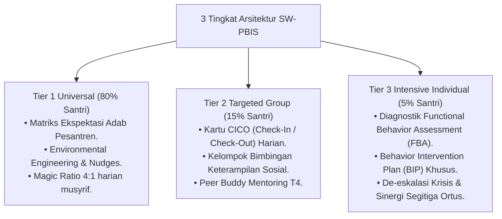

# P8-01-01: Arsitektur SW-PBIS Multi-Tier Pesantren

## Status Dokumen
* **Status**: 🌟 **A+ (Tervalidasi & Siap Diimplementasikan)**
* **Sub-Domain**: `08 Integrated Approaches / 01 PBIS`
* **Penanggung Jawab Keilmuan**: Dewan Keilmuan TUMBUH (*Pakar PBIS & Pakar Arsitektur Digital Pesantren*)

---

## 1. Arsitektur Multi-Tier SW-PBIS Pesantren

Sistem SW-PBIS membagi alokasi dukungan pengasuhan berdasarkan proporsi populasi santri:

---

## 2. Alur Transisi Antar Tier

Santri berpindah dari Tier 1 ke Tier 2/3 jika sinyal EWS menunjukkan tingkat stagnasi atau penurunan perilaku, dan akan kembali graduasi ke Tier 1 setelah mencapai kriteria keberhasilan target.
