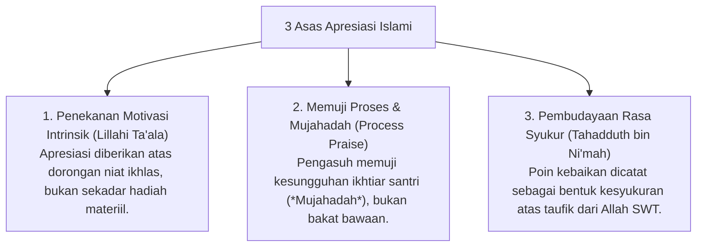

# P8-01-02: Integrasi Nilai Syari dalam Sistem Apresiasi PBIS

## Status Dokumen
* **Status**: 🌟 **A+ (Tervalidasi & Siap Diimplementasikan)**
* **Sub-Domain**: `08 Integrated Approaches / 01 PBIS`
* **Penanggung Jawab Keilmuan**: Dewan Keilmuan TUMBUH (*Pakar Epistemologi Turats & Pakar PBIS*)

---

## 1. Penyelarasan Poin Apresiasi dengan Syariat Islam

Sistem poin dan apresiasi PBIS dalam ekosistem **TUMBUH** diselarasakan dengan ajaran **Tahadduth bin Ni'mah** (Menyebut nikmat kebaikan Allah) dan **Ikhlas an-Niyyah**:

---

## 2. Pemurnian dari Sistem Token Ekonomi Transaksional

Poin PBIS tidak dijadikan alat transaksi komersial (membeli barang mewah), melainkan ditukarkan dengan hak istimewa sosial seperti menjadi pemandu halaqah atau kesempatan khidmah sosial.
