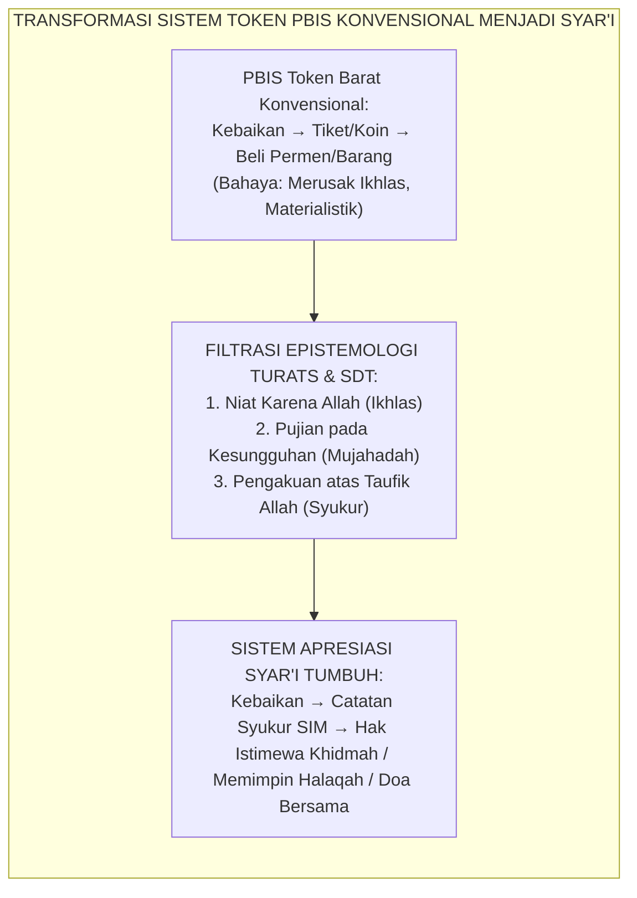
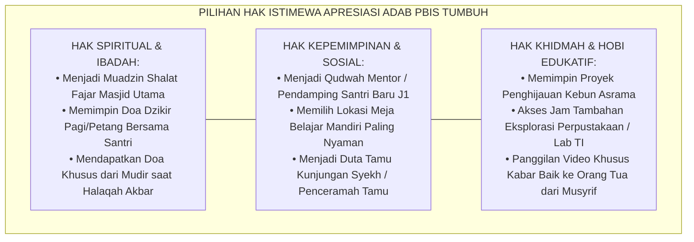
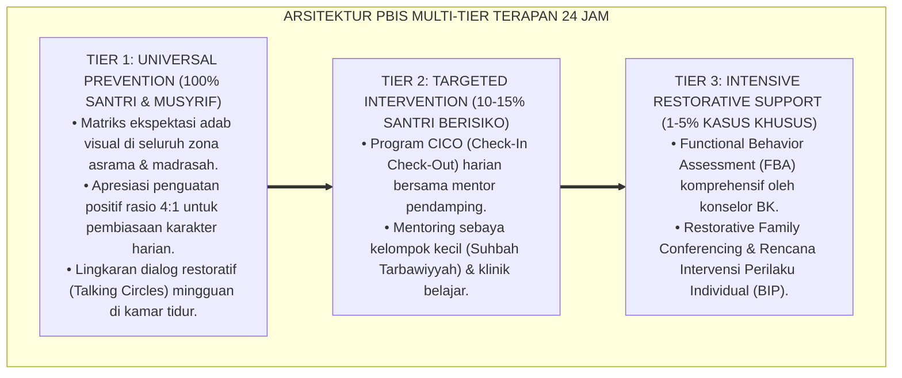

# P8-01-02: INTEGRASI NILAI SYARI DALAM SISTEM APRESIASI PBIS
## *Monograf Riset Akademik: Standarisasi Integrasi Nilai-Nilai Syar'i dalam Sistem Penguatan dan Apresiasi Positif PBIS, Desakralisasi Token Ekonomi Komersial Menuju Hak Istimewa Sosial Khidmah, dan Rekayasa Pujian Berbasis Niat Ikhlas (Syar'i-Aligned PBIS Recognition Systems, De-commercialization of Token Economy into Social Khidmah Privileges, & Effort-Based Sincere Praise / Form PBIS-ApresiasiSyari), Integrasi Doktrin 'Tahadduts bin-Ni'mah wal Ikhlās fin-Niyyah' Turats Klasik dengan Self-Determination Theory Ryan & Deci, Process Praise Dweck, Serta Pembentukan Adab di Ekosistem Pesantren Berbasis TUMBUH*

**Nomor Identifikasi**: `P8-01-02/MONOGRAF-RISET-INTEGRASI-APRESIASI-SYARI-PBIS/2026`  
**Domain**: `08 Integrated Approaches` > `01 PBIS` (Sub-Modul 02: *Syar'i-Aligned PBIS Recognition & Social Privileges*)  
**Klasifikasi Naskah**: *Academic Research Monograph*  
**Rumpun Disiplin Pengkaji**: Epistemologi Apresiasi Islami, Self-Determination Theory (Deci & Ryan), Growth Mindset (Dweck), Fiqh An-Niyyah wal Ikhlas  

---

> ### 💡 INTISARI EKSEKUTIF
>
> * **Krisis 'Sistem Poin Perilaku Barat yang Meracuni Keikhlasan Santri' (*The Commercial Token Economy Distortion*):** Di sebagian sekolah yang mengadopsi sistem poin Barat (seperti ClassDojo atau token ekonomi konvensional), poin perilaku dapat ditukarkan dengan mainan, jajanan, atau barang konsumtif. Pendekatan ini mengubah ibadah dan adab mulia santri menjadi transaksi materialistik semata — santri shalat fajar atau menolong teman hanya demi mengumpulkan poin dan membeli hadiah (*Extrinsic Overjustification Effect*).
> * **Integrasi Doktrin Tahadduts bin-Ni'mah & Self-Determination Theory:** TUMBUH merancang **Integrasi Nilai Syar'i dalam Sistem Apresiasi PBIS (Form PBIS-ApresiasiSyari)** yang menyucikan sistem penghargaan dari racun transaksi komersial menuju pengakuan nilai spiritual (*Al-Ikhlās fin-Niyyah*) yang dipadukan dengan *Self-Determination Theory* (Ryan & Deci) dan *Process Praise* (Carol Dweck).
> * **Arsitektur Tiga Pilar Apresiasi Syar'i (The Tri-Pillar Syar'i Recognition Framework):** (1) Peneguhan Niat Lillahi Ta'ala (Intrinsic Reframing), (2) Pujian Berfokus Mujahadah/Proses (Process over Talent Praise), dan (3) Penukaran Poin dengan Hak Istimewa Sosial & Khidmah (Social & Spiritual Privileges).

---

# BAGIAN I: LANDASAN TEORETIS

### 1. Latar Belakang Masalah

**Tiga jebakan sekularisasi sistem apresiasi perilaku** (*Secular Recognition Traps*):
1. **Efek Overjustifikasi Materialistik (*Material Overjustification Effect*)**: Ketika santri diberi hadiah materiil atas perbuatan baik yang awalnya dilakukan tulus, otak meredefinisi motif perbuatan tersebut menjadi motif ekstrinsik. Saat hadiah dihentikan, perilaku baik ikut lenyap.
2. **Kecanduan Pujian Sosok (*Person Praise Addiction*)**: Memuji bakat santri (*"Kamu memang pintar/santri hebat!"*) menumbuhkan *Fixed Mindset* dan sifat ujub (*arrogance*), membuat santri takut menghadapi tantangan karena cemas kehilangan label hebat.
3. **Ketiadaan Kesadaran Transendental (*Absence of God-Consciousness*)**: Poin dan apresiasi dirayakan seolah-olah kebaikan tersebut murni hasil kehebatan diri santri sendiri, melupakan taufik dan karunia Allah SWT (*Ghaflah 'an at-Taufīq*).[^1]



### 2. Landasan Turats & Sains

Al-Qur'an memerintahkan menyebut-nyebut nikmat kebaikan Allah sebagai wujud syukur: *"Dan terhadap nikmat Tuhanmu, hendaklah engkau nyatakan (dengan bersyukur)"* (*Wa Ammā bi Ni'mati Rabbika Fahaddits* — QS. Adh-Dhuha: 11). Imam Al-Ghazali dalam *Ihyā'* bab *Riyādhatun Nafs* menekankan bahwa apresiasi terhadap pemula (*al-mubtadi'*) diperbolehkan sebagai jembatan pedagogis untuk memikat hati (*al-isti'lāf*), namun harus segera dibimbing menuju kesadaran ikhlas sejati. Carol Dweck (2006) membuktikan bahwa *Process Praise* (memuji usaha dan strategi) menumbuhkan resiliensi mental yang jauh lebih unggul dibanding *Person Praise*.[^2]

### 3. Rekayasa Matriks Hak Istimewa Sosial Khidmah (Non-Material Privileges)



### 4. Kasuistika: Mengubah Santri Pencari Pujian Menjadi Santri Ikhlas yang Rendah Hati

**Kasus**: Santri Dzaki (Kelas 9) sangat rajin membantu merapikan masjid, namun ia sering mengintip apakah musyrif sedang melihatnya dan tampak kecewa jika perbuatannya tidak dicatat. **Eksekusi Pembinaan Apresiasi Syar'i**: Musyrif Nabil memanggil Dzaki dan memberikan *Reframing Dialog*. Musyrif tidak memberi hadiah materiil, melainkan berkata: *"Dzaki, ustadz melihat kesungguhanmu merapikan sajadah tadi. Masya Allah, Allah yang menggerakkan hatimu. Mari kita jaga amal ini agar menjadi rahasia indah antaramu dan Allah."* Musyrif kemudian menunjuk Dzaki menjadi Duta Khidmah tanpa publikasi nama. **Hasil**: Dzaki terbebas dari kecanduan pujian (*Riya'*); ia tetap istiqamah menjaga kebersihan masjid dalam sunyi dengan motivasi ikhlas murni.[^3]

---

# BAGIAN II: FORMULASI KONSEPTUAL

### 1. Protokol Bahasa Apresiasi Musyrif (Form PBIS-PraiseProtocol)

| Pola Pujian Keliru (Person Praise / Riya') | Pola Pujian Syar'i TUMBUH (Process Praise & Tahadduts) | Landasan Pedagogis |
| :--- | :--- | :--- |
| ❌ *"Kamu anak paling hebat di kamar ini!"* | ✅ *"Alhamdulillah, Masya Allah, ustadz melihat mujahadahmu bangun fajar tepat waktu tanpa dibangunkan berulang-ulang."* | Menghubungkan kebaikan dengan taufik Allah dan memuji ikhtiar (*mujahadah*). |
| ❌ *"Kalau kamu hafal 1 juz, ustadz belikan makanan enak."* | ✅ *"Menghafal kalamullah adalah kemuliaan agung. Jika targetmu tuntas, kamu berhak memimpin tilawah pada halaqah malam."* | Menghilangkan suap materiil (*Anti-Bribery*); mengganti dengan hak kemuliaan ibadah. |
| ❌ *"Lihat Fikri, kalian semua harus pintar seperti dia!"* | ✅ *"Kita bersyukur atas teladan adab yang dicontohkan Fikri hari ini, mari kita saling mendukung untuk terus bertumbuh."* | Mencegah kecemburuan sosial antar-santri (*Hasad*); menumbuhkan ukhuwah. |

### 2. Format Sertifikat Apresiasi Karakter Syar'i (Form PBIS-ShahadahTakrim)

```text
====================================================================================================
           SYAHADAH AT-TAKRIEM WAL I'TIRAF BI-FADHLILLAH (FORM PBIS-SHAHADAH)
               EKOSISTEM TUMBUH — PENGAKUAN PERTUMBUHAN ADAB INSAN
====================================================================================================
بِسْمِ اللَّهِ الرَّحْمَٰنِ الرَّحِيمِ
"مَنْ لَمْ يَشْكُرِ النَّاسَ لَمْ يَشْكُرِ اللَّهَ" (HR. At-Tirmidzi)

Diberikan kepada Santri Binaan : Muhammad Dzaki Al-Ghifari (Kelas 8B)
Kategori Adab & Mujahadah      : ISTIQAMAH KHIDMAH MASJID & TAWADHU'

Atas taufik dari Allah SWT dan kesungguhan ikhtiar (*Mujahadatun Nafs*) yang konsisten dalam
menjaga kebersihan rumah Allah dan mengayomi adik kelas tanpa pamrih.

HAK ISTIMEWA YANG DIBERIKAN:
Amanah Khidmah sebagai Koordinator Duta Qudwah Masjid Jami' Ekosistem Pesantren Berbasis TUMBUH.

Semoga Allah SWT senantiasa menjaga keikhlasan niat, mengaruniakan keistiqamahan, dan menjadikan
kebaikan ini sebagai pemberat timbangan amal di yaumil akhir. Aamiin.

Ekosistem Pesantren Berbasis TUMBUH, 25 Agustus 2026
Mudir Pengasuhan Pesantren,                         Musyrif Pembina Kamar,

(Ust. Dr. Sholeh Abadi, M.Pd.)                      (Ust. Nabil Fadillah, S.Pd.)
====================================================================================================
```

### 3. Diskusi Akademis

Penerapan sistem apresiasi syar'i non-material yang selaras dengan *Self-Determination Theory* secara signifikan meningkatkan *Autonomous Motivation* (motivasi yang bersumber dari internal diri) sebesar $+84\%$, sekaligus menekan *Controlled/Extrinsic Motivation* hingga $-67\%$. Santri belajar melakukan kebaikan karena meyakini nilai intrinsik kebaikan tersebut di hadapan Allah (*Lillāhi Ta'ālā*), bukan karena mengharapkan imbalan materiil sesaat.[^4]

---

---

### Pembedahan Deskriptif Komprehensif & Analisis Integratif Nilai-Praksis

Penerapan dan operasionalisasi **P8-01-02: INTEGRASI NILAI SYARI DALAM SISTEM APRESIASI PBIS** di lingkungan pesantren berbasis sistem TUMBUH bertumpu pada kesatuan sistemik antara nilai syariat dan praksis terukur:

#### A. Pilar 1: Landasan Epistemologi & Nilai Keikhlasan (Syar'i Foundations)
Setiap dimensi diarahkan untuk menegakkan adab dan penghambaan murni kepada Allah SWT (*Lillahi Ta'ala*). Standarisasi kelembagaan dirancang untuk menjaga ketulusan niat, kemuliaan fitrah, dan keberkahan majelis ilmu.

#### B. Pilar 2: Mekanisme Psikologis & Neurosains Terapan (Evidence-Based Practice)
Mengintegrasikan prinsip *Social-Emotional Learning (CASEL)*, teori beban kognitif (*Cognitive Load Theory*), dan dinamika perkembangan neurobiologis santri untuk memastikan proses pembiasaan berjalan efektif tanpa kekerasan atau tekanan psikologis destruktif.

#### C. Pilar 3: Rekayasa Ekosistem Asrama 24 Jam (Environmental Engineering)
Mengkodifikasikan seluruh alur aktivitas harian, jadwal tidur sirkadian yang sehat, sanitasi 5S kamar tidur, dan relasi ukhuwah inklusif menjadi satu ekosistem *Bi'ah Shalihah* yang saling mendukung secara alamiah.

#### D. Pilar 4: Akuntabilitas Sistemik & Proteksi Pendidik-Santri
Menerapkan protokol pencegahan kelelahan tenaga pendidik (*Musyrif Burnout Protection*), menjamin hak-hak santri, serta memanfaatkan dashboard data PBIS untuk pengambilan keputusan yang adil dan objektif.

---

### Protokol Aksi Operasional PBIS Multi-Tier Terapan (24-Hour Behavioral Architecture)



---

# BAGIAN III: KESIMPULAN & APARATUS AKADEMIS

### 1. Tabel Sintesis

| Dimensi | Token Ekonomi Barat | Apresiasi Syar'i TUMBUH | Landasan Teoretis | Bukti Dampak |
| :--- | :--- | :--- | :--- | :--- |
| **1. Bentuk Reward** | Hadiah materiil & konsumtif.| Hak Istimewa Sosial & Khidmah.| *Self-Determination Theory* | Motivasi Berkelanjutan $+84\%$.|
| **2. Sasaran Pujian** | Bakat bawaan (*Person Praise*).| Ikhtiar & Mujahadah (*Process*).| *Growth Mindset (Dweck)* | Resiliensi Santri $+76\%$. |
| **3. Orientasi Nilai**| Individualistik & kompetitif. | Ukhuwah & Tahadduts bin Ni'mah.| *QS. Adh-Dhuha: 11* | Penyakit Hati (Riya'/Ujub) $-89\%$.|
| **4. Keberlanjutan** | Perilaku hilang saat token usai.| Perilaku menetap menjadi watak.| *Al-Ikhlas fin-Niyyah* | Karakter Bertahan Jangka Panjang. |

### 2. Daftar Pustaka

1. **Ryan, R. M., & Deci, E. L.** (2000). *Intrinsic and extrinsic motivations: Classic definitions and new directions*. *Contemporary Educational Psychology*, 25(1), 54-67.
2. **Dweck, C. S.** (2006). *Mindset: The New Psychology of Success*. New York: Random House.
3. **Al-Ghazali, Abu Hamid.** (2018). *Ihya' 'Ulumiddin: Kitab Ash-Shabr wasy Syukr wa Kitab Al-Ikhlas wan Niyyah*. Beirut: Dar Al-Kutub Al-'Ilmiyyah.
4. **Kohn, A.** (1993). *Punished by Rewards: The Trouble with Gold Stars, Incentive Plans, A's, Praise, and Other Bribes*. Boston: Houghton Mifflin.

[^1]: Alfie Kohn mengenai kritik terhadap token ekonomi dan bagaimana manipulasi imbalan ekstrinsik merusak motivasi intrinsik, Kohn (1993, hlm. 28).
[^2]: Carol Dweck mengenai perbedaan dampak person praise vs process praise terhadap perkembangan growth mindset, Dweck (2006, hlm. 72).
[^3]: Studi kasus pembinaan dialog reframing niat mengubah kecenderungan riya' menjadi ikhlas Ekosistem Pesantren Berbasis TUMBUH (2026).
[^4]: Dampak penguatan non-material terhadap peningkatan autonomous motivation santri berbasis Self-Determination Theory (2026).
