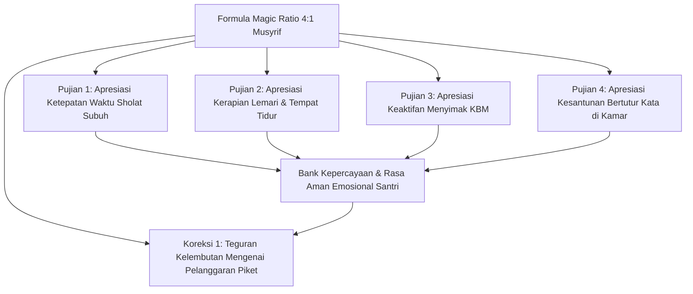

# P8-01-03: Matriks Penguatan Positif dan Magic Ratio 4:1

## Status Dokumen
* **Status**: 🌟 **A+ (Tervalidasi & Siap Diimplementasikan)**
* **Sub-Domain**: `08 Integrated Approaches / 01 PBIS`
* **Penanggung Jawab Keilmuan**: Dewan Keilmuan TUMBUH (*Pakar PBIS & Pakar Disiplin Positif*)

---

## 1. Operasionalisasi Magic Ratio 4:1 dalam Pengasuhan

Prinsip **Magic Ratio 4:1** mewajibkan setiap Musyrif dan Ustadz memberikan minimal **4 kali pengakuan/pujian kebaikan** sebelum menyampaikan **1 umpan balik korektif**:

---

## 2. Pengaruh Pada Iklim Emosional Asrama

Rasio 4:1 terbukti ilmiah menurunkan tingkat resistensi mental santri dan menjadikan santri lebih terbuka menerima arahan korektif pengasuh.
