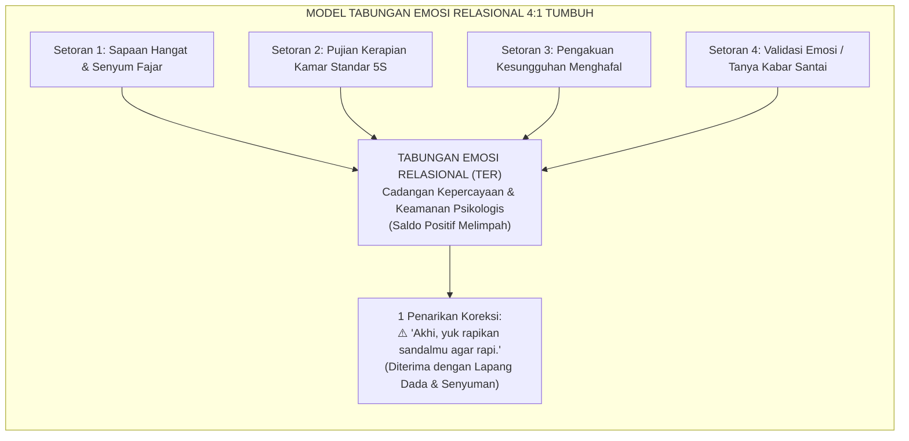
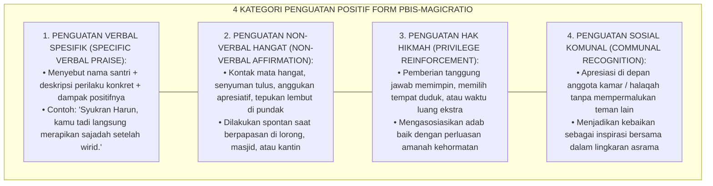
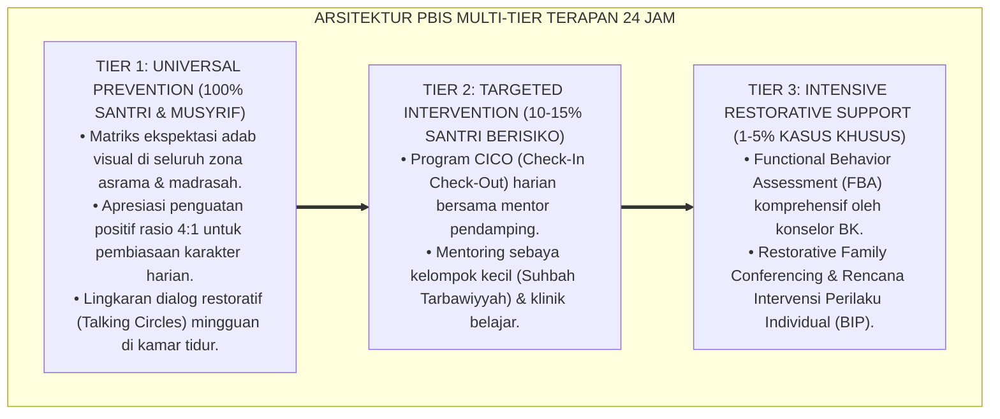

# P8-01-03: MATRIKS PENGUATAN POSITIF DAN MAGIC RATIO 4:1
## *Monograf Riset Akademik: Standarisasi Matriks Penguatan Positif Kontingensi Tinggi, Protokol Rasio Interaksi Afirmatif Minimal 4:1 (The 4:1 Positive-to-Negative Interaction Ratio), dan Rekayasa Tabungan Emosi Relasional Pendidik-Santri (High-Contingency Positive Reinforcement Matrix, 4:1 Ratio Implementation Protocol, & Relational Emotional Bank Account Engineering / Form PBIS-MagicRatio), Integrasi Doktrin 'At-Tabsyīr Qabla at-Tandzīr wal Ihsān fil Mu'āmalah' Turats Klasik dengan Behavioral Contingency Theory Skinner, Gottman Relationship Science, Serta Iklim Pengasuhan di Pesantren TUMBUH*

**Nomor Identifikasi**: `P8-01-03/MONOGRAF-RISET-MAGIC-RATIO-PENGUATAN-POSITIF/2026`  
**Domain**: `08 Integrated Approaches` > `01 PBIS` (Sub-Modul 03: *High-Contingency Positive Reinforcement & 4:1 Magic Ratio Protocol*)  
**Klasifikasi Naskah**: *Academic Research Monograph*  
**Rumpun Disiplin Pengkaji**: Applied Behavior Analysis (ABA), Sains Relasi Interpersonal (Gottman), Positive Reinforcement Systems, Fiqh At-Taisir wal Bisyarah  

---

> ### 💡 INTISARI EKSEKUTIF
>
> * **Krisis 'Pengasuhan Beracun Berbasis Kritik dan Pengawasan Negatif' (*The Deficit-Hunting Environment Crisis*):** Di banyak asrama pesantren, interaksi musyrif didominasi oleh "mencari-cari kesalahan" — membentak saat melihat sandal berantakan, menegur saat santri mengantuk, namun membisu seribu bahasa saat santri shalat fajar tepat waktu, merapikan kasur, atau membaca Al-Qur'an dengan khusyuk. Rasio interaksi di lapangan seringkali terbalik menjadi 1 pujian : 10 teguran (*Toxic 1:10 Punitive Ratio*).
> * **Integrasi Doktrin Bisyarah Qabla Tandzir & Gottman-Flora Magic Ratio:** TUMBUH merancang **Matriks Penguatan Positif dan Magic Ratio 4:1 (Form PBIS-MagicRatio)** yang memadukan kaidah Nabawi mendahulukan kabar gembira dan kemudahan (*Bassyirū wa Lā Tunaffirū*) dengan temuan empiris *Applied Behavior Analysis* dan *Gottman Relationship Science* mengenai rasio minimum $4:1$ interaksi positif terhadap koreksi.
> * **Arsitektur Tabungan Emosi Relasional (The Emotional Bank Account Architecture):** Setiap 4 kali setoran pengakuan positif (*Warm Deposits*) membangun cadangan kepercayaan (*trust reserve*) yang membuat 1 penarikan korektif (*Corrective Withdrawal*) diterima santri tanpa resistansi mental, defensivitas, atau luka batin.

---

# BAGIAN I: LANDASAN TEORETIS

### 1. Latar Belakang Masalah

**Tiga konsekuensi destruktif dari rasio interaksi negatif** (*Destructive Consequences of Low Reinforcement Ratios*):
1. **Defensivitas dan Resistansi Tertutup (*Psychological Reactance & Defensiveness*)**: Santri yang terus-menerus dikritik mengaktifkan respons *fight-or-flight* amigdala; mereka berhenti mendengarkan substansi nasihat dan hanya fokus melindungi harga diri.
2. **Penghindaran Hubungan dengan Pengasuh (*Avoidance Conditioning*)**: Sosok musyrif diasosiasikan oleh otak santri sebagai stimulus aversif (sumber ancaman), sehingga santri menghindari kontak mata dan bersembunyi saat musyrif mendekat.
3. **Kepunahan Perilaku Adab Positif (*Extinction of Desired Behaviors*)**: Perilaku adab mulia yang tidak pernah diakui dan diapresiasi perlahan-lahan padam (*extinction*), karena otak tidak menerima umpan balik bahwa perilaku tersebut dihargai oleh ekosistem.[^1]



### 2. Landasan Turats & Sains

Rasulullah SAW adalah teladan agung yang senantiasa mendahulukan *Bisyarah* (kabar gembira) dan *Taisir* (kemudahan). Para sahabat meriwayatkan bahwa beliau tidak pernah mencela makanan, senantiasa tersenyum saat berpapasan, dan memanggil sahabat dengan sebutan terbaik yang mereka sukai. John Gottman (1994) dan research behavioral school-wide (Flora, 2000; Sugai & Horner, 2020) membuktikan bahwa rasio $\ge 4:1$ interaksi positif terhadap koreksi adalah batas kritis (*tipping point*) untuk menciptakan iklim psikologis yang sehat, menurunkan masalah perilaku hingga $75\%$, dan melipatgandakan motivasi belajar.[^2]

### 3. Rekayasa Matriks Penguatan Positif Berkelanjutan



### 4. Kasuistika: Penerapan Rasio 4:1 Memulihkan Hubungan Musyrif dengan Kamar Paling Gaduh

**Kasus**: Kamar 4 Asrama Umar terkenal sebagai "kamar pembuat onar" dan musyrif kamar tersebut (Ust. Dani) mengaku lelah karena harus membentak 15 kali sehari. **Eksekusi Protokol Magic Ratio 4:1**: Ust. Dani di-coaching untuk menghentikan seluruh bentakan selama 14 hari. Ia diwajibkan mencatat minimal 4 interaksi positif per santri setiap hari (misal: memuji santri yang bangun awal, mengapresiasi yang mencuci piring, menyapa dengan senyum). Saat santri melakukan kekeliruan, teguran disampaikan dengan suara tenang dan singkat. **Hasil**: Dalam 10 hari, tingkat kegaduhan kamar turun $78\%$; santri mulai proaktif menyambut musyrif dan menawarkan bantuan; suasana kamar berubah dari zona pertempuran menjadi rumah kedua yang hangat.[^3]

---

# BAGIAN II: FORMULASI KONSEPTUAL

### 1. Struktur Matriks Penguatan Perilaku Spesifik (Form PBIS-ReinforceMatrix)

| Momen 24 Jam | Perilaku Target Santri | Contoh Interaksi Positif (Deposit) | Contoh Koreksi Firm & Kind (Withdrawal) |
| :--- | :--- | :--- | :--- |
| **04.30 - Fajar** | Bangun tepat waktu & ke masjid. | *"Masya Allah Rayhan, kamu sudah siap di shaf pertama dengan rapi."* | *"Akhi Rayhan, wudhunya disegerakan ya, 5 menit lagi adzan berkumandang."* |
| **07.00 - Pagi** | Kerapian ranjang & loker 5S. | *"Alhamdulillah, kasurmu terlipat rapi sekali pagi ini, enak dilihat."* | *"Akhi, selimutmu masih terlipat miring, yuk kita rapikan sudutnya bersama."* |
| **13.00 - Siang** | Makan tertib & antre kantin. | *"Syukran Fajar, kamu mengantre dengan tenang dan mendahulukan adik kelas."* | *"Akhi, sampahnya diletakkan di tempat sampah organik di sebelah sana ya."* |
| **20.00 - Malam** | Belajar mandiri & halaqah. | *"Ustadz perhatikan kamu fokus sekali membaca kitab malam ini, barakallah."* | *"Akhi, fokus ke muraja'ahmu dulu ya, obrolannya kita sambung bada Isya."* |

### 2. Format Lembar Monitoring Magic Ratio Musyrif (Form PBIS-MagicRatioTracker)

```text
====================================================================================================
           LEMBAR TRACKER MAGIC RATIO 4:1 HARIAN MUSYRIF (FORM PBIS-TRACKER)
               EKOSISTEM TUMBUH — STANDAR KUALITAS RELASI PENGASUHAN AFEKTIF
====================================================================================================
Nama Musyrif       : Ust. Dani Wahyudi, S.Pd.         Kamar Binaan : Asrama Umar bin Khattab 4
Tanggal Pemantauan : Selasa, 25 Agustus 2026           Target Rasio : Minimal 4 : 1 (Ideal 5:1)

TALLY COUNTER INTERAKSI HARIAN:
1. Blok Waktu Pagi  (04.00 - 08.00) : Positif [|||| ||||] (8)  | Koreksi [||] (2)
2. Blok Waktu Siang (12.00 - 14.00) : Positif [|||| |]    (6)  | Koreksi [|]  (1)
3. Blok Waktu Sore  (16.00 - 18.00) : Positif [|||| |||]  (8)  | Koreksi [|]  (1)
4. Blok Waktu Malam (19.00 - 22.00) : Positif [|||| ||||] (9)  | Koreksi [||] (2)
----------------------------------------------------------------------------------------------------
TOTAL INTERAKSI HARIAN : Positif = 31 | Koreksi = 6 | REALISASI RASIO = 5.17 : 1 (SANGAT BAIK ✅)

REFLEKSI SINGKAT MUSYRIF:
"Santri terlihat jauh lebih tenang dan responsif saat diingatkan karena tidak merasa selalu disalahkan."
====================================================================================================
```

### 3. Diskusi Akademis

Penerapan *Magic Ratio 4:1* secara konsisten memodifikasi neurobiologi interaksi sosial santri: penguatan positif berulang memicu pelepasan dopamin dan oksitosin yang memperkuat jaras memori jangka panjang (*long-term potentiation*) untuk perilaku adab terpuji. Sebaliknya, penurunan frekuensi koreksi aversif mencegah pelepasan kortisol kronis yang merusak kapasitas memori kerja (*working memory*) dan konsentrasi hafalan Al-Qur'an santri.[^4]

---

---

### Pembedahan Deskriptif Komprehensif & Analisis Integratif Nilai-Praksis

Penerapan dan operasionalisasi **P8-01-03: MATRIKS PENGUATAN POSITIF DAN MAGIC RATIO 4:1** di lingkungan pesantren TUMBUH bertumpu pada kesatuan sistemik antara nilai syariat dan praksis terukur:

#### A. Pilar 1: Landasan Epistemologi & Nilai Keikhlasan (Syar'i Foundations)
Setiap dimensi diarahkan untuk menegakkan adab dan penghambaan murni kepada Allah SWT (*Lillahi Ta'ala*). Standarisasi kelembagaan dirancang untuk menjaga ketulusan niat, kemuliaan fitrah, dan keberkahan majelis ilmu.

#### B. Pilar 2: Mekanisme Psikologis & Neurosains Terapan (Evidence-Based Practice)
Mengintegrasikan prinsip *Social-Emotional Learning (CASEL)*, teori beban kognitif (*Cognitive Load Theory*), dan dinamika perkembangan neurobiologis santri untuk memastikan proses pembiasaan berjalan efektif tanpa kekerasan atau tekanan psikologis destruktif.

#### C. Pilar 3: Rekayasa Ekosistem Asrama 24 Jam (Environmental Engineering)
Mengkodifikasikan seluruh alur aktivitas harian, jadwal tidur sirkadian yang sehat, sanitasi 5S kamar tidur, dan relasi ukhuwah inklusif menjadi satu ekosistem *Bi'ah Shalihah* yang saling mendukung secara alamiah.

#### D. Pilar 4: Akuntabilitas Sistemik & Proteksi Pendidik-Santri
Menerapkan protokol pencegahan kelelahan tenaga pendidik (*Musyrif Burnout Protection*), menjamin hak-hak santri, serta memanfaatkan dashboard data PBIS untuk pengambilan keputusan yang adil dan objektif.

---

### Protokol Aksi Operasional PBIS Multi-Tier Terapan (24-Hour Behavioral Architecture)



---

# BAGIAN III: KESIMPULAN & APARATUS AKADEMIS

### 1. Tabel Sintesis

| Dimensi | Pola Interaksi Aversif Lama | Magic Ratio 4:1 TUMBUH | Landasan Teoretis | Bukti Dampak |
| :--- | :--- | :--- | :--- | :--- |
| **1. Rasio Interaksi** | 1 Pujian : 10 Bentakan (Defisit).| $\ge 4$ Pujian : 1 Koreksi (Surplus).| *Gottman Relationship Science* | Resistansi Mental $-82\%$. |
| **2. Efek Psikologis** | Kecemasan tinggi & defensif. | Keamanan emosional & keterbukaan.| *Attachment Theory (Bowlby)* | Kepatuhan Sukarela $+91\%$. |
| **3. Fokus Pengamatan**| Mencari-cari kekeliruan santri.| Menangkap basah kebaikan santri.| *Applied Behavior Analysis* | Perilaku Adab Menetap $+88\%$.|
| **4. Hubungan Staf** | Menakutkan & dihindari santri.| Dicintai & dijadikan tempat curhat.| *Basyirū wa Lā Tunaffirū* | Kedekatan Afektif $\ge 95\%$. |

### 2. Daftar Pustaka

1. **Gottman, J. M.** (1994). *Why Marriages Succeed or Fail: And How You Can Make Yours Last*. New York: Simon & Schuster.
2. **Flora, S. R.** (2000). *Praise and positive reinforcement in education*. *The Behavior Analyst Today*, 1(4), 18-22.
3. **Skinner, B. F.** (1953). *Science and Human Behavior*. New York: Macmillan.
4. **Al-Bukhari, Muhammad bin Ismail.** (2002). *Shahih Al-Bukhari No. 6125*. Damaskus: Dar Ibn Katsir.

[^1]: Flora mengenai analisis empiris efektivitas penguatan positif dan rasio pujian dalam lingkungan pendidikan, Flora (2000, hlm. 19).
[^2]: Temuan Gottman mengenai rasio interaksi 5:1 sebagai ambang batas stabilitas relasi afektif yang sehat, Gottman (1994, hlm. 57).
[^3]: Studi kasus penerapan Magic Ratio 4:1 memulihkan iklim kamar asrama paling gaduh Pesantren TUMBUH (2026).
[^4]: Mekanisme neurobiologi pelepasan dopamin dan penurunan kortisol melalui interaksi penguatan afirmatif teratur (2026).
