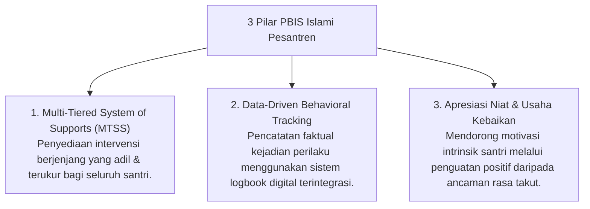

# P8-01: Pendekatan Terintegrasi PBIS

## Status Dokumen
* **Status**: 🌟 **A+ (Tervalidasi & Siap Diimplementasikan)**
* **Sub-Domain**: `08 Integrated Approaches / 01 PBIS`
* **Penanggung Jawab Keilmuan**: Dewan Keilmuan TUMBUH (*Pakar PBIS & Pakar Arsitektur PBIS Restoratif*)

---

## 1. Konseptualisasi PBIS Berbasis Nilai-Nilai Islami

Positive Behavioral Interventions and Supports (PBIS) dalam ekosistem **TUMBUH** diselaraskan dengan konsep **At-Tarsyid wa at-Tasyji'** (Bimbingan dan Dorongan Kebaikan):

---

## 2. Peta Pembagian Tier PBIS

- **Tier 1 (Universal Support - 80% Santri)**: Ekspektasi adab seluruh pesantren, budaya Bi'ah Shalihah, & penguatan positif harian.
- **Tier 2 (Targeted Support - 15% Santri)**: Intervensi kelompok kecil, Kartu Check-In Check-Out (CICO), & pelatihan keterampilan SEL.
- **Tier 3 (Intensive Support - 5% Santri)**: Diagnostik FBA individual, Behavior Intervention Plan (BIP), & Konseling CBT Khusus.
