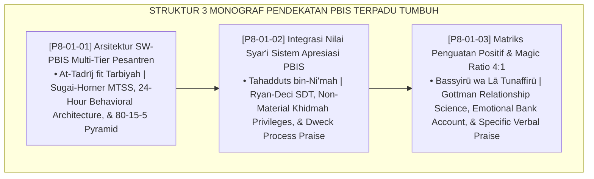

# P8-01: DOKUMEN INDUK PENDEKATAN TERINTEGRASI PBIS PESANTREN
## *Arsitektur dan Standarisasi School-Wide Positive Behavioral Interventions and Supports (SW-PBIS) Multi-Tier 24 Jam, Integrasi Nilai-Nilai Syar'i dalam Sistem Apresiasi Non-Material, dan Protokol Interaksi Afirmatif Magic Ratio 4:1 sebagai Tiga Pilar Pendekatan Perilaku Positif (SW-PBIS Multi-Tier Form PBIS-Arsitektur, Syar'i Recognition Form PBIS-ApresiasiSyari, Serta Magic Ratio Matrix Form PBIS-MagicRatio) di Ekosistem TUMBUH Pesantren*

**Nomor Identifikasi**: `P8-01/DOKUMEN-INDUK-PENDEKATAN-TERINTEGRASI-PBIS/2026`  
**Domain**: `08 Integrated Approaches` > `01 PBIS` (Gugus Sub-Domain 01: *School-Wide PBIS Multi-Tier, Syar'i Recognition, & Magic Ratio 4:1*)  
**Klasifikasi Naskah**: *Master Architecture & Navigation Monograph*  
**Rumpun Disiplin Pengkaji**: Multi-Tiered Behavioral Systems (SW-PBIS), Applied Behavior Analysis, Self-Determination Theory, Fiqh At-Tadrij wal Bisyarah  

---

> ### 💡 INTISARI EKSEKUTIF
>
> * **Kedudukan Strategis Gugus Pendekatan Terintegrasi PBIS:** Gugus ini adalah fondasi rekayasa sistem perilaku (*behavioral system engineering*) di ekosistem TUMBUH. Menggantikan tradisi kekerasan dan hukuman fisik yang merusak fitrah, PBIS menyediakan arsitektur multi-tier yang terukur, dipadukan secara harmonis dengan nilai-nilai luhur Islam tentang keteladanan, keikhlasan, dan kemudahan (*Yassirū wa Lā Tu'assirū*).
> * **Triad Pendekatan Terintegrasi PBIS TUMBUH:** (1) **Arsitektur SW-PBIS Multi-Tier** yang membagi dukungan pengasuhan secara proporsional (80-15-5) dalam konteks asrama 24 jam, (2) **Sistem Apresiasi Syar'i** yang menyucikan penghargaan dari transaksi komersial menuju pengakuan hak istimewa khidmah, dan (3) **Magic Ratio 4:1** yang memastikan tabungan emosi relasional pendidik-santri selalu bernilai positif melimpah.
> * **3 Monograf Riset Komprehensif:** Form PBIS-Arsitektur, Form PBIS-ApresiasiSyari, dan Form PBIS-MagicRatio.

---

## 📑 PETA NAVIGASI TIGA MONOGRAF

---

## 📚 DESKRIPSI RINGKAS 3 BERKAS MONOGRAF

1. **[P8-01-01: Arsitektur SW-PBIS Multi-Tier Pesantren](file:///c:/xampp/htdocs/tumbuh/08%20Integrated%20Approaches/01%20PBIS/P8-01-01-Arsitektur-SW-PBIS-Multi-Tier-Pesantren.md)**  
   *Arsitektur piramida 80-15-5 di lingkungan asrama 24 jam, matriks ekspektasi adab terpadu, alur transisi dinamis CICO-FBA-BIP berbasis data SIM, dan Form PBIS-Arsitektur.*
2. **[P8-01-02: Integrasi Nilai Syari dalam Sistem Apresiasi PBIS](file:///c:/xampp/htdocs/tumbuh/08%20Integrated%20Approaches/01%20PBIS/P8-01-02-Integrasi-Nilai-Syari-dalam-Sistem-Apresiasi-PBIS.md)**  
   *Desakralisasi token ekonomi komersial, konversi poin menjadi hak istimewa khidmah dan kepemimpinan sosial, penguatan niat ikhlas, dan Form PBIS-ApresiasiSyari.*
3. **[P8-01-03: Matriks Penguatan Positif dan Magic Ratio 4:1](file:///c:/xampp/htdocs/tumbuh/08%20Integrated%20Approaches/01%20PBIS/P8-01-03-Matriks-Penguatan-Positif-dan-Magic-Ratio-4-1.md)**  
   *Standarisasi rasio minimal 4 setoran positif : 1 penarikan koreksi, matriks penguatan verbal spesifik 24 jam, tracker harian musyrif, dan Form PBIS-MagicRatio.*

---

## 🎯 STANDAR PENJAMINAN MUTU PENDEKATAN PBIS

Penerapan gugus **Pendekatan Terintegrasi PBIS** menjamin bahwa:
1. **Pengasuhan Pesantren Berorientasi Pencegahan Primer Positif (*Universal Prevention Guarantee*)**: 80%+ santri berkembang secara alami melalui lingkungan yang jelas ekspektasi adabnya.
2. **Keikhlasan Niat Santri Terjaga dari Komersialisasi Ibadah (*Purity of Intention Guarantee*)**: Apresiasi diarahkan pada kemuliaan khidmah dan doa syukur, bukan hadiah materialistis.
3. **Hubungan Pengasuh dan Santri Dipenuhi Rasa Kasih Sayang (*High-Trust Relationship Guarantee*)**: Magic Ratio 4:1 memastikan asrama menjadi lingkungan yang ramah jiwa, aman, dan mendidik.
