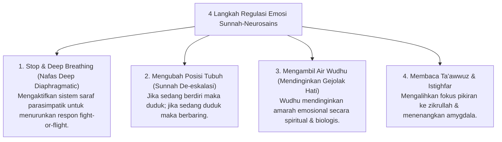

# P8-02-02: Modul Pengembangan Regulasi Emosi dan Mujahadah

## Status Dokumen
* **Status**: 🌟 **A+ (Tervalidasi & Siap Diimplementasikan)**
* **Sub-Domain**: `08 Integrated Approaches / 02 SEL`
* **Penanggung Jawab Keilmuan**: Dewan Keilmuan TUMBUH (*Pakar Social Emotional Learning & Pakar Neurosains Perkembangan*)

---

## 1. Operasionalisasi Teknik De-eskalasi & Regulasi Emosi

Modul Pelatihan Regulasi Emosi melatih santri mengendalikan ledakan amarah (*Ghadhab*) melalui kombinasi neurosains & tuntunan Sunnah Nabi SAW:

---

## 2. Praktik Mandiri di Kamar Asrama

Setiap santri yang mengalami kejenuhan emosional diajarkan menggunakan *Pojok Calming Corner* di kamar sebelum berdiskusi kembali dengan musyrif.
