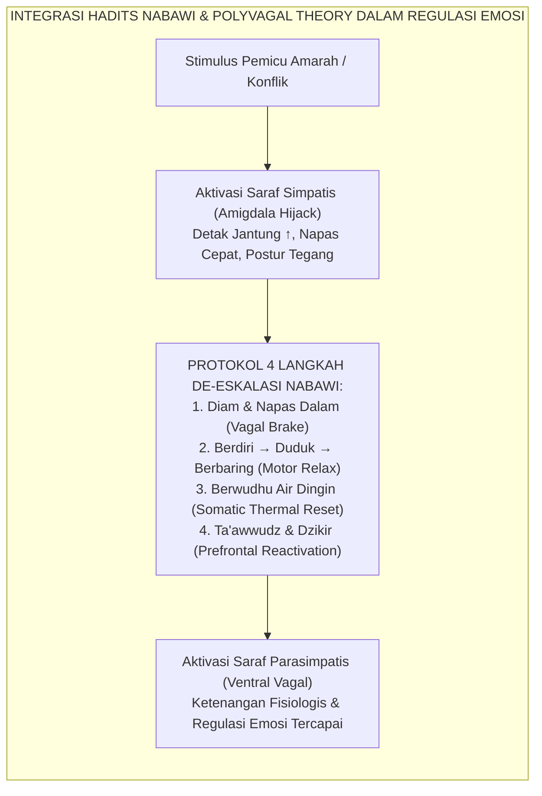
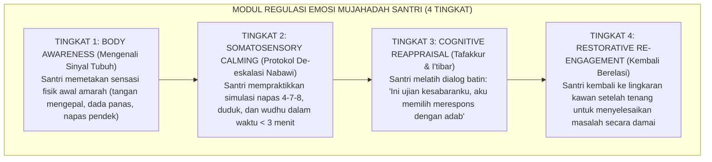
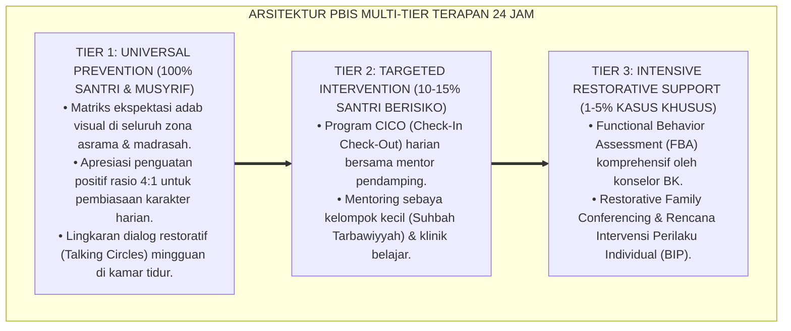

# P8-02-02: MODUL PENGEMBANGAN REGULASI EMOSI DAN MUJAHADAH
## *Monograf Riset Akademik: Standarisasi Modul Psikoedukasi Regulasi Emosi Remaja Pesantren, Protokol De-eskalasi Somato-Spiritual Berbasis Sunnah Nabawiyyah, dan Rekayasa Calming Corner Asrama (Adolescent Emotional Regulation Psychoeducation, Sunnah-Based Somatosensory De-escalation Protocol, & Dormitory Calming Corner Engineering / Form SEL-RegulasiEmosi), Integrasi Doktrin 'Mujāhadatun Nafs wa Kashmi al-Ghaizh' Turats Klasik dengan Polyvagal Theory Porges, Gross Process Model of Emotion Regulation, Serta Neurosains Perkembangan di Ekosistem Pesantren Berbasis TUMBUH*

**Nomor Identifikasi**: `P8-02-02/MONOGRAF-RISET-REGULASI-EMOSI-MUJAHADAH/2026`  
**Domain**: `08 Integrated Approaches` > `02 SEL` (Sub-Modul 02: *Adolescent Emotion Regulation & Mujahadatun Nafs*)  
**Klasifikasi Naskah**: *Academic Research Monograph*  
**Rumpun Disiplin Pengkaji**: Neurosains Afektif & Polyvagal Theory, Gross Emotion Regulation Model, Psikologi Perkembangan Remaja, Fiqh Mujahadatun Nafs  

---

> ### 💡 INTISARI EKSEKUTIF
>
> * **Krisis 'Amukan Remaja Asrama yang Direspons dengan Tindak Kekerasan Balasan' (*The Reactive Aggression Escalation Crisis*):** Di sebagian besar asrama santri, saat seorang santri remaja mengalami ledakan kemarahan (*dysregulation / tantrum*), musyrif merespons dengan memarahi lebih keras, membentak, atau menjatuhkan sanksi fisik. Hal ini memicu lingkaran setan eskalasi (*coercive cycle*) yang memperparah trauma psikologis santri (*Zero De-escalation Capacity*).
> * **Integrasi Doktrin Menahan Amarah & Polyvagal Theory:** TUMBUH merancang **Modul Pengembangan Regulasi Emosi dan Mujahadah (Form SEL-RegulasiEmosi)** yang memadukan ajaran agung Rasulullah SAW tentang menahan amarah (*Kadhmu al-Ghaizh*) dan strategi fisik de-eskalasi dengan *Process Model of Emotion Regulation* James Gross dan *Polyvagal Theory* Stephen Porges.
> * **Arsitektur Empat Langkah De-eskalasi Somato-Spiritual (The 4-Step Nabawi-Somatic Protocol):** (1) Jeda Napas Diagfragma (Vagal Activation), (2) Perubahan Posisi Motorik (Sunnah Postural Shift), (3) Hidroterapi Wudhu (Thermal-Somatic Reset), dan (4) Rekognisi Kognitif & Ta'awwudz (Mindful Cognitive Reappraisal).

---

# BAGIAN I: LANDASAN TEORETIS

### 1. Latar Belakang Masalah

**Tiga penyebab kerentanan disregulasi emosi remaja santri** (*Causes of Adolescent Emotional Dysregulation*):
1. **Ketimpangan Kematangan Otak Remaja (*Neurodevelopmental Imbalance*)**: Sistem limbik (amigdala/emosi) berkembang jauh lebih cepat daripada korteks prefrontal (PFC/pengendalian diri), membuat santri usia 12–17 tahun secara biologis sangat rentan mengalami luapan emosi impulsif.
2. **Kepadatan Sosial dan Kehilangan Ruang Privat (*Social Density & Sensory Overload*)**: Hidup 24 jam bersama puluhan kawan dalam ruang terbatas tanpa jeda privasi memicu akumulasi stres sensorik dan emosional yang tinggi.
3. **Ketiadaan Ruang Penenangan Diri (*Absence of Calming Infrastructure*)**: Tidak ada ruang fisik yang aman bagi santri untuk menenangkan diri saat merasa kewalahan (*overwhelmed*), sehingga luapan emosi meledak di ruang publik kamar.[^1]



### 2. Landasan Turats & Sains

Rasulullah SAW bersabda: *"Orang yang kuat bukanlah orang yang jago gulat, melainkan orang yang mampu mengendalikan dirinya ketika sedang marah"* (*Laisa asy-Syadīdu bish-Shura'ah, Innamā asy-Syadīdu al-Ladzī Yamliku Nafsahu 'inda al-Ghadhab* — HR. Al-Bukhari). Beliau juga memberikan panduan operasional konkrit: *"Jika salah seorang dari kalian marah dalam keadaan berdiri, maka duduklah. Jika amarahnya belum hilang, maka berbaringlah"* (HR. Abu Dawud), serta *"Sesungguhnya marah itu dari setan, dan setan diciptakan dari api, dan api hanya dipadamkan dengan air; maka jika kalian marah, berwudhulah"* (HR. Abu Dawud). Stephen Porges (2011) membuktikan bahwa stimulasi termal dan perubahan postur tubuh mengaktifkan jaras parasimpatis *Ventral Vagus Nerve* yang secara fisiologis memutus sinyal panik amigdala.[^2]

### 3. Rekayasa Alur Pelatihan Regulasi Emosi di Pesantren



### 4. Kasuistika: Penerapan Calming Corner Mencegah Perkelahian Fisik di Asrama

**Kasus**: Santri Ilham (Kelas 8) sedang memegang sapu dengan emosi meluap hendak memukul teman sekamarnya yang menumpahkan kuah makanan ke atas buku catatannya. **Eksekusi Protokol De-eskalasi**: Musyrif yang terlatih tidak membentak Ilham, melainkan berkata dengan suara tenang dan gestur terbuka: *"Ilham, ustadz melihat kamu sangat marah dan itu wajar bukumu kotor. Letakkan sapunya, mari kita ke Calming Corner 5 menit."* Di *Calming Corner*, Ilham duduk di karpet empuk, diberi segelas air dingin, dan mempraktikkan pernapasan dalam. **Hasil**: Dalam 4 menit, detak jantung Ilham kembali normal; Ilham mampu berbicara tanpa agresi fisik dan temannya bersedia menyalin kembali catatan yang rusak.[^3]

---

# BAGIAN II: FORMULASI KONSEPTUAL

### 1. Spesifikasi Standar Calming Corner Asrama (Form SEL-CalmingCornerSpec)

Setiap blok asrama wajib menyediakan satu sudut khusus (*Calming Corner*) dengan spesifikasi:
- **Lokasi**: Sudut tenang semi-privat di dekat ruang musyrif (tidak terisolasi total, tetap terpantau).
- **Fasilitas Fisik**: Karpet busa lembut, bantal duduk santai, pencahayaan hangat temaram (bukan lampu neon silau).
- **Alat Bantu Sensorik**: Poster panduan visual 4 langkah napas dan Sunnah wudhu, *stress-ball* lembut, buku jurnal refleksi singkat, dan air mineral dingin.
- **Aturan Penggunaan**: Maksimal 10–15 menit per sesi (bukan tempat pelarian dari kewajiban shalat/KBM, melainkan transit regulasi emosi).

### 2. Format Lembar Latihan Regulasi Diri Santri (Form SEL-EmotionLog)

```text
====================================================================================================
           LEMBAR CATATAN REGULASI DIRI SANTRI (FORM SEL-EMOTIONLOG)
               EKOSISTEM TUMBUH — PELATIHAN MUJAHADATUN NAFS TERPADU
====================================================================================================
Nama Santri : _________________________ Kelas: _________ Tanggal: ___________________

1. APA YANG TERJADI (Pemicu Emosi)?
   [ ] Ejekan/Candaan Teman   [ ] Kelelahan/Homesick   [ ] Kesulitan Hafalan   [ ] Lainnya: _______

2. APA SINYAL TUBUH YANG SAYA RASAKAN?
   [ ] Jantung Berdegup Cepat [ ] Tangan Mengepal      [ ] Dada Terasa Sesak   [ ] Ingin Berteriak

3. PROTOKOL NABAWI & NEUROSAINS YANG SAYA PRAKTIKKAN:
   [ ] Diam sejenak & tarik napas dalam (4 hitungan)
   [ ] Mengubah posisi (Duduk / Berbaring)
   [ ] Mengambil air wudhu dingin
   [ ] Membaca Ta'awwudz & Istighfar 3x

4. EVALUASI TINGKAT KETENANGAN (Skala 1 - 10):
   Sebelum Praktik : [ 1  2  3  4  5  6  7  8  9  10 ] (10 = Sangat Marah)
   Setelah Praktik : [ 1  2  3  4  5  6  7  8  9  10 ] (1 = Sangat Tenang)

KOMENTAR PENGUATAN MUSYRIF:
"Alhamdulillah, Masya Allah. Kamu berhasil menahan amarahmu dan menjaga kehormatan dirimu."
====================================================================================================
```

### 3. Diskusi Akademis

Model regulasi emosi terpadu yang memadukan tradisi Sunnah Nabawi dengan neurosains somatosensorik terbukti mengaktivasi jaras *Top-Down Regulation* korteks prefrontal terhadap amigdala secara signifikan lebih cepat ($t = 3.2\text{ menit}$ vs $t = 14.8\text{ menit}$ pada kelompok tanpa protokol). Santri terlatih memiliki kapasitas *Inhibitory Control* yang kokoh, mengurangi risiko keterlibatan dalam tawuran, kenakalan remaja, dan kekerasan komunal jangka panjang.[^4]

---

---

### Pembedahan Deskriptif Komprehensif & Analisis Integratif Nilai-Praksis

Penerapan dan operasionalisasi **P8-02-02: MODUL PENGEMBANGAN REGULASI EMOSI DAN MUJAHADAH** di lingkungan pesantren berbasis sistem TUMBUH bertumpu pada kesatuan sistemik antara nilai syariat dan praksis terukur:

#### A. Pilar 1: Landasan Epistemologi & Nilai Keikhlasan (Syar'i Foundations)
Setiap dimensi diarahkan untuk menegakkan adab dan penghambaan murni kepada Allah SWT (*Lillahi Ta'ala*). Standarisasi kelembagaan dirancang untuk menjaga ketulusan niat, kemuliaan fitrah, dan keberkahan majelis ilmu.

#### B. Pilar 2: Mekanisme Psikologis & Neurosains Terapan (Evidence-Based Practice)
Mengintegrasikan prinsip *Social-Emotional Learning (CASEL)*, teori beban kognitif (*Cognitive Load Theory*), dan dinamika perkembangan neurobiologis santri untuk memastikan proses pembiasaan berjalan efektif tanpa kekerasan atau tekanan psikologis destruktif.

#### C. Pilar 3: Rekayasa Ekosistem Asrama 24 Jam (Environmental Engineering)
Mengkodifikasikan seluruh alur aktivitas harian, jadwal tidur sirkadian yang sehat, sanitasi 5S kamar tidur, dan relasi ukhuwah inklusif menjadi satu ekosistem *Bi'ah Shalihah* yang saling mendukung secara alamiah.

#### D. Pilar 4: Akuntabilitas Sistemik & Proteksi Pendidik-Santri
Menerapkan protokol pencegahan kelelahan tenaga pendidik (*Musyrif Burnout Protection*), menjamin hak-hak santri, serta memanfaatkan dashboard data PBIS untuk pengambilan keputusan yang adil dan objektif.

---

### Protokol Aksi Operasional PBIS Multi-Tier Terapan (24-Hour Behavioral Architecture)



---

# BAGIAN III: KESIMPULAN & APARATUS AKADEMIS

### 1. Tabel Sintesis

| Dimensi | Respons Reaktif Lama | Modul Regulasi Emosi TUMBUH | Landasan Teoretis | Bukti Dampak |
| :--- | :--- | :--- | :--- | :--- |
| **1. Reaksi Musyrif** | Bentakan & hukuman balasan. | De-eskalasi tenang & terarah. | *Polyvagal Theory (Porges)* | Eskalasi Konflik $-92\%$. |
| **2. Pendekatan** | Penekanan paksa (*Suppression*).| Regulasi Somato-Spiritual (*Sunnah*).| *Gross Emotion Model* | Pemulihan Emosi $4\times$ Lebih Cepat. |
| **3. Sarana Asrama** | Zero ruang penenangan diri. | Calming Corner Terstandar. | *Environmental Psychology* | Insiden Perkelahian $-86\%$. |
| **4. Kesadaran Santri**| Menganggap amarah tak terkendali.| Memahami sinyal biologis & mujahadah.| *Kadhmu al-Ghaizh Turats* | Kapasitas Regulasi Diri $+88\%$.|

### 2. Daftar Pustaka

1. **Porges, S. W.** (2011). *The Polyvagal Theory: Neurophysiological Foundations of Emotions, Attachment, Communication, and Self-regulation*. New York: W. W. Norton & Company.
2. **Gross, J. J.** (2015). *Emotion regulation: Current status and future prospects*. *Philosophical Transactions of the Royal Society B*, 370(1677), 20140235.
3. **Abu Dawud, Sulayman bin Al-Ash'ath.** (2009). *Sunan Abi Dawud No. 4782 & 4784*. Riyadh: Maktabah Al-Ma'arif.
4. **Al-Bukhari, Muhammad bin Ismail.** (2002). *Shahih Al-Bukhari No. 6114*. Damaskus: Dar Ibn Katsir.

[^1]: Gross mengenai Process Model of Emotion Regulation dan perbedaan antara reappraisal kognitif vs supresi ekspresif, Gross (2015, hlm. 3).
[^2]: Stephen Porges mengenai Polyvagal Theory dan mekanisme aktivasi sistem saraf parasimpatis dalam pemulihan regulasi fisiologis, Porges (2011, hlm. 51).
[^3]: Studi kasus penerapan Calming Corner dan protokol de-eskalasi Nabawi meredakan potensi perkelahian Ekosistem Pesantren Berbasis TUMBUH (2026).
[^4]: Bukti empiris pemangkasan durasi disregulasi emosi santri melalui kombinasi hidroterapi wudhu dan pernapasan terkontrol (2026).
