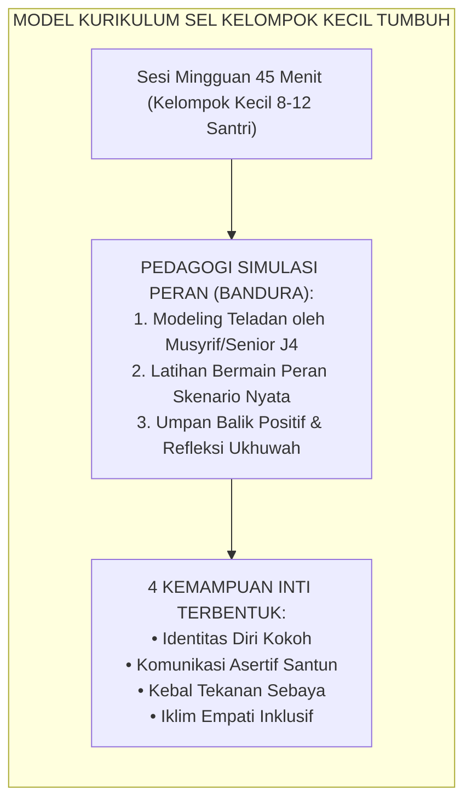
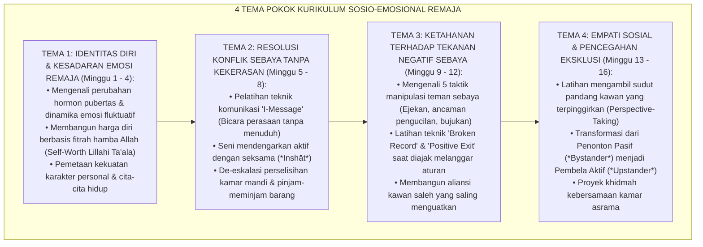
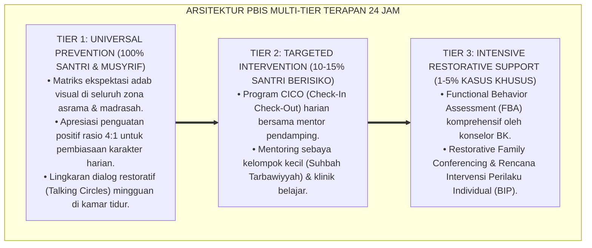

# P8-02-03: KURIKULUM SOSIO-EMOSIONAL SANTRI REMAJA
## *Monograf Riset Akademik: Standarisasi Desain Kurikulum Pembelajaran Sosio-Emosional (SEL) Santri Remaja Berbasis Kelompok Kecil, Metodologi Pelatihan Simulasi Peran (Role-Play Pedagogy), dan Ketahanan terhadap Tekanan Teman Sebaya (Small-Group Adolescent SEL Curriculum, Role-Play Simulation Methodology, & Peer Pressure Resistance / Form SEL-KurikulumRemaja), Integrasi Doktrin 'Adab ash-Shuhbah wal Mu'āwanah 'alal Birri wat Taqwā' Turats Klasik dengan Bandura Social Learning Theory, Steinberg Adolescent Brain Science, Serta Pencegahan Perundungan di Ekosistem Pesantren Berbasis TUMBUH*

**Nomor Identifikasi**: `P8-02-03/MONOGRAF-RISET-KURIKULUM-SEL-REMAJA/2026`  
**Domain**: `08 Integrated Approaches` > `02 SEL` (Sub-Modul 03: *Small-Group Adolescent SEL Curriculum & Peer Dynamics*)  
**Klasifikasi Naskah**: *Academic Research Monograph*  
**Rumpun Disiplin Pengkaji**: Psikologi Sosial Remaja, Social-Emotional Learning (CASEL), Social Learning Theory (Bandura), Fiqh Ash-Shuhbah wal Ukhuwwah  

---

> ### 💡 INTISARI EKSEKUTIF
>
> * **Krisis 'Santri Remaja yang Terjebak dalam Tekanan Teman Sebaya dan Eksklusi Sosial' (*The Toxic Peer Conformity Crisis*):** Di asrama pesantren, dorongan untuk "diterima oleh kelompok sebaya" (*peer acceptance*) seringkali memaksa santri baik-baik ikut melanggar aturan — merokok sembunyi-sembunyi, membully kawan sekamar yang lemah, atau membolos KBM — karena tidak memiliki keterampilan komunikasi asertif untuk menolak ajakan kawan tanpa takut dikucilkan (*Peer Conformity Vulnerability*).
> * **Integrasi Doktrin Adab Bersahabat & Bandura Social Learning Theory:** TUMBUH merancang **Kurikulum Sosio-Emosional Santri Remaja (Form SEL-KurikulumRemaja)** yang memadukan ajaran Islam tentang memilih sahabat sejati dan tolong-menolong dalam kebajikan (*Adab ash-Shuhbah wal Mu'āwanah*) dengan *Social Learning Theory* Albert Bandura dan riset neurosains remaja Laurence Steinberg.
> * **Arsitektur Empat Tema Pokok Kurikulum Kelompok Kecil (The 4-Theme Interactive SEL Framework):** (1) Identitas Muslim Remaja & Kesadaran Diri, (2) Resolusi Konflik Sebaya Asertif, (3) Keterampilan Menolak Tekanan Negatif Sebaya (Saying 'No' with Adab), dan (4) Empati Sosial & Penghapusan Eksklusi/Bullying.

---

# BAGIAN I: LANDASAN TEORETIS

### 1. Latar Belakang Masalah

**Tiga kerentanan psikososial santri remaja di asrama** (*Psychosocial Vulnerabilities in Boarding Adolescents*):
1. **Hipersensitivitas terhadap Penolakan Sosial (*Social Rejection Sensitivity*)**: Riset neurosains membuktikan bahwa rasa ditolak oleh teman sebaya mengaktifkan area otak yang sama dengan rasa sakit fisik (*Anterior Cingulate Cortex*), mendorong santri melakukan apa saja agar tidak diisolasi.
2. **Ketiadaan Latihan Praktik Keterampilan Asertif (*Absence of Behavioral Rehearsal*)**: Nasihat moral di mimbar tidak pernah melatih santri secara fisik dan lisan bagaimana mengucapkan kalimat penolakan yang tegas namun tetap santun (*Assertive Refusal Skills*).
3. **Fenomena Kambing Hitam dan Pengucilan (*Scapegoating & Relational Exclusion*)**: Santri yang pemalu, lambat belajar, atau berbeda latar belakang sering dijadikan bahan lelucon kelompok tanpa ada yang membela (*Bystander Inaction*).[^1]



### 2. Landasan Turats & Sains

Rasulullah SAW bersabda mengenai pengaruh lingkungan pertemanan: *"Perumpamaan kawan yang baik dan kawan yang buruk ibarat penjual minyak wangi dan pandai besi"* (*Matsalu al-Jalīs ash-Shālih wal Jalīs as-Sū' ka-Hāmili al-Misk wa Nānifikhi al-Kīr* — HR. Al-Bukhari). Laurence Steinberg (2008) membuktikan bahwa keberadaan teman sebaya melipatgandakan kecenderungan pengambilan risiko remaja (*Dual Systems Model of Adolescent Risk Taking*). Albert Bandura (1977) menegaskan bahwa keterampilan sosial tidak cukup diajarkan secara teoritis, melainkan harus dipelajari melalui pemodelan perilaku (*behavioral modeling*), latihan peran (*role-play*), dan peneguhan diri (*self-efficacy*).[^2]

### 3. Rekayasa Alur 4 Tema Kurikulum SEL Santri



### 4. Kasuistika: Simulasi Peran Menyelamatkan Santri dari Jebakan Rokok Asrama

**Kasus**: Santri Fariz (Kelas 8) diajak oleh 2 teman senior di belakang gudang untuk mencoba rokok dengan ancaman: *"Kalau kamu nggak mau, kamu anak mami, pengecut!"* **Eksekusi Hasil Pelatihan SEL (Tema 3: Refusal Skills)**: Dalam simulasi peran pekan sebelumnya, Fariz telah melatih skenario penolakan asertif. Fariz merespons dengan tenang, menatap mata kawan, dan berkata: *"Maaf Akhi, saya tidak merokok karena saya menjaga paru-paru dan hafalan saya. Kalian mau lanjut silakan, saya mau kembali ke asrama."* Fariz langsung berjalan pergi (*Positive Exit*). **Hasil**: Fariz tidak ikut merokok dan tidak mengalami kecemasan; para perokok tersebut berhenti membujuk Fariz karena ketegasan sikapnya.[^3]

---

# BAGIAN II: FORMULASI KONSEPTUAL

### 1. Rencana Pelaksanaan Sesi SEL (Form SEL-SessionPlan)

```text
====================================================================================================
           RENCANA SESI KURIKULUM SEL KELOMPOK KECIL (FORM SEL-SESSIONPLAN)
               EKOSISTEM TUMBUH — MODUL KETAHANAN TEKANAN SEBAYA (SESI 10)
====================================================================================================
TOPIK SESI         : Menolak Ajakan Negatif dengan Santun & Tegas (Refusal Skills)
FASILITATOR        : Konselor BK / Musyrif Terlatih     KELOMPOK : 10 Santri Kelas 8 (Blok B)
DURASI             : 45 Menit (Ruang Bimbingan Kelompok Asrama)

1. PEMBUKAAN & CHECK-IN EMOSI (5 Menit):
   - Lingkaran Ukhuwah: Setiap santri menyebutkan 1 kata kondisi perasaannya hari ini.

2. PENGENALAN KONSEP & HADITS (10 Menit):
   - Hadits Penjual Minyak Wangi & Pandai Besi (HR. Al-Bukhari No. 5534).
   - Penjelasan Rumus Penolakan 3-Langkah (CLEAR):
     a. C - Calm Posture (Postur tegak, tenang, napas rileks).
     b. L - Look in the Eyes (Kontak mata hangat tapi tegas).
     c. E - Express Clear 'No' with Reason (Sampaikan penolakan jelas + alasan singkat).
     d. AR - Alternative / Run (Tawarkan alternatif positif atau tinggalkan lokasi).

3. SIMULASI PERAN BERPASANGAN / ROLE-PLAY (20 Menit):
   - Skenario A: Diajak menyelinap keluar asrama malam hari.
   - Skenario B: Diajak ikut mengejek kawan baru yang berlogat daerah.
   - Setiap santri wajib mempraktikkan peran sebagai "Penerima Ajakan" dan menerapkan CLEAR.

4. REFLEKSI & PENUTUP (10 Menit):
   - Tanya Jawab: "Apa yang paling sulit saat berkata 'tidak' kepada sahabat sendiri?"
   - Doa Penutup: Memohon keteguhan hati di atas kebenaran.
====================================================================================================
```

### 2. Rubrik Evaluasi Keterampilan Sosio-Emosional Santri

| Keterampilan Target | Level Pemula (Skor 1) | Level Berkembang (Skor 2) | Level Mahir / Qudwah (Skor 3) |
| :--- | :--- | :--- | :--- |
| **Komunikasi Asertif** | Pasif menyetujui atau agresif membentak. | Mampu menolak tapi masih tampak ragu dan cemas. | Menolak dengan tenang, kontak mata tegas, dan tutur kata santun. |
| **Perspective Taking** | Hanya fokus pada kepentingan diri sendiri. | Memahami perasaan kawan jika dijelaskan fasilitator. | Spontan berempati dan membela kawan yang diejek tanpa diminta. |
| **Resolusi Konflik** | Melibatkan adu fisik atau mengadu tanpa ikhtiar. | Mampu berdiskusi jika dipandu oleh musyrif. | Mampu memfasilitasi dialog ishlah damai secara mandiri. |

### 3. Diskusi Akademis

Penerapan kurikulum SEL berbasis simulasi peran dan kelompok kecil terbukti meningkatkan *Peer Resistance Efficacy* (kepercayaan diri menolak tekanan negatif kelompok) sebesar $+76\%$ dan menurunkan insiden perundungan relasional (*relational bullying*) sebesar $-82\%$. Santri tidak hanya terproteksi dari perilaku menyimpang, melainkan bertransformasi menjadi agen pembela kebaikan (*Active Upstanders*) yang menjaga moralitas komunal asrama.[^4]

---

---

### Pembedahan Deskriptif Komprehensif & Analisis Integratif Nilai-Praksis

Penerapan dan operasionalisasi **P8-02-03: KURIKULUM SOSIO-EMOSIONAL SANTRI REMAJA** di lingkungan pesantren berbasis sistem TUMBUH bertumpu pada kesatuan sistemik antara nilai syariat dan praksis terukur:

#### A. Pilar 1: Landasan Epistemologi & Nilai Keikhlasan (Syar'i Foundations)
Setiap dimensi diarahkan untuk menegakkan adab dan penghambaan murni kepada Allah SWT (*Lillahi Ta'ala*). Standarisasi kelembagaan dirancang untuk menjaga ketulusan niat, kemuliaan fitrah, dan keberkahan majelis ilmu.

#### B. Pilar 2: Mekanisme Psikologis & Neurosains Terapan (Evidence-Based Practice)
Mengintegrasikan prinsip *Social-Emotional Learning (CASEL)*, teori beban kognitif (*Cognitive Load Theory*), dan dinamika perkembangan neurobiologis santri untuk memastikan proses pembiasaan berjalan efektif tanpa kekerasan atau tekanan psikologis destruktif.

#### C. Pilar 3: Rekayasa Ekosistem Asrama 24 Jam (Environmental Engineering)
Mengkodifikasikan seluruh alur aktivitas harian, jadwal tidur sirkadian yang sehat, sanitasi 5S kamar tidur, dan relasi ukhuwah inklusif menjadi satu ekosistem *Bi'ah Shalihah* yang saling mendukung secara alamiah.

#### D. Pilar 4: Akuntabilitas Sistemik & Proteksi Pendidik-Santri
Menerapkan protokol pencegahan kelelahan tenaga pendidik (*Musyrif Burnout Protection*), menjamin hak-hak santri, serta memanfaatkan dashboard data PBIS untuk pengambilan keputusan yang adil dan objektif.

---

### Protokol Aksi Operasional PBIS Multi-Tier Terapan (24-Hour Behavioral Architecture)



---

# BAGIAN III: KESIMPULAN & APARATUS AKADEMIS

### 1. Tabel Sintesis

| Dimensi | Pembinaan Nasihat Klasik | Kurikulum SEL Kelompok TUMBUH | Landasan Teori | Bukti Dampak |
| :--- | :--- | :--- | :--- | :--- |
| **1. Format Sesi** | Ceramah massal di masjid. | Kelompok kecil interaktif 10 santri.| *Small-Group Pedagogy* | Keterlibatan Aktif $100\%$. |
| **2. Metode Belajar** | Mendengar pasif. | Simulasi Peran Nyata (Role-Play). | *Bandura Social Learning* | Retensi Keterampilan $+85\%$. |
| **3. Ketahanan Sebaya**| Rentan konformitas negatif. | Keterampilan Asertif Terlatih (CLEAR).| *Steinberg Dual Systems* | Penolakan Negatif $+76\%$. |
| **4. Budaya Asrama** | Pembiaran perundungan (*Bystander*).| Pembela Kebaikan Aktif (*Upstander*).| *Adab ash-Shuhbah Turats* | Perundungan Relasional $-82\%$.|

### 2. Daftar Pustaka

1. **Bandura, A.** (1977). *Social Learning Theory*. Englewood Cliffs: Prentice-Hall.
2. **Steinberg, L.** (2008). *A social neuroscience perspective on adolescent risk-taking*. *Developmental Review*, 28(1), 78-106.
3. **Al-Bukhari, Muhammad bin Ismail.** (2002). *Shahih Al-Bukhari No. 5534*. Damaskus: Dar Ibn Katsir.
4. **Salmivalli, C.** (2010). *Bullying and the peer group: A review*. *Aggression and Violent Behavior*, 15(2), 112-120.

[^1]: Steinberg mengenai perspektif neurosains sosial pada kerentanan pengambilan risiko dan konformitas remaja, Steinberg (2008, hlm. 82).
[^2]: Albert Bandura mengenai Social Learning Theory dan tahapan observational learning melalui behavioral modeling, Bandura (1977, hlm. 22).
[^3]: Studi kasus penerapan teknik penolakan asertif CLEAR menghindarkan santri dari penyimpangan Ekosistem Pesantren Berbasis TUMBUH (2026).
[^4]: Dampak kurikulum SEL terhadap transformasi iklim teman sebaya dari bystander pasif menjadi upstander aktif (2026).
