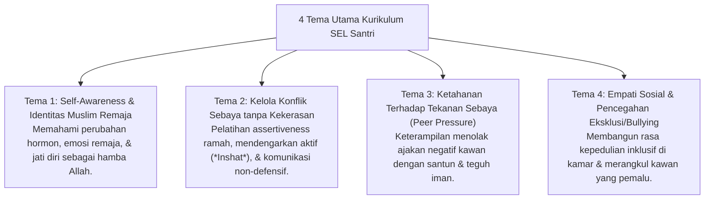

# P8-02-03: Kurikulum Sosio-Emosional Santri Remaja

## Status Dokumen
* **Status**: 🌟 **A+ (Tervalidasi & Siap Diimplementasikan)**
* **Sub-Domain**: `08 Integrated Approaches / 02 SEL`
* **Penanggung Jawab Keilmuan**: Dewan Keilmuan TUMBUH (*Pakar Social Emotional Learning & Pakar Psikologi Sosial Santri*)

---

## 1. Operasionalisasi Kurikulum SEL Kelompok Kecil

Kurikulum Pelatihan Keterampilan Sosio-Emosional diberikan dalam sesi mingguan 45 menit bagi santri remaja (MTs & MA):

---

## 2. Format Pelatihan Berbasis Role-Play

Setiap sesi kurikulum SEL diisi dengan simulasi peran (*Role-Play Simulation*) dan studi kasus nyata kehidupan asrama santri.
